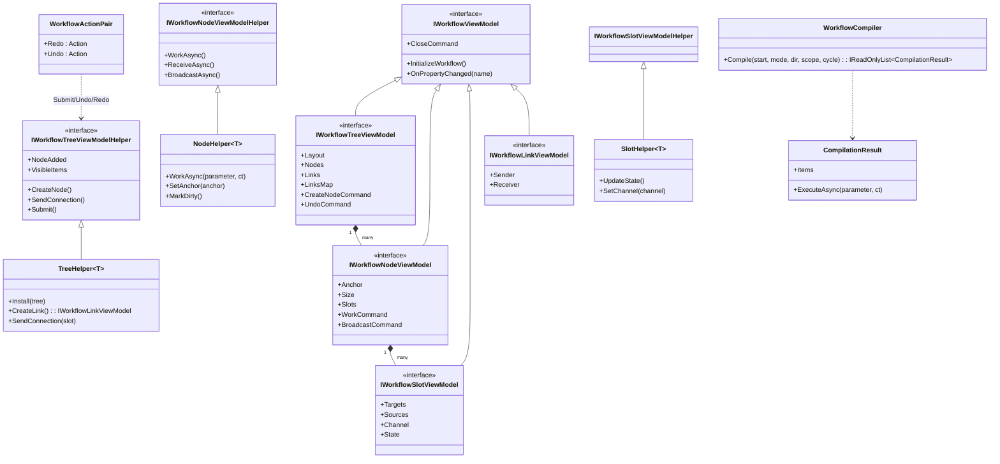

# Design Patterns — WorkflowSystem

## Class Diagram



## Patterns Identified

### 1. Template Method — Helpers

Each component's Helper base class defines the lifecycle skeleton (`Install` → subscribe collections, `Uninstall` → unsubscribe, `Closing/CloseAsync/Closed`) and exposes overridable hooks. `TreeHelper<T>` calls `base.Install` then enables virtualization; `HttpHelper<T>` overrides `Install` to subscribe `WorkCommand` events and `WorkAsync` to run business logic.

> Source: `Src/Core/VeloxDev.Core/WorkflowSystem/Templates/Helpers/TreeHelper.cs`, lines 109-124

```csharp
public virtual void Install(IWorkflowTreeViewModel tree)
{
    Component = tree as T;
    commands = tree.GetStandardCommands();
    VisibleItems = [];
    tree.Nodes.CollectionChanged += OnNodesChanged;
    tree.Links.CollectionChanged += OnLinksChanged;

    if (!useVirtualization) return;

    if (Component is null || tree.EnableMap(CellSize, VisibleItems) < 0)
    {
        Debug.Fail("EnableMap did not return a non-negative value as expected...");
    }
    InitializeMonoBehaviour();
}
```

### 2. Command Pattern — `IVeloxCommand` + Undo/Redo

Every mutation goes through a command object. Undoable mutations submit a `WorkflowActionPair(redo, undo)` to the tree's undo stack via `StandardSubmit`; `StandardUndo` pops and runs `Undo`, pushing onto the redo stack. `StandardCreateNode` is a canonical example:

> Source: `Src/Core/VeloxDev.Core/WorkflowSystem/StandardEx/WorkflowTreeEx.cs`, lines 27-35 and 238-248

```csharp
public static void StandardCreateNode(this IWorkflowTreeViewModel component, IWorkflowNodeViewModel node)
{
    var oldParent = node.Parent;
    var newParent = component;
    node.GetHelper().Delete();
    component.StandardSubmit(new WorkflowActionPair(
        () => CreateNodeRedo(component, node, newParent),
        () => CreateNodeUndo(component, node, oldParent)));
}
```

### 3. Observer Pattern — Collections and Command Events

Helpers observe `ObservableCollection` changes and command lifecycle events. `TreeHelper` raises `NodeAdded/NodeRemoved/LinkAdded/LinkRemoved` from `CollectionChanged` handlers; `HttpHelper<T>` subscribes `WorkCommand.Started/Exited/Enqueued/Dequeued` to update runtime counters:

> Source: `Examples/Workflow/Common/Lib/ViewModels/Workflow/Helper/HttpHelper.cs`, lines 42-82

```csharp
_startedHandler = e => { Interlocked.Increment(ref _activeRuns); ... };
_exitedHandler   = e => { ... if (Interlocked.Decrement(ref _activeRuns) <= 0) StopRuntimeTicker(); };
_viewModel.WorkCommand.Started += _startedHandler;
_viewModel.WorkCommand.Exited  += _exitedHandler;
```

### 4. Strategy Pattern — SlotEnumerator / Selectors + `ICompileTimeRouter`

A `SlotEnumerator<TSlot>` swaps its output-slot strategy via `SetSelector(type)`. `BoolSelectorNodeViewModel` and `EnumSelectorNodeViewModel` implement `ICompileTimeRouter`, letting the compiler pre-collect the routing table (`GetRouteTable`) and the executor skip unchosen branches (`GetCurrentRouteKey`):

> Source: `Examples/Workflow/Common/Lib/ViewModels/Workflow/BoolSelectorNodeViewModel.cs`, lines 70-91

```csharp
public object? GetCurrentRouteKey() => Condition ? (object)true : (object)false;

public IReadOnlyDictionary<object, IWorkflowNodeViewModel> GetRouteTable()
{
    var dict = new Dictionary<object, IWorkflowNodeViewModel>();
    if (TrueSlot is not null)
        foreach (var target in TrueSlot.Targets)
            if (target.Parent is not null)
                dict[true] = target.Parent;
    // ... false branch likewise
    return dict;
}
```

### 5. Proxy / Decorator — Source-Generated Partial ViewModels

`[WorkflowBuilder.Node<THelper>]` etc. make the user's `partial` class the decorated surface; the generator emits property/command members while the Helper (a separate object injected via `SetHelper`) owns behavior. The demo `ControllerViewModel` exposes extra instance properties for ComboBox sources alongside generated commands:

> Source: `Examples/Workflow/Common/Lib/ViewModels/Workflow/ControllerViewModel.cs`, lines 47-57

```csharp
public CompileMode[] CompileModeOptions => [CompileMode.BFS, CompileMode.DFS];
public CompileDirection[] CompileDirectionOptions => [CompileDirection.Forward, CompileDirection.Reverse];
public CompileScope[] CompileScopeOptions => [CompileScope.FromNode, CompileScope.Omni];
public CycleHandling[] CycleHandlingOptions => [CycleHandling.Throw, CycleHandling.Trim, CycleHandling.Allow];
```

### 6. Facade — `WorkflowBuilder`

The `WorkflowBuilder` nested attribute types (`TreeAttribute<T>`, `NodeAttribute<T>`, `SlotAttribute<T>`, `LinkAttribute<T>`) form a compact façade over the whole component system: one attribute selects helper type, concurrency, virtual-link type, etc., and the generator produces the rest.

### 7. Composition — Node contains Slots

`IWorkflowNodeViewModel.Slots` owns `IWorkflowSlotViewModel` instances; links are derived from `sender.Targets` / `receiver.Sources` and are indexed as node pairs (`NodePairBoundsProvider`) by `WorkflowSpatialManager`:

> Source: `Src/Core/VeloxDev.Core/WorkflowSystem/WorkflowSpatialManager.cs`, lines 142-164

```csharp
private void InsertLink(IWorkflowLinkViewModel link)
{
    if (link == null || _nodePairProviders.ContainsKey(link)) return;
    if (link.Sender?.Parent is IWorkflowNodeViewModel nodeA &&
        link.Receiver?.Parent is IWorkflowNodeViewModel nodeB &&
        nodeA != nodeB &&
        _nodeProviders.TryGetValue(nodeA, out var providerA) &&
        _nodeProviders.TryGetValue(nodeB, out var providerB))
    {
        var pairProvider = new NodePairBoundsProvider(nodeA, nodeB, providerA, providerB);
        _nodePairProviders[link] = pairProvider;
        _pairToLink[pairProvider] = link;
        _nodePairMap.Insert(pairProvider);
        AddToNodeIndex(nodeA, pairProvider);
        AddToNodeIndex(nodeB, pairProvider);
    }
}
```

### 8. Virtual Proxy — `ViewPool` + Spatial Virtualization

`WorkflowSpatialEx.Virtualize` queries the spatial map and reconciles `VisibleItems` in-place, so the UI only renders what intersects the viewport (plus one depth of connected links). Re-entrancy is guarded by a per-tree flag:

> Source: `Src/Core/VeloxDev.Core/WorkflowSystem/StandardEx/WorkflowSpatialEx.cs`, lines 93-111

```csharp
public static void Virtualize(this IWorkflowTreeViewModel tree, Viewport viewport)
{
    if (viewport.Width <= 0 || viewport.Height <= 0) return;
    if (!Virtualizing.TryAdd(tree, 0)) return;
    try { VirtualizeCore(tree, viewport); }
    finally { Virtualizing.TryRemove(tree, out _); }
}
```

### 9. Builder — Fluent `WorkflowAgentScope`

`tree.AsAgentScope().WithPromptLanguage(...).WithAutoDiscovery(...).WithMaxToolCalls(...)` chains configuration and finally materializes prompt + tools (`ProvideProgressiveContextPrompt()`, `ProvideTools()`):

> Source: `Examples/Workflow/Common/Lib/ViewModels/Workflow/Helper/AgentHelper.cs`, lines 86-121

```csharp
var scope = tree.AsAgentScope()
    .WithPromptLanguage(AgentLanguages.English)
    .WithOutputLanguage(AgentLanguages.Chinese)
    .WithAutoDiscovery(assemblyName: "VeloxDev.Core")
    .WithAutoDiscovery(assemblyName: "Lib")
    .WithMaxToolCalls(200)
    .WithToolCallCallback(args => { helper.ToolCalled?.Invoke(); return Task.CompletedTask; });
var contextPrompt = scope.ProvideProgressiveContextPrompt();
var tools = scope.ProvideTools();
```
