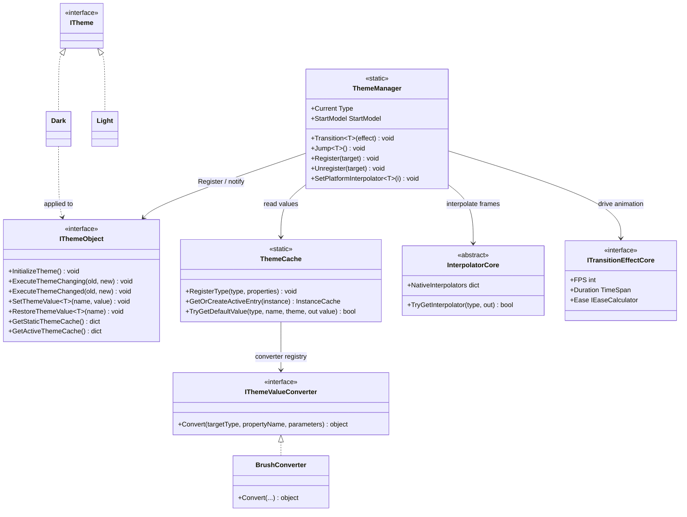

# Design Patterns — Dynamic Theme

The Dynamic Theme feature combines declaration-driven configuration (source-generated) with a runtime registry and a strategy-based interpolation engine.



## Patterns Identified

### 1. Facade Pattern (ThemeManager)

`ThemeManager` is a static façade over `ThemeCache` (storage), `InterpolatorCore` (animation), and the `IThemeObject` registry. Callers only see `Transition<T>` / `Jump<T>` / `SetPlatformInterpolator`.

### 2. Observer Pattern (theme change notification)

`ThemeManager.Transition(Type, effect)` iterates all registered `IThemeObject`s and calls `ExecuteThemeChanging(old, new)` before the animation and `ExecuteThemeChanged(old, new)` after. The generated implementation forwards to the user's `partial void OnThemeChanging` / `partial void OnThemeChanged`.

```csharp
// Src/Core/VeloxDev.Core/DynamicTheme/ThemeManager.cs (Transition)
foreach (var themeObject in actives)
    themeObject?.ExecuteThemeChanging(current, themeType);
await ExecuteTransition(CalculateFrames(...), deltaTime, themeType);
foreach (var themeObject in actives)
    themeObject?.ExecuteThemeChanged(current, themeType);
```

### 3. Template Method Pattern (source-generated IThemeObject)

`IThemeObject.InitializeTheme()` is a fixed algorithm (register type in `ThemeCache` → `ThemeManager.Register(this)` → apply current theme values); the user plugs in only the per-property values via `[ThemeConfig]`. The generator produces `virtual`/`override` hooks (`OnThemeChanging`, `OnThemeChanged`) so a base class's implementation can be extended.

### 4. Strategy Pattern (StartModel)

`ThemeManager.StartModel` (`Reflect` vs `Cache`) selects the strategy that resolves each property's animation **start value** — reflection over the live property vs. the cached value for the current theme.

### 5. Strategy Pattern (IThemeValueConverter + IEaseCalculator)

`IThemeValueConverter.Convert(Type, string, object?[])` is a strategy that adapts raw string parameters to platform types (`Brush`, `Thickness`, ...). `Eases.*` returns `IEaseCalculator` strategies (`Sine`, `Quad`, `Bounce`, ...) used by `CalculateFrames` to shape the interpolation.

### 6. Registry Pattern (WeakReference tracking)

`ThemeManager` keeps live instances in a list of `WeakReference`s (pruned on each transition) and `ThemeCache` uses `ConditionalWeakTable`-backed instance entries — no strong refs, so registration never leaks.

```csharp
// Src/Core/VeloxDev.Core/DynamicTheme/ThemeManager.cs (Transition)
CancleTransition();
activeThemes.RemoveAll(x => !x.TryGetTarget(out _));
var actives = activeThemes.Select(x => x.TryGetTarget(out var obj) ? obj : null)
                          .Where(x => x != null).ToArray();
```

### 7. Adapter Pattern (platform adapters)

`Interpolator`, `TransitionEffect`, and the value converters are adapter-provided implementations of core contracts (`InterpolatorCore`, `ITransitionEffectCore`, `IThemeValueConverter`), letting the core engine stay GUI-agnostic.

> Source references: `Src/Core/VeloxDev.Core/DynamicTheme/ThemeManager.cs`, `Src/Generators/VeloxDev.Core.Generator/Theme.cs`, `Src/Adapters/VeloxDev.WPF/PlatformAdapters/ThemeValueConverters.cs`, `Examples/Theme/WPF/Demo/MainWindow.xaml.cs`.
