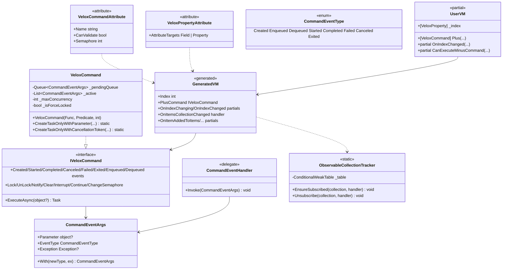

# Design Patterns — MVVM



## Patterns Identified

### 1. Source Generation / Code Generation (Roslyn incremental generators)

`MVVM` and `Command` implement `IIncrementalGenerator` (Src/Generators/VeloxDev.Core.Generator/MVVM.cs lines 12-13; Command.cs lines 12-13) and register source output from `partial` class declarations (`Analizer.Filters.FilterContext`). Each writer (`MVVMWriter`, `CommandWriter`) produces one `.g.cs` file per class. The generated setter shape for the default mode (`Base/Analizer.cs`, `GetSetterBodyLines`, lines 287-307):

```csharp
if(global::System.Object.Equals(_index, value)) return;
var old = _index;
OnPropertyChanging(nameof(Index));
OnIndexChanging(old, value);
_index = value;
OnIndexChanged(old, value);
OnPropertyChanged(nameof(Index));
```

### 2. Observer Pattern (PropertyChanged + command lifecycle events)

`VeloxCommand` exposes eight lifecycle events — `Created`/`Enqueued`/`Dequeued`/`Started`/`Completed`/`Failed`/`Canceled`/`Exited` — plus `CanExecuteChanged` (VeloxCommand.cs, lines 92-101). `ExecuteCoreAsync` raises `Started` before invoking, then `Completed`/`Canceled`/`Failed`, then `Exited` (lines 176-204). The generated properties raise `PropertyChanging`/`PropertyChanged` through the base `OnPropertyChanging`/`OnPropertyChanged` methods, which the demo base implements as event invocations (Examples/MVVM/WPF/Demo/ObservableViewModelBase.cs, lines 11-19).

### 3. Command Pattern (IVeloxCommand)

`IVeloxCommand : ICommand` adds async execution and concurrency control. `ExecuteAsync` checks the force-lock, then either starts immediately (`_active.Count < _maxConcurrency`) or enqueues (`_pendingQueue.Enqueue`) and raises `Enqueued` (VeloxCommand.cs, lines 139-174). `TryStartPendingAsync` drains the queue when capacity frees (lines 349-377). `CanExecute` combines the user predicate with the force-lock: `(_canExecute?.Invoke(parameter) ?? true) && !_isForceLocked` (line 126).

### 4. Template Method Pattern (partial hooks)

The generated code declares `partial void OnXxxChanging/OnXxxChanged` and the collection partials `OnItemAddedToXxx`/`OnItemRemovedFromXxx`/`OnItemMovedInXxx`/`OnItemsResetInXxx`; the user supplies implementations and the generated skeleton calls them at fixed points in the setter / collection handler. The demo fills these in (Examples/MVVM/WPF/Demo/MainWindowViewModel.cs, lines 33-36 and 178-209).

### 5. Fluent / Notification base-class adaptation

Rather than forcing a base class, the generator adapts to whatever notification infrastructure already exists. If the class or a base already declares `OnPropertyChanging`/`OnPropertyChanged` string methods, the generated code calls those instead of generating events (`MVVMWriter.ConfigurePropertyNotificationInfrastructure`, lines 198-258). Framework bases are detected by `DetectSetterMode` (lines 42-89) and their `SetProperty`/`RaiseAndSetIfChanged`/`NotifyOfPropertyChange` is used. This is how the demo reuses its local `ObservableViewModelBase` unchanged.

> Source references: `Src/Generators/VeloxDev.Core.Generator/{MVVM.cs, Command.cs, Writers/MVVMWriter.cs, Writers/CommandWriter.cs, Base/Analizer.cs}`, `Src/Core/VeloxDev.Core/MVVM/VeloxCommand.cs`, `Examples/MVVM/WPF/Demo/MainWindowViewModel.cs`, `Examples/MVVM/WPF/Demo/ObservableViewModelBase.cs`.
