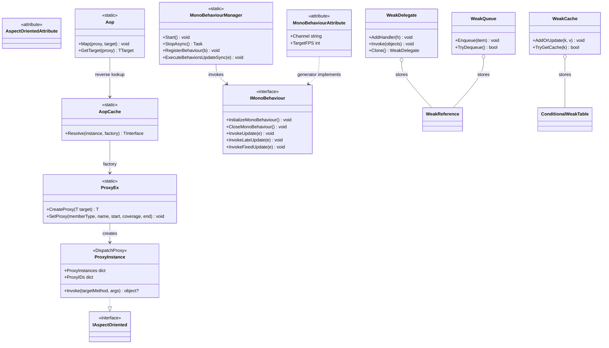

# Design Patterns — AOP, MonoBehaviour & WeakTypes



## 1. Proxy Pattern — AOP via `DispatchProxy`

`ProxyEx.CreateProxy<T>` hands the target to `DispatchProxy.Create<T, ProxyInstance>()`, then records the real target and its type on the proxy:

```csharp
// Src/Core/VeloxDev.Core/AspectOriented/ProxyEx.cs (lines 16-25)
public static T CreateProxy<T>(this T target) where T : IAspectOriented
{
    var type = typeof(T);
    dynamic proxy = DispatchProxy.Create<T, ProxyInstance>() ?? throw new InvalidOperationException();
    proxy._target = target;
    proxy._targetType = type;
    ProxyInstance.ProxyIDs.Add(proxy, proxy._localid);
    return proxy;
}
```

Every call on the proxy funnels into the single `ProxyInstance.Invoke` interception point.

## 2. Decorator / Interceptor — start / coverage / end hooks

`SetProxy` writes a `(start, coverage, end)` triple into the member's hook table. `ProxyInstance.Invoke` decorates the member by running start → (coverage or reflection) → end, chaining the return value through `previous`:

```csharp
// Src/Core/VeloxDev.Core/AspectOriented/ProxyInstance.cs (lines 23-35)
protected override object? Invoke(MethodInfo? targetMethod, object?[]? args)
{
    var Name = targetMethod?.Name ?? string.Empty;
    if (Name == string.Empty) return null;
    if (Name.StartsWith("get_"))
    {
        GetterActions.TryGetValue(Name, out var actions);
        var R0 = actions?.Item1?.Invoke(args, null);
        var R1 = actions?.Item2 == null ? _targetType?.GetMethod(Name)?.Invoke(_target, args) : actions.Item2.Invoke(args, R0);
        actions?.Item3?.Invoke(args, R1);
        return R1;
    }
```

A non-null `coverage` handler is a **decorator**: it receives the start result `R0` and its own return value `R1` becomes the member's result, bypassing the original logic.

## 3. Template Method — generated MonoBehaviour lifecycle

The generator produces the `IMonoBehaviour` bridge and declares the partial hooks; the user fills in the `Update`/`FixedUpdate` steps. The loop skeleton lives in the manager, the variable steps in the partial methods:

```csharp
// Src/Generators/VeloxDev.Core.Generator/Writers/MonoWriter.cs (lines 80-120, excerpt)
public void InvokeUpdate(VeloxDev.TimeLine.FrameEventArgs e)
{
    Update(e);
}
// ...
partial void Awake();
partial void Start();
partial void Update(VeloxDev.TimeLine.FrameEventArgs e);
partial void LateUpdate(VeloxDev.TimeLine.FrameEventArgs e);
partial void FixedUpdate(VeloxDev.TimeLine.FrameEventArgs e);
```

## 4. Observer — lifecycle / channel events

`LoopChannel` exposes `Started` / `Paused` / `Resumed` / `Stopped`, forwarded to the static `MonoBehaviourManager` events as `MonoBehaviourChannelEventArgs`:

```csharp
// Src/Core/VeloxDev.Core/TimeLine/MonoBehaviourManager.cs (lines 156-159, 987-991)
public event EventHandler? Started;
public event EventHandler? Paused;
public event EventHandler? Resumed;
public event EventHandler? Stopped;
// ...
ch.Started += (s, e) => OnChannelStarted?.Invoke(s, new MonoBehaviourChannelEventArgs(n));
```

## 5. Flyweight / Registry — `AopCache` with `ConditionalWeakTable`

One shared `ConditionalWeakTable<TClass, TInterface>` per `(TClass, TInterface)` pair — realized by CLR generic specialization, so no per-class generated cache code is needed. The proxy is created once and garbage-collected with its target:

```csharp
// Src/Core/VeloxDev.Core/AspectOriented/AopCache.cs (lines 14-32)
private static class Entry<TClass, TInterface>
    where TClass : class
    where TInterface : class, IAspectOriented
{
    public static readonly ConditionalWeakTable<TClass, TInterface> Instances = [];
}
// ...
return Entry<TClass, TInterface>.Instances.GetValue(instance, k => factory(k));
```

## 6. Weak Reference idiom — WeakTypes

All four WeakTypes types store `WeakReference<T>` (or `ConditionalWeakTable`) instead of strong references, so a publisher / cache never roots its subscribers / keys:

```csharp
// Src/Core/VeloxDev.Core/WeakTypes/WeakQueue.cs (lines 34-42)
public void Enqueue(T item)
{
    if (item == null) throw new ArgumentNullException(nameof(item));
    lock (_lock)
    {
        _references.Enqueue(new WeakReference<T>(item));
    }
}
```

`TryDequeue`/`TryPop`/`TryPeek` skip dead references; `Count`, `GetEnumerator`, and `TrimExcess` first `Prune()` the collected entries (`WeakQueue.cs` lines 124-135, `WeakStack.cs` lines 124-136).

> Source references: `Src/Core/VeloxDev.Core/AspectOriented/*.cs`, `Src/Core/VeloxDev.Core/TimeLine/*.cs`, `Src/Core/VeloxDev.Core/WeakTypes/*.cs`, `Src/Generators/VeloxDev.Core.Generator/Writers/{AopWriter,MonoWriter}.cs`, `Examples/AOP/WPF/Demo/MainWindow.xaml.cs`.
