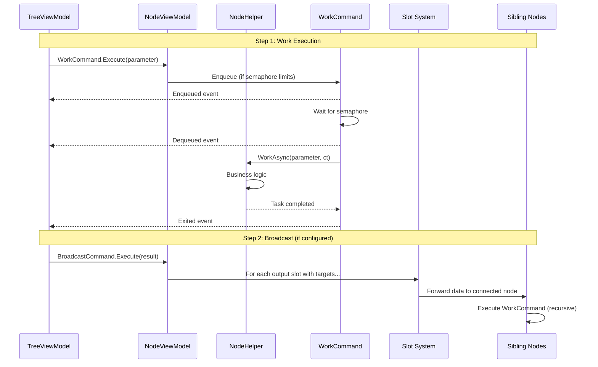
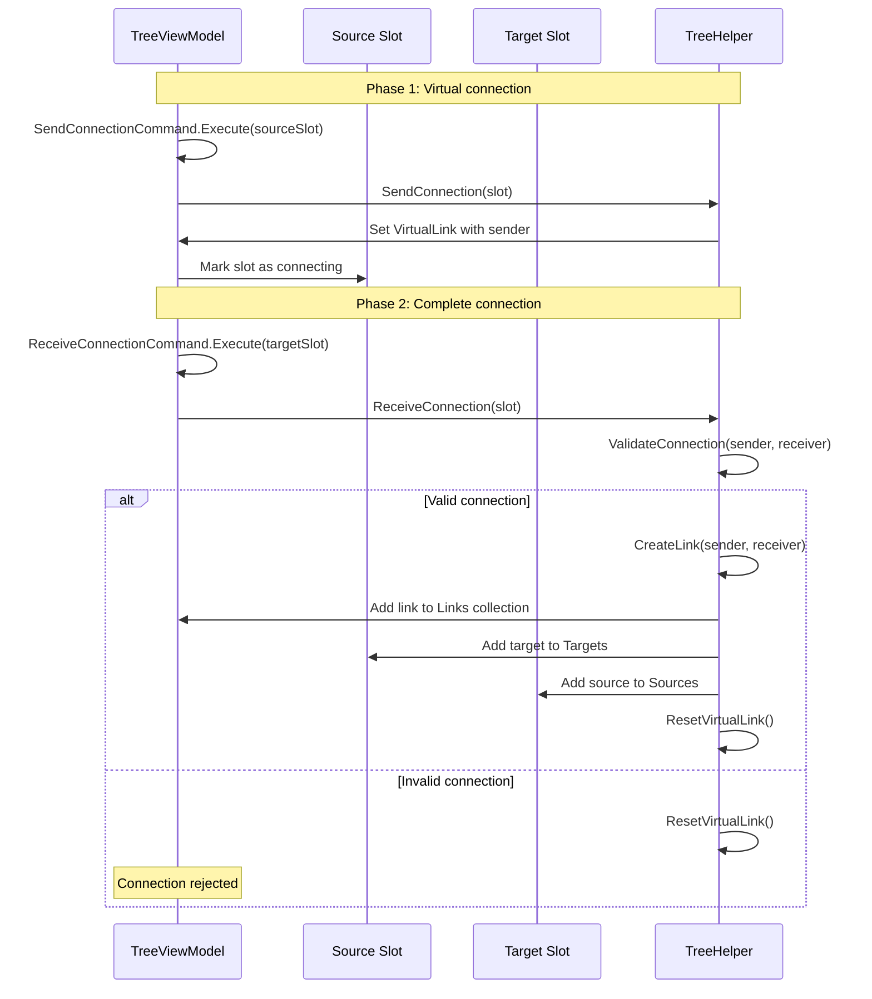
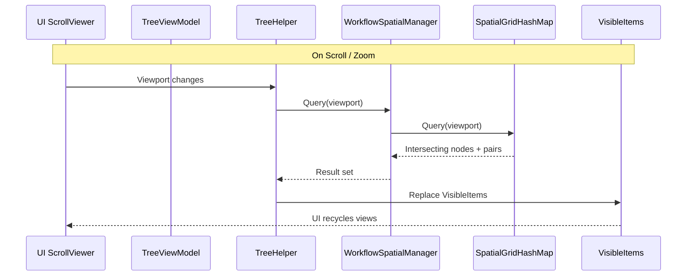
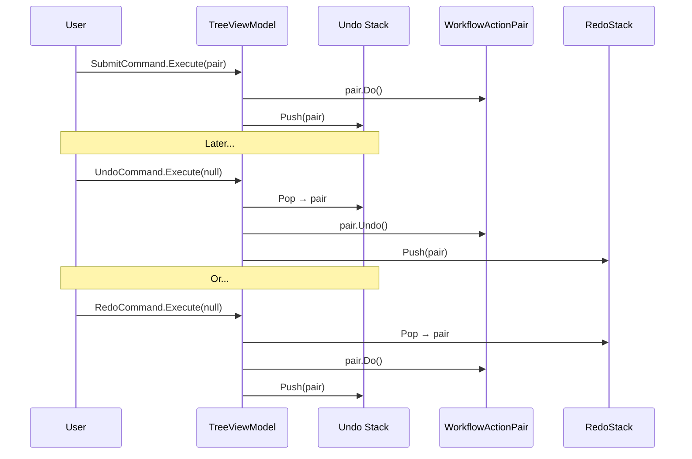
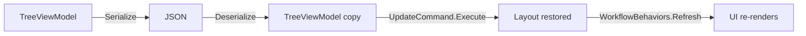

# Data Flow — WorkflowSystem

## 1. Node Work Execution Flow

When a node's `WorkCommand` is triggered, the following sequence occurs:

## 2. Connection Establishment Flow

## 3. Spatial Query Flow (Viewport Culling)

## 4. Undo/Redo Flow

## 5. Serialization Flow

The `VeloxDev.MVVM.Serialization` namespace provides `Serialize()` and `Deserialize<T>()` extension methods. Serialization preserves the full object graph: nodes, slots, links, layout state, and custom data properties.
