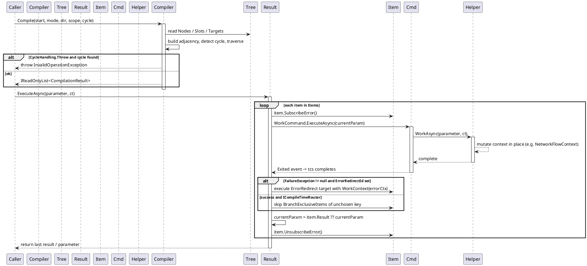
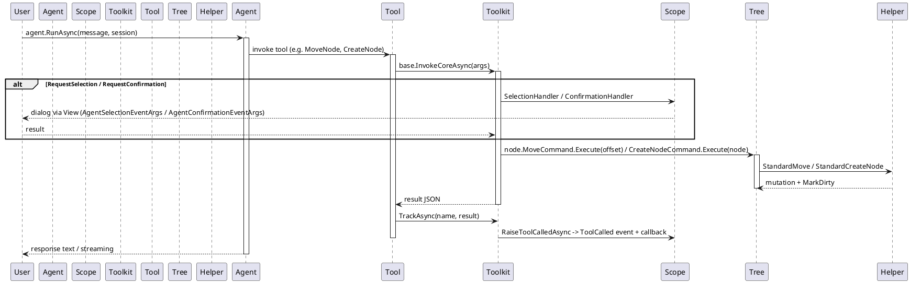

# Data Flow — WorkflowSystem

Four sequence diagrams trace the main data flows. PlantUML syntax is used so the diagrams can be rendered by any PlantUML server.

## 1. CreateNode + Undo / Redo

`helper.CreateNode(node)` funnels into `StandardCreateNode`, which submits an undoable `WorkflowActionPair`. Undo and redo pop the stacks and run the paired actions.

```plantuml
@startuml
    participant Caller
    participant Helper as TreeHelper
    participant Tree as IWorkflowTreeViewModel
    participant Cache as TreeCache(UndoStack/RedoStack)
    participant Pair as WorkflowActionPair
    participant Node as IWorkflowNodeViewModel

    Caller -> Helper: CreateNode(node)
    activate Helper
    Helper -> Tree: StandardCreateNode(node)
    activate Tree
    Tree -> Node: GetHelper().Delete()
    Tree -> Tree: new WorkflowActionPair(redo, undo)
    Tree -> Cache: StandardSubmit(pair)
    activate Cache
    Cache -> Pair: pair.Redo.Invoke()
    activate Pair
    Pair -> Tree: redo: Nodes.Add(node); node.Parent = tree
    deactivate Pair
    Cache -> Cache: UndoStack.Push(pair)
    deactivate Cache
    deactivate Tree
    deactivate Helper

    Caller -> Tree: UndoCommand.Execute(null)
    activate Tree
    Tree -> Cache: StandardUndo()
    activate Cache
    Cache -> Cache: UndoStack.TryPop(out pair)
    Cache -> Pair: pair.Undo.Invoke()
    activate Pair
    Pair -> Tree: undo: Nodes.Remove(node); node.Parent = oldParent
    deactivate Pair
    Cache -> Cache: RedoStack.Push(pair)
    deactivate Cache
    deactivate Tree

    Caller -> Tree: RedoCommand.Execute(null)
    activate Tree
    Tree -> Cache: StandardRedo()
    activate Cache
    Cache -> Cache: RedoStack.TryPop(out pair)
    Cache -> Pair: pair.Redo.Invoke()
    activate Pair
    Pair -> Tree: redo: Nodes.Add(node); node.Parent = tree
    deactivate Pair
    Cache -> Cache: UndoStack.Push(pair)
    deactivate Cache
    deactivate Tree
@enduml
```

Error path: if `pair.Redo.Invoke()` throws, `StandardSubmit`/`StandardUndo`/`StandardRedo` catch the exception and log via `Debug.WriteLine` — the stack is left unchanged.

*Source: `Src/Core/VeloxDev.Core/WorkflowSystem/StandardEx/WorkflowTreeEx.cs`, lines 27-35, 181-234.*

## 2. SendConnection / ReceiveConnection

A connection is built in two phases. `SendConnection(sender)` checks sender capacity, shows the virtual link and sets `PreviewSender`. `ReceiveConnection(receiver)` validates capacity + `ValidateConnection`, cleans up conflicting same-direction links, creates the link, and submits the whole connection as one undoable action.

```plantuml
@startuml
    participant Caller
    participant Tree as IWorkflowTreeViewModel
    participant Sender as Slot(sender)
    participant Receiver as Slot(receiver)
    participant Link as IWorkflowLinkViewModel

    Caller -> Tree: SendConnectionCommand.Execute(sender)
    activate Tree
    Tree -> Sender: StandardCanBeSender()
    alt not canBeSender
        Tree -> Tree: ResetVirtualLink(); CurrentSender = null
    else canBeSender
        Tree -> Tree: SmartCleanupSenderConnections(sender)
        Tree -> Tree: VirtualLink.IsVisible = true
        Tree -> Sender: State = PreviewSender; UpdateState()
        Tree --> Caller: CurrentSender = sender
    end
    deactivate Tree

    Caller -> Tree: ReceiveConnectionCommand.Execute(receiver)
    activate Tree
    alt CurrentSender == null
        Tree --> Caller: return (no-op)
    else CurrentSender != null
        Tree -> Receiver: StandardCanBeReceiver()
        Tree -> Tree: GetHelper().ValidateConnection(CurrentSender, receiver)
        alt invalid (capacity / validation / same parent)
            Tree -> Tree: ResetVirtualLink(); CurrentSender = null
        else valid
            Tree -> Tree: CleanupSameDirectionConnections / SmartCleanupReceiver
            Tree -> Link: CreateLink(sender, receiver) via GetHelper()
            Tree -> Tree: StandardSubmit(WorkflowActionPair)
            Tree -> Tree: redo: LinksMap[sender][receiver] = link; Links.Add; Sender.Targets.Add; Receiver.Sources.Add
            Tree -> Tree: ResetVirtualLink(); CurrentSender = null
        end
    end
    deactivate Tree
@enduml
```

Error path: any failed validation (capacity, custom `ValidateConnection`, same-node connection) resets the virtual link and leaves no connection; existing same-direction connections are atomically replaced through a submitted `WorkflowActionPair`.

*Source: `Src/Core/VeloxDev.Core/WorkflowSystem/StandardEx/WorkflowTreeEx.cs`, lines 92-177, 363-416.*

## 3. Compile + ExecuteAsync with WorkCommand lifecycle

`WorkflowCompiler.Compile` traverses the graph (BFS or DFS) and produces `CompilationResult` items with `Order`/`Depth`. `ExecuteAsync` runs each item by dispatching `WorkCommand` (fire-and-forget) and waiting for the `Exited` event, then forwards the parameter to the next item. Router branches are skipped via `BranchExclusiveItems`.



Cancellation path: `ct.ThrowIfCancellationRequested()` at the top of each loop iteration aborts the whole chain; an `OperationCanceledException` from a node rethrows immediately.

*Source: `Src/Core/VeloxDev.Core/WorkflowSystem/Compilation/Compiler.cs`, lines 54-149; `Models/CompilationResult.cs`, lines 157-260; `Models/CompiledItem.cs`, lines 104-121.*

## 4. Agent tool call flow

The chat client drives an `IAIAgent`. On a tool call, `WorkflowAgentToolkit` invokes the underlying `AIFunction`, tracks the call, and the tool mutates the tree through helpers/commands. Interaction tools (`RequestSelection` / `RequestConfirmation`) can pause for the user.



Error path: `TrackedAIFunction.InvokeCoreAsync` catches exceptions and returns a JSON `{"error": "..."}` instead of throwing; when `MaxToolCalls` is reached, subsequent calls return `"Tool call limit exceeded"`.

*Source: `Src/Core/VeloxDev.Core.Extension/Agent/Workflow/Functions/WorkflowAgentToolkit.cs`, lines 146-195; `Workflow/WorkflowAgentScope.cs`, lines 276-297.*
