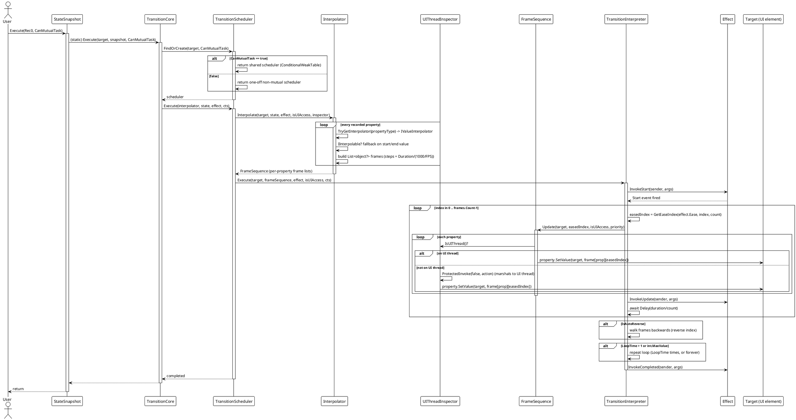
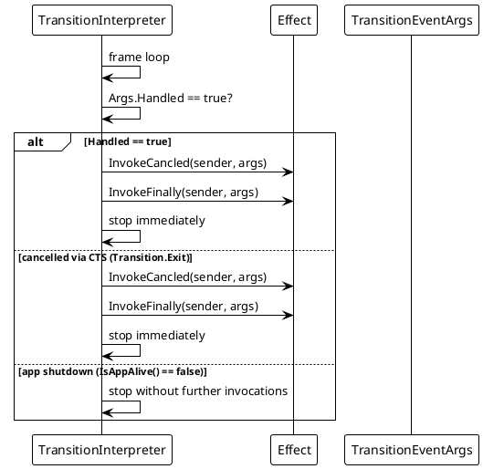

# Data Flow — Transition System

## Executing a State Snapshot (`snapshot.Execute(target)`)

The complete call chain from `Execute` to the frame pump. This flow works identically across all six platform adapters.

## Cancellation & Error Path

## Normal / Error Path Summary

| Scenario | Behavior |
|---|---|
| Normal execution | Frames applied on the UI thread via `UIThreadInspector`; `Update`/`LateUpdate` events fire per frame; `Completed` + `Finally` at the end. |
| New mutual animation on same target | Previous scheduler is `Exit()`-ed (current animation cancelled) before the new one runs. |
| `TransitionEventArgs.Handled = true` | Short-circuits the timeline; `Canceled` + `Finally` events fire. |
| `Transition.Exit(target)` | Cancels the target's mutual (and optionally non-mutual) schedulers. |
| Background-thread start | `UIThreadInspector.ProtectedInvoke(false, action)` marshals frame writes to the UI thread. |
| Property without interpolator | The property is skipped; other properties still animate. |

> Source references: `Src/Core/VeloxDev.Core/TransitionSystem/TransitionInterpreter.cs` (frame pump), `TransitionScheduler.cs` (`FindOrCreate`, `Execute`), `Interpolator.cs` (resolution), `InterpolatorOutputCore.cs` (`Update`), `Src/Adapters/*/PlatformAdapters/UIThreadInspector.cs`.
