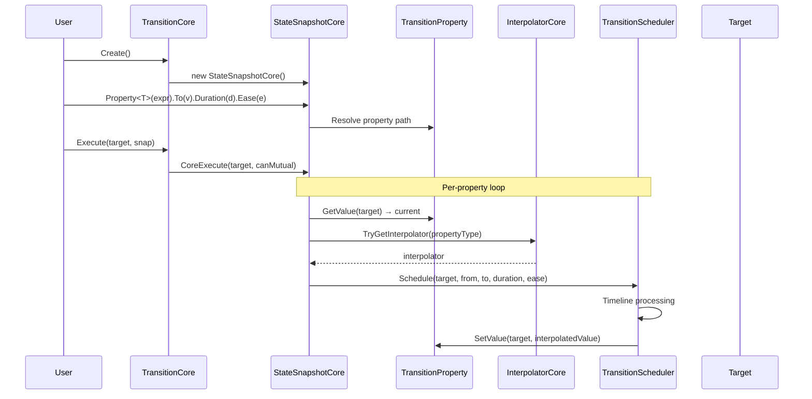
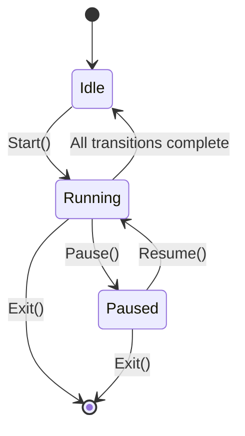

# Data Flow — TransitionSystem

## Transition Execution Flow

```mermaid
sequenceDiagram
	participant User
	participant TCore as TransitionCore
	participant Snap as StateSnapshotCore
	participant TP as TransitionProperty
	participant IC as InterpolatorCore
	participant Sch as TransitionScheduler
	participant Target

	User->>TCore: Create()
	TCore->>Snap: new StateSnapshotCore()
	User->>Snap: Property<T>(expr).To(v).Duration(d).Ease(e)
	Snap->>TP: Resolve property path
	User->>TCore: Execute(target, snap)
	TCore->>Snap: CoreExecute(target, canMutual)

	Note over Snap,Sch: Per-property loop
	Snap->>TP: GetValue(target) → current
	Snap->>IC: TryGetInterpolator(propertyType)
	IC-->>Snap: interpolator
	Snap->>Sch: Schedule(target, from, to, duration, ease)
	Sch->>Sch: Timeline processing
	Sch->>TP: SetValue(target, interpolatedValue)
```

## Scheduler Timeline

```mermaid
stateDiagram-v2
	[*] --> Idle
	Idle --> Running: Start()
	Running --> Paused: Pause()
	Paused --> Running: Resume()
	Running --> Idle: All transitions complete
	Running --> [*]: Exit()
	Paused --> [*]: Exit()
```
