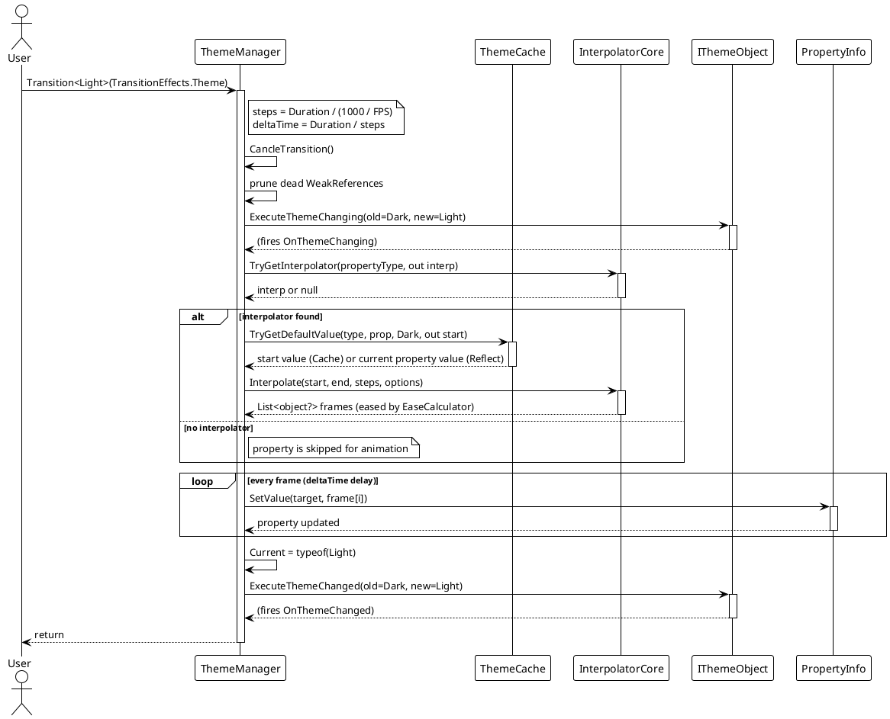
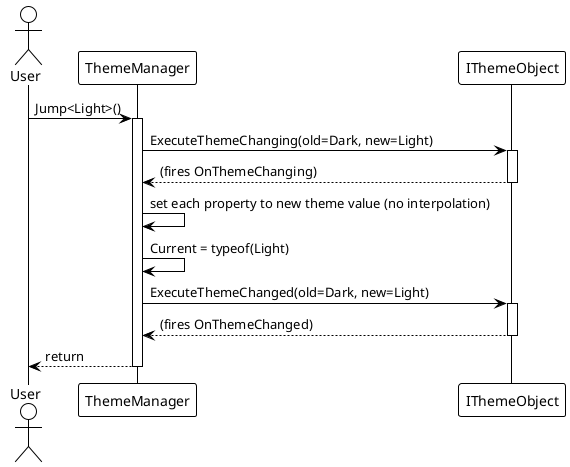
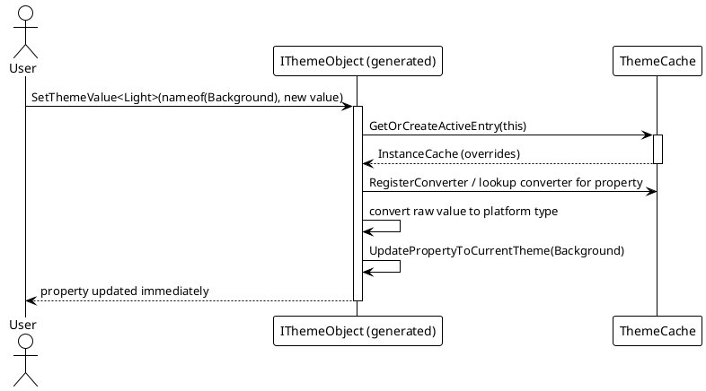

# Data Flow — Dynamic Theme

## Animated Theme Switch (`Transition<T>`)

This is the core API call chain. `ThemeManager.Transition` pre-computes all interpolation frames, then applies them frame by frame on a timer.

## Instant Switch (`Jump<T>`)

## Runtime Value Override (`SetThemeValue<T>`)

## Normal vs. Error Paths

| Scenario | Behavior |
|---|---|
| Normal animated switch | Interpolate each registered object's properties over `Duration`, then set `Current` and fire `OnThemeChanged`. |
| `themeType == Current` | Aborted early — debug message "Invalid theme type, jumping to current theme." |
| `themeType` not assignable to `ITheme` | Aborted early with the same debug message. |
| Property without an interpolator | Property skipped during animation; still set to the final value by `Jump`/`SetThemeValue`. |
| `steps <= 0` (zero-duration effect) | Clamped to `steps = 1`, so the theme still applies. |

> Source references: `Src/Core/VeloxDev.Core/DynamicTheme/ThemeManager.cs` (lines 83–106 `Transition`, 153–407 `CalculateFrames`, 414–452 `ExecuteTransition`), `Src/Generators/VeloxDev.Core.Generator/Theme.cs`.
