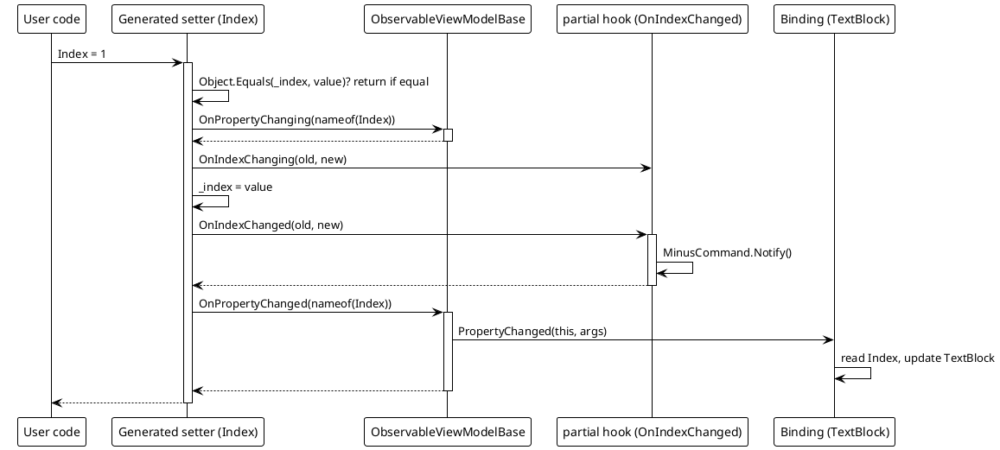
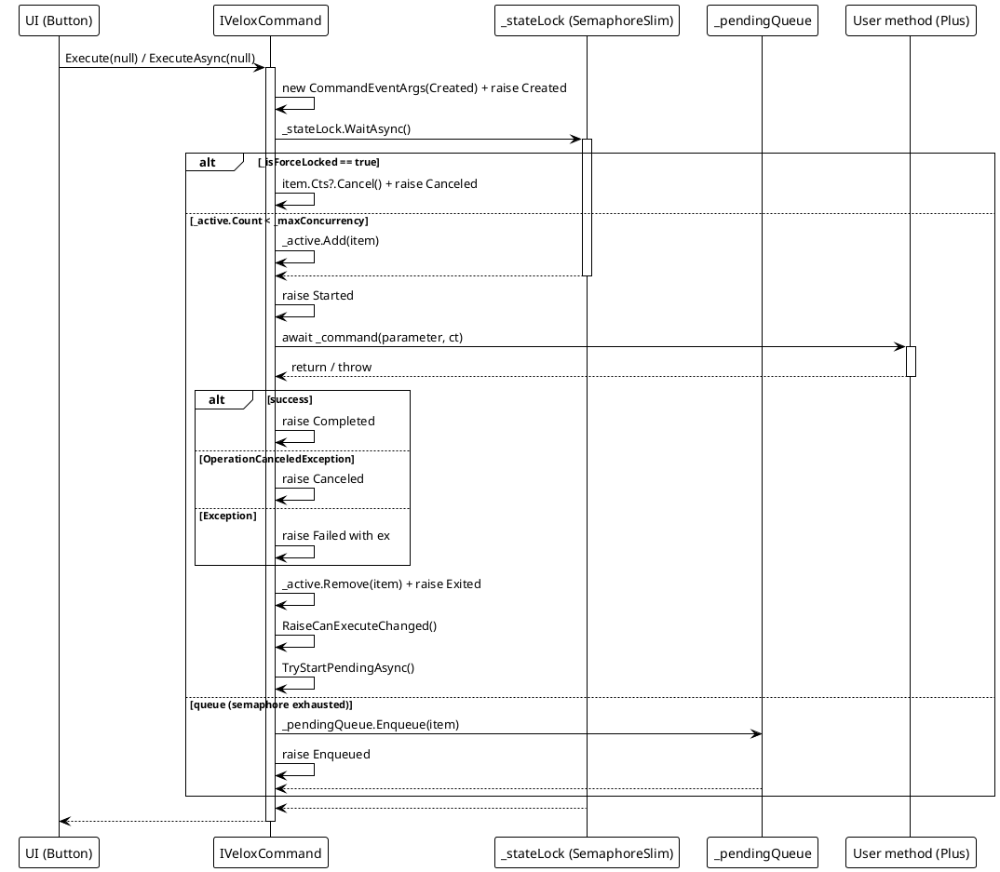
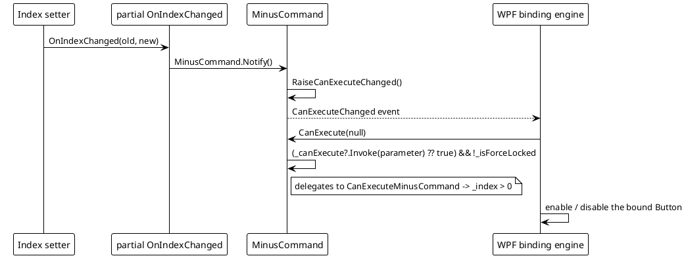

# Data Flow — MVVM

## (a) Setting a `[VeloxProperty]` field

The generated setter (default mode) raises change notifications and forwards to the partial hooks. Setter line source: `Src/Generators/VeloxDev.Core.Generator/Base/Analizer.cs`, `GetSetterBodyLines`, lines 287-307.

## (b) Executing a `[VeloxCommand]`

Flow through `ExecuteAsync` → semaphore / queue → lifecycle events (VeloxCommand.cs, lines 139-174, 176-204, 206-222).

## (c) CanExecute flow with `Notify()`

## Error / Concurrency Path Summary

| Scenario | Behavior |
|---|---|
| Force-locked trigger (`Lock()`) | `ExecuteAsync` cancels the new item and raises `Canceled`; no execution starts. |
| Capacity exhausted (`_active.Count == _maxConcurrency`) | The item is enqueued and `Enqueued` raised; `TryStartPendingAsync` later dequeues it (raising `Dequeued`) when capacity frees or after `UnLock` / `Continue` / `ChangeSemaphore`. |
| User method throws | `Failed` is raised with `CommandEventArgs.Exception`; `Exited` still fires. |
| `OperationCanceledException` | `Canceled` is raised. |
| `Interrupt()` | Cancels the active CTS, then `UnLockAsync` re-enables triggers. |
| `Clear()` | Cancels active and dequeues all pending, raising `Dequeued` then `Canceled` for each. |

> Source references: `Src/Core/VeloxDev.Core/MVVM/VeloxCommand.cs` (`ExecuteAsync`, `ExecuteCoreAsync`, `OnExecutionCompletedAsync`, `TryStartPendingAsync`, `InterruptAsync`, `ClearAsync`), `Src/Generators/VeloxDev.Core.Generator/Base/Analizer.cs` (`GetSetterBodyLines`, `GenerateCollectionMembers`), `Examples/MVVM/WPF/Demo/MainWindowViewModel.cs`.
