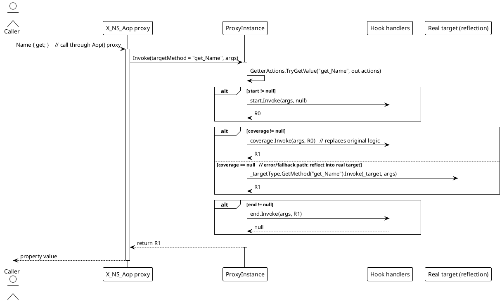
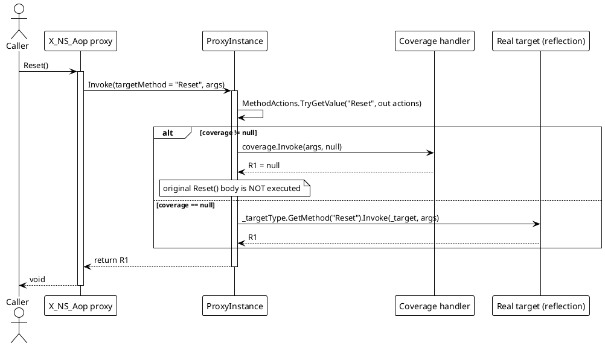
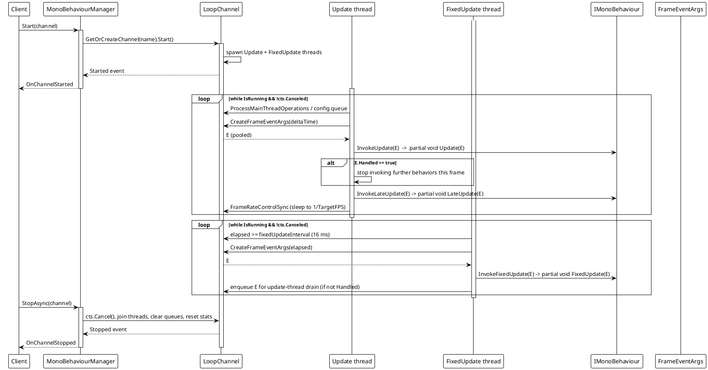
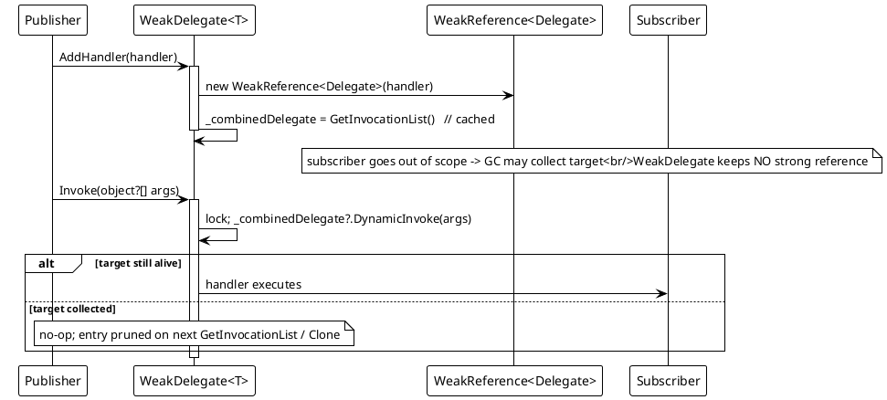

# Data Flow — AOP, MonoBehaviour & WeakTypes

## 1. AOP property read (getter with start hook)

The same shape applies to `set_*` (writes to `SetterActions`) and plain methods (writes to `MethodActions`). A null `coverage` always falls back to `_targetType.GetMethod(Name)?.Invoke(_target, args)` (`ProxyInstance.cs` lines 23-53).

## 2. AOP method call with coverage overriding

Demo wiring: `p.SetProxy(ProxyMembers.Method, nameof(TeamViewModel.Reset), null, coverage, null)` cancels the default `Reset()` (`Examples/AOP/WPF/Demo/MainWindow.xaml.cs` lines 63-68).

## 3. MonoBehaviour frame loop

Key loop source: `MonoBehaviourManager.cs` lines 394-441 (`FixedUpdateLoop`), 443-488 (`UpdateLoop`), 610-656 (`ExecuteBehaviorsUpdateSync` / `LateUpdate` / `FixedUpdate`), 245-291 (`Start`), 293-336 (`StopAsync`).

## 4. WeakDelegate — add + invoke

Source: `WeakDelegate.cs` lines 10-17 (`AddHandler`), 35-55 (`GetInvocationList`), 57-66 (`CleanupCollectedHandlers`), 68-74 (`Invoke`), 76-91 (`Clone`).
