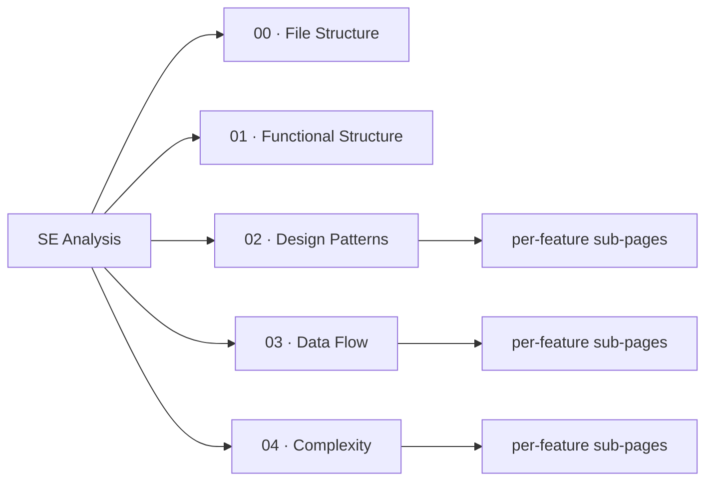

# Software Engineering Analysis

Rigorous engineering analysis of the VeloxDev codebase, organized into five page groups. Each page group after `01_functional-structure` has sub-pages grouped by feature (from the Feature Inventory), so each feature gets its own dedicated analysis.

| Page group | Content |
|---|---|
| [00 File Structure](00_file-structure) | Repository layout, directory tree, project-to-folder mapping |
| [01 Functional Structure](01_functional-structure) | Module responsibility boundaries, feature-to-project mapping, entry points |
| [02 Design Patterns](02_design-patterns) | Design-pattern analysis per feature (Mermaid class diagrams) |
| [03 Data Flow](03_data-flow) | API call-chain sequence diagrams per feature (PlantUML) |
| [04 Complexity](04_complexity) | Time/space complexity of core operations per feature (KaTeX) |

The feature set is defined in the Feature Inventory and is consistent with the `1_QuickStart` and `2_API` dimensions.
