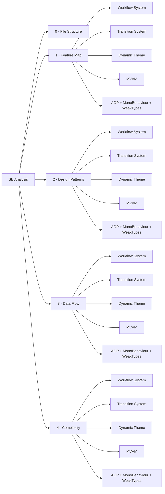

# Software Engineering Analysis

This section analyzes the VeloxDev architecture across five fixed dimensions. Every dimension is further divided by **feature** (Workflow System, Transition System, Dynamic Theme, MVVM, AOP + MonoBehaviour + WeakTypes), matching the feature inventory established during discovery.

| Dimension | Description |
|---|---|
| [File Structure](0_file_structure) | Repository layout, project-to-folder mapping, Mermaid flowchart |
| [Feature Map](1_feature_map) | Module responsibility boundaries, feature → project → dependency mapping |
| [Design Patterns](2_design_patterns) | Patterns used by each feature (Command, Template Method, Proxy, Registry, ...) |
| [Data Flow](3_data_flow) | PlantUML sequence diagrams for each feature's core API call chains |
| [Complexity](4_complexity) | KaTeX time/space complexity for each feature's core operations |

## Feature Index

| Feature | Owning Project | Evidence |
|---|---|---|
| Workflow System (+ Agent / AI / MCP) | `VeloxDev.Core` + `VeloxDev.Core.Extension` | Demo (`Examples/Workflow`) + Test |
| Transition System | `VeloxDev.Core` + adapters | Demo (`Examples/Transition`, 6 platforms) + Test |
| Dynamic Theme | `VeloxDev.Core` + adapters | Demo (`Examples/Theme`) + Test |
| MVVM | `VeloxDev.Core` + `VeloxDev.Core.Generator` | Demo (`Examples/MVVM`) + Test |
| AOP + MonoBehaviour + WeakTypes | `VeloxDev.Core` | Demo (`Examples/AOP`, `Examples/MonoBehaviour`) + Test |
