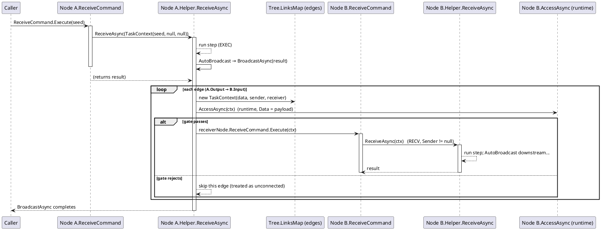

# Workflow System — 执行机制（Compiler 与 非Compiler）

两种执行机制驱动**同一个**单一入口。**Compiler** 是引擎驱动：先对可达子图做编译，再由 `CompilerEngine` 沿图逐节点驱动。**非Compiler** 路径是节点驱动：每个节点执行后*自动广播*结果到下游，投递本身触发下一个节点。两者最终都落到同一个方法——节点只能靠**收到的 context 类型**区分自己走的是哪条路径。

> 本页是"数据究竟怎么流动"的指南。CompilerEx 类型参考见 [compilerex](../02_compilerex)；核心接口表见 [workflowsystem](../00_workflowsystem)；完整时序图见 [data-flow](../../../3_SE_Analysis/03_data-flow/00_workflow-system)。

---

## 0. 唯一入口：`ReceiveAsync`

所有路径——编译驱动、广播投递、手动 EXEC——都汇入同一个方法：

```csharp
Task<object?> IWorkflowNodeViewModelHelper.ReceiveAsync(ITaskContext context, CancellationToken ct)
```

`ReceiveCommand` 只是*人/Agent* 的触发入口。其生成的处理程序把参数包成 context 后调用 `ReceiveAsync`（`NodeDefaultViewModel.Receive`，67-72 行）：

```csharp
var ctx = parameter as ITaskContext ?? new TaskContext(parameter);
return await Helper.ReceiveAsync(ctx, ct);
```

**Compiler 绕过 `ReceiveCommand`** —— `CompilerEngine.DriveAsync` 直接以 `IRuntimeContext` 会话调用 `Helper.ReceiveAsync(context, ct)`。所以到达 `ReceiveAsync` 共有**三种**方式：

| 路径 | 谁触发 | 如何到达 | 收到的 `context` |
|---|---|---|---|
| **编译驱动** | `CompilerEngine.DriveAsync` | **直接**调用 `Helper.ReceiveAsync(context, ct)`（无命令） | `IRuntimeContext` —— 运行时会话（本身是 `ITaskContext`） |
| **广播 RECV** | `StandardBroadcastAsync` | 每条边：`new TaskContext(data, sender, receiver)` → `receiverNode.ReceiveCommand.Execute(ctx)` → `ReceiveAsync` | `TaskContext`，`Sender`/`Receiver` 已填充 |
| **手动 EXEC** | `ReceiveCommand.Execute(data)` | 裸参数包成 `new TaskContext(data)` | `TaskContext`，`Sender`/`Receiver` = `null` |

节点从 context 判断自己所在路径——这正是 demo `HttpHelper` 的做法：

```csharp
if (context is IRuntimeContext)     { /* 编译步骤 */ }
else if (context.Sender is not null) { /* RECV —— 沿链接投递而来 */ }
else                                 { /* EXEC —— 手动 / AI 启动 */ }
```

---

## 1. 两种机制一览

| | **Compiler**（引擎驱动） | **非Compiler**（节点驱动、无状态） |
|---|---|---|
| **谁决定下一个节点** | 引擎沿预编译的 `CompiledGraph` 行走（`ExecuteEntry` / `BranchEntry` / `ParallelEntry`） | 每个节点自己的 `BroadcastAsync` 沿实时输出边（`LinksMap`）行走 |
| **是否预编译** | 是 —— `CompileAsync(start)` 一次性分解可达子图 | 否 —— 调用时刻的 `LinksMap` 拓扑 |
| **节点自动广播** | **关闭** —— 节点*不*自动转发；下游派发归引擎所有 | **开启** —— `ReceiveAsync` 返回后节点调用 `BroadcastAsync(flow, ct)`（`AutoBroadcast`） |
| **每节点的 context** | 共享的 `IRuntimeContext` 会话；引擎每驱动完一个节点写 `Data` 以链式传递 | 每条投递边一个全新的 `TaskContext` |
| **`AccessAsync` 门** | 仅编译期静态检测（`ICompileContext`，`Data = null`）把非法边从图中剪除 | 每条边投递前的运行期实时检测（`TaskContext`，`Data = 负载`） |
| **错误 / 重定向** | `IRedirectable` → 引擎从目标 `Order` 重跑整张图（可跨链） | 无重跑；出错仅结束本步 |
| **扇出 / 汇聚** | `ParallelEntry` + 多输入节点处的 `GroupData` 汇合注入 | 纯广度优先扇出，无汇合聚合 |
| **适用场景** | 多输入汇合、路由、扇出、确定性的整链运行（demo 的 Run） | 手动单步 EXEC、简单线性馈送、GUI 逐步驱动 |

两条路径在线上共享**相同**的运行时 `AccessAsync` 语义，但 Compiler 把这道门移到编译期——图本身已排除被拒绝的边。

---

## 2. 参数 —— 每条路径携带什么

### 2.1 上下文继承体系

所有 context 都派生自一个携带负载的根：

```
IContext                       object? Data { get; }        // 运行期为真实数据，编译身份恒为 null
└─ IAccessContext              + bool IsCompilePhase, IWorkflowSlotViewModel? Sender, Receiver
   ├─ ITaskContext             // ReceiveCommand → ReceiveAsync 的入参契约（data/sender/receiver 均可空）
   │   └─ IRuntimeContext      // + Uid/Sequence/Logs/CurrentOrder/BranchKey/Attempt/... ；new Data { set } —— 可写的链式结果
   └─ ICompileContext          // + Order/ChainIndex/Offset（编译身份；Order = -1 = 绝对停止）
```

### 2.2 编译运行下 `Data` 的形态

编译运行中节点从 `context.Data` 读到的形态：

| 形态 | 何时出现 | 说明 |
|---|---|---|
| `null` | 无 seed，或上游返回 `null` | `RunCompiledWorkflow` 的 seed 是可选的 |
| **任意链式值** | 每个非汇合节点 | 引擎每驱动完一个 `ReceiveAsync` 写 `context.Data = result` —— 上游返回什么就是什么 |
| **`IGroupData`** | 多输入汇合（`CompileContext.InputNodes.Count > 1`） | 只读 `IReadOnlyDictionary<IWorkflowNodeViewModel, object?>`，Key = 来源节点引用身份；未运行的来源不存在（`TryGetValue` → false） |
| **扇出源负载恢复** | `ParallelEntry` | 引擎在每分支前设 `Data = sourceData`，所有分支读到*同一个*源输出 |
| *透传* | 纯路由节点（router） | 必须 `return ctx.Data` 原样，否则选中分支看到 `null` |

### 2.3 各路径的 `Data` / `Sender` / `Receiver`

| 路径 | `Data` | `Sender` / `Receiver` |
|---|---|---|
| 编译驱动 | seed / 链式值 / `IGroupData` / 恢复的扇出源负载 | **恒为 `null`**（引擎按图驱动，不走边） |
| 广播 RECV | 发送方广播的负载（demo 中为 `NetworkFlowContext`） | 该投递边的两端槽 |
| 手动 EXEC | 传给 `ReceiveCommand` 的裸参数 | `null` |

> 编译运行中的节点若检查 `context.Sender`/`context.Receiver` 恒看到 `null` —— 那里只有 `Data` 有意义。运行期 `AccessAsync` 门（带 Sender/Receiver）在编译运行中**不会触发**，只出现在非Compiler 的广播线上。

---

## 3. 时序 —— 谁驱动谁

### 3.1 Compiler 路径（引擎拥有整条链）

```
CompileAsync(start)
  └─ 遍历可达子图 → ExecuteEntry / BranchEntry / ParallelEntry（+ 每条输出边 AccessAsync 静态门）
RunAsync(graph, context, ct)
  └─ 遍历每个 entry：
       ExecuteEntry  → 逐个节点：注入 IRuntimeContext → ReceiveAsync(context, ct)
                        引擎写 context.Data = result（链式）
                        汇合点？  驱动前先 context.Data = new GroupData(收集各上游输出)
       BranchEntry   → 选 key（CompileKey 静态 | ResolveRouteKey 动态）→ 驱动选中子图
       ParallelEntry → 恢复 Data = sourceData，再按顺序驱动每个分支图
```

时序图见 [data-flow §2 —— Compile + Run](../../../3_SE_Analysis/03_data-flow/00_workflow-system)。

- 节点**不**广播；引擎取返回值驱动下一个节点。
- 节点调用 `Error()`/`Warn()` 或抛异常即请求重定向 → `IRedirectable` 从目标 Order 重跑（见 [strategy-runtime](../../../3_SE_Analysis/02_design-patterns/00_workflow-system/10_strategy-runtime)）。

### 3.2 非Compiler 路径（节点驱动的广播链式反应）

```
ReceiveCommand.Execute(seed)
  └─ TaskContext(seed, null, null)  →  node.ReceiveAsync  (EXEC)
        └─ 执行节点步骤（读取 context.Data）
        └─ AutoBroadcast → BroadcastAsync(result)
             └─ 对每条输出边：new TaskContext(data, sender, receiver)
                  └─ AccessAsync(ctx) 运行期门 —— false → 跳过该边
                  └─ receiverNode.ReceiveCommand.Execute(ctx)
                        └─ receiver.ReceiveAsync  (RECV, Sender != null)
                              └─ 执行步骤 → AutoBroadcast → ...（链式反应）
```



时序是**节点驱动的深度优先链**：从一个节点起跑，每个节点向所有相连的下游扇出，各自再继续扇出。没有中央调度器、没有 `GroupData` 聚合 —— 多输入节点只是每条入边各执行一次（每次 `ReceiveCommand` 一次）。

---

## 4. 该用哪种

- **Compiler** —— 任何需要确定性整链时序的运行：多输入汇合（`IGroupData`）、路由（`ICompileTimeRouter`）、共享源负载的扇出、重定向，以及 demo 的 Run 路径（`ControllerViewModel` → `Compiler.CompileAsync(this)` → `RunAsync`）。
- **非Compiler** —— 手动单步执行（`ReceiveCommand.Execute(data)`）、每个节点自动转发的简单线性馈送、GUI/AI 逐步驱动。它没有汇合与重定向模型。

两者**不互斥**：同一个工作流可以先手动单步搭（非Compiler），再把同一张图编译成链运行（Compiler）——都走同一个 `ReceiveAsync`，所以节点只需实现一个 `ReceiveAsync` 就能同时工作在两种机制下。

---

*Sources: `Src/Core/VeloxDev.Core/WorkflowSystem/CompilerEx/CompilerEngine.cs`, `CompilerViewModel.cs`, `RuntimeContext.cs`, `GroupData.cs`；`Src/Core/VeloxDev.Core/Interfaces/WorkflowSystem/IContext.cs`, `IAccessContext.cs`, `ITaskContext.cs`；`Src/Core/VeloxDev.Core/WorkflowSystem/Templates/ViewModels/NodeDefaultViewModel.cs`；`Examples/Workflow/Common/Lib/ViewModels/Workflow/Helper/HttpHelper.cs`（统一入口）, `Helper/BoolSelectorHelper.cs`（router 透传）, `NetworkFlowContext.cs`。*
