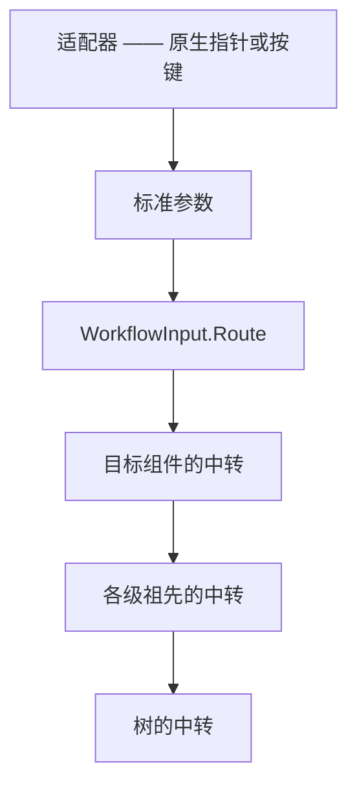

# 工作流系统 — GUI 输入：被路由的输入面

一套标准的指针与键盘输入面，让宿主把一次交互**只写一遍**，而不是每家 GUI 各写一遍。适配器决定**命中了什么**（它自己的手势逻辑早就知道），把事件交给 `WorkflowInput`；Core 决定**谁该听到** —— 目标先，然后它的祖先，每一级看到的是同一个参数实例。

Core 在路由上**不做任何动作**。删连线、点亮连线、弹菜单都是宿主的，写在看得见、改得动的地方。

源码：`Src/Core/VeloxDev.Core/WorkflowSystem/GUI/Events/Input/*.cs`（那 15 个类型）、`GUI/Events/WorkflowInput.cs`（路由）。



## `WorkflowInput` —— 入口

**签名：** `public sealed class WorkflowInput`（`GUI/Events/WorkflowInput.cs:31`）。一棵树一个实例，首次使用时创建，随树存活。

| 成员 | 签名 | 说明 |
|---|---|---|
| `For` | `static WorkflowInput For(IWorkflowTreeViewModel tree)` | 取这棵树的实例的唯一入口（`:49`） |
| 构造函数 | `WorkflowInput(IWorkflowTreeViewModel tree)` | `null` 抛 `ArgumentNullException`（`:42`） |
| `Tree` | `IWorkflowTreeViewModel` | （`:56`） |
| `Route` | `void Route(PointerEventArgs e)` / `void Route(KeyEventArgs e)` | 展开目标的祖先链并沿链派发（`:90,104`） |
| `PointerTarget` | `IWorkflowViewModel?` | 指针落在哪个组件上 —— 这是路由持有的唯一状态（`:62`） |
| `HoveredLink` | `IWorkflowLinkViewModel?` | 即 `PointerTarget as IWorkflowLinkViewModel`（`:65`） |
| `HitRadius` | `double` | 曲线的命中半径；默认 `LinkHitTestEx.DefaultHitRadius`（`:71`） |
| `IsSuspended` | `bool` | 宿主菜单打开时置位，指针跟踪停止（`:78`） |

**路由顺序。** 目标先派发，然后逐级祖先直到树。链上每个元素看到的是**同一个参数实例** —— 所以一次动作只有一个 `WorkflowEventHandle`，祖先也能读到更靠近目标的那一级做了什么决定。

## `IInputEvents` / `InputRelay`

**签名：** `public interface IInputEvents { InputRelay Input { get; } }`（`Input/IInputEvents.cs`）。四个 Helper（`TreeHelper<T>`、`NodeHelper<T>`、`SlotHelper<T>`、`LinkHelper<T>`）都实现了它，宿主这样订阅：

```csharp
((IInputEvents)link.GetHelper()).Input.PointerEntered += OnLinkEntered;
```

这个能力**刻意不是** `IWorkflow…ViewModelHelper` 的成员：往那个接口加成员会打断每一个现有实现者，而且一个对输入毫无兴趣的 Helper 不该为它负责。

| `InputRelay` 事件 | 参数 |
|---|---|
| `PointerEntered` / `PointerExited` / `PointerMoved` / `PointerPressed` / `PointerReleased` | `PointerEnteredEventArgs` 及其同族 |
| `PointerWheelChanged` | `PointerWheelEventArgs` |
| `KeyDown` / `KeyUp` | `KeyDownEventArgs` / `KeyUpEventArgs` |

`sender` 是这个中转，订阅者据此判断自己听到的是链上的哪一级。

## 那十五个类型

| 组 | 类型 |
|---|---|
| 能力接口 / 中转 | `IInputEvents`、`InputRelay` |
| 指针 | `PointerEventArgs` + `PointerEntered` / `PointerExited` / `PointerMoved` / `PointerPressed` / `PointerReleased` / `PointerWheel` 六个 args |
| 键盘 | `KeyEventArgs`、`KeyDownEventArgs`、`KeyUpEventArgs`、`InputKey` |
| 值类型 | `MouseButton`、`InputModifiers` |

### `PointerEventArgs`（抽象）

| 成员 | 类型 | 说明 |
|---|---|---|
| `Position` | `Anchor` | 表面坐标；它的 `Layer` 是**来源视图**的图层 —— 指针本身没有图层 |
| `Modifiers` | `InputModifiers` | |
| `Source` | `object?` | 输入来自哪个视图；这就是过去的事件 `sender` |
| `Target` | `IWorkflowViewModel?` | 适配器把指针解析到哪个组件上；空白画布上是 `null`。链上**每一级**看到的都是这个同一个值 —— 祖先看到的是最初的目标，不是它自己 |
| `Handle` | `WorkflowEventHandle` | |

子类追加的成员：`PointerPressedEventArgs` 与 `PointerReleasedEventArgs` → `Button`（`MouseButton`）、`ClickCount`（`int`）；`PointerWheelEventArgs` → `DeltaX`、`DeltaY`（`double`）。`PointerEntered` / `Exited` / `Moved` 不追加任何成员。

### `KeyEventArgs`（抽象）

| 成员 | 类型 | 说明 |
|---|---|---|
| `Key` | `InputKey` | 本枚举叫不出名字时是 `Unknown` |
| `RawKeyCode` | `int` | 平台自己的键码 —— **跨适配器不可比** |
| `Modifiers` | `InputModifiers` | 即使 `Key` 是 `Unknown` 也精确，所以 Ctrl + 一个未映射键仍然可分辨 |
| `IsRepeat` | `bool` | 平台报的是自动重复，而非新的一次按下 |
| `Source` / `Target` / `Handle` | | `Target` 是适配器判定该按键作用于谁 —— 对 `Delete` 就是指针所在的组件 |

按下与抬起是**两个独立事件**，不是一次动作的两个阶段。

### `MouseButton` / `InputModifiers` / `InputKey`

| 类型 | 成员 |
|---|---|
| `MouseButton` | `None`、`Left`、`Right`、`Middle`、`XButton1`、`XButton2`。滚轮**刻意不是**按钮 —— 它有自己的事件 |
| `InputModifiers` | `[Flags]`：`None`、`Alt`、`Control`、`Shift`、`Meta` |
| `InputKey` | 一个精选子集（约 66 个成员），拼写对齐 `Avalonia.Input.Key` —— 编辑与导航键、功能键行、字母与数字。其余一律 `Unknown`，而 `RawKeyCode` 仍带着平台的键码 |

## 那个句柄

`WorkflowEventHandle` 由整条链共用 —— 一次动作一个：

| 标志 | 效果 |
|---|---|
| `PreventDefault` | 框架自己那一手不执行。对 `Delete` 而言就是「这一次按下不删」。 |
| `StopPropagation` | 事件到此为止，祖先一个都收不到。 |

两个标志都不设时，行为与它们出现之前逐字相同。

## 别名纪律（平台层）

在 `Src/Adapters/`、`Src/Templates/` 与 `Examples/` 里，这十五个名字**一律走别名**，不留裸名：

```csharp
using Wf = VeloxDev.WorkflowSystem;          // Core 侧   → Wf.PointerPressedEventArgs
using PlatformInput = <平台输入命名空间>;      // 平台侧     → PlatformInput.PointerEventArgs
```

**为什么**：适配器的命名空间是 `VeloxDev.WorkflowSystem.AttachedBehaviors` —— Core 命名空间的**下级**。C# 查名字是从最内层命名空间往外走、`using` 最后才轮到，所以**外层命名空间里声明的同名类型静默胜出**。这里**不会**报 CS0104 歧义，而是在很远处表现为 `CS1061`（「不含 `GetPosition`」）、`CS0019`（「运算符 `!=` 无法应用于 `MouseButton` 和 `MouseButton`」）或 `CS0115`（「没有找到适合的方法来重写」）。去掉前缀那次改名，第一次全量构建实测 **134 个错误、11 个文件**，没有一条指向真正的原因。

每个碰到这十五个之一的文件都**同时声明两个别名** —— **哪怕某个别名在本文件里用不上**。判据不是「这个名字在这里冲不冲突」，而是「这一层不留裸名，读的人不必先推一遍解析规则」。

这十五个之外的名字（`WorkflowInput`、`WorkflowEventHandle`、`Anchor`、`IWorkflow…ViewModel` 这一族，以及按组件定制的事件族 `IWorkflowNodeEvents` / `IWorkflowSlotEvents` / `IWorkflowTreeEvents`）保持**裸名**。
