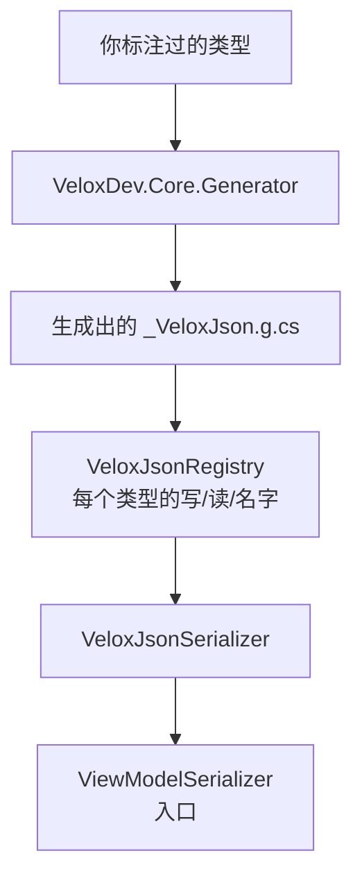

# 序列化 — API 参考

`VeloxDev.Serialization` 是一个**独立的模块**，不是工作流的子话题：它为**任意**视图模型归档，工作流只是它的调用方之一。引擎随 **`VeloxDev.Core`** 发布；只有两种文档住在 `VeloxDev.Core.Extension` 里、同属这个命名空间 —— 编译后的图，和一次运行的检查点。

源码：`Src/Core/VeloxDev.Core/Serialization/*.cs`（引擎、标注、`ViewModelSerializer`）、`Src/Core/VeloxDev.Core.Extension/CompiledGraphEx.cs`、`CheckpointEx.cs`。

**一句话说清设计**：闭世界、零反射。只有当源生成器为某个类型编出了读写器，它才会被写出去（`Src/Core/VeloxDev.Core/Serialization/VeloxJsonSerializer.cs:21`）。生成器没见过的类型会**带着说明报错**，而不是写成一个空壳 —— 这正是这套引擎对裁剪与 AOT 友好的前提。



---

## 作者要满足什么

进入闭世界有四条路，任一条即可（`Src/Generators/VeloxDev.Core.Generator/Base/VeloxJsonModel.cs:588-614`）：

| 进入方式 | 适用于 |
|---|---|
| 实现 `IWorkflowTreeViewModel` / `IWorkflowNodeViewModel` / `IWorkflowSlotViewModel` / `IWorkflowLinkViewModel` | 四个工作流组件 |
| 带一个 `[WorkflowBuilder.*]` 特性 | 由模板生成出来的组件 |
| 有一个 `[VeloxProperty]` **字段** | 你自己的 ViewModel —— 此时类必须是 `partial` |
| 贴 `[Archivable]` | 普通文档类型 —— 不需要 `partial` |

```csharp
// ViewModel 那条路。出处：Src/Core/VeloxDev.Core.Extension.Test/Serialization/ViewModelSerializerContractTests.cs:23-26
internal sealed partial class ContractModel
{
    [VeloxProperty] private int count;
}

// 文档类型那条路。出处：Src/Core/VeloxDev.Core/WorkflowSystem/CompilerEx/Runtime/Model/ExecutionCheckpoints.cs:27-28
[Archivable]
public sealed class ExecutionCheckpoint
```

**成员收录规则** —— public 且带 public setter 的属性，按声明顺序；`[VeloxProperty]` 提升出来的字段排其后；继承成员最后（`Base/VeloxJsonModel.cs:912-1025`）。这个顺序是格式的**逐字节契约**。

生成器只在消费方程序集**引用了 `VeloxDev.MVVM`** 时才运行（`Base/VeloxJsonModel.cs:333`）；MSBuild 属性 `VeloxJsonSerialization=false` 可以整个关掉它（`Src/Generators/VeloxDev.Core.Generator/VeloxJson.cs:34`）。

---

## `ViewModelSerializer` —— 入口

**签名：** `public static class ViewModelSerializer`（`Serialization/ViewModelSerializer.cs:55`）。所有方法都带约束 `where T : INotifyPropertyChanged`。

| 成员 | 签名 | 说明 |
|---|---|---|
| `Serialize` | `string Serialize<T>(this T workflow)` / `(this T workflow, SerializationOptions options)` | `ViewModelSerializer.cs:109,114` |
| `Deserialize` | `T Deserialize<T>(this string json)` / `(this string json, SerializationOptions options)` | 空白文本抛 `ArgumentException`；结果为 `null` 抛 `InvalidOperationException`（`:151,161`） |
| `TryDeserialize` | `bool TryDeserialize<T>(this string json, out T? workflow)` / `(…, SerializationOptions, out T?)` | 不抛异常的版本 —— null、空白、畸形文本一律 `false`（`:122,138`） |
| `DeserializeToType` | `object? DeserializeToType(this VeloxJsonValue value, Type targetType)` | `IsNull` 时得 `null`（`:97`） |
| 异步 | `SerializeAsync<T>(…)` / `DeserializeAsync<T>(…)` | 各带 `CancellationToken = default`，入口即检查（`:173-208`） |
| 文本/流 | `SerializeToTextWriter`、`SerializeToStream`、`DeserializeFromTextReader`、`DeserializeFromStream` | 返回 `T?`；同步版 `DeserializeFromTextReader` 遇 null 文档返回 `null`（`:222-274`） |
| UTF-8 字节 | `SerializeToUtf8Bytes`、`DeserializeFromUtf8Bytes`（含异步） | （`:286-311`） |
| 异步文本/流 | `SerializeToTextWriterAsync`、`DeserializeFromTextReaderAsync`、`SerializeToStreamAsync`、`DeserializeFromStreamAsync` | ⚠️ 异步读**遇 null 文档抛** `InvalidOperationException`，而同步版返回 `null` —— 由 `ViewModelSerializerContractTests.cs:159-170` 钉住 |

---

## `SerializationOptions`

**签名：** `public sealed class SerializationOptions`（`ViewModelSerializer.cs:19`）。它**就地改自己并返回 `this`**。

| 成员 | 签名 | 说明 |
|---|---|---|
| `Create()` | `static SerializationOptions Create()` | `:25` |
| `WithIndented()` | `SerializationOptions` | `VeloxJsonFormat.Indented`（`:28`） |
| `WithCompact()` | `SerializationOptions` | `VeloxJsonFormat.Compact`（`:31`） |
| `WithExcludedPropertyTypes(params Type[])` | `SerializationOptions` | 按**声明类型精确匹配**整批排除 —— `CompiledGraphEx` 靠它阻止写者沿着引用走出图外（`:44`） |

Newtonsoft 时代那三个开关（`WithTypeNameHandling`、`WithNullValueHandling`、`WithDefaultValueHandling`）**已不存在**。类型信息现在只在运行期类型与声明类型不同时才写；null/默认值的处理下沉成了逐成员的 `[JsonIgnore(Condition = …)]`。

---

## 标注

| 特性 | 可标于 | 签名 | 作用 |
|---|---|---|---|
| `ArchivableAttribute` | class、struct | `ArchivableAttribute(params Type[] additionalRoots)` | 把一个生成器本来看不见的类型打开。点名的类型必须**同程序集**，否则生成器报 `VELOX_JSON_ARCH001`。`AdditionalRoots` 以 `IReadOnlyList<Type>` 暴露（`Annotations/ArchivableAttribute.cs:32-41`） |
| `ArchiveAttribute` | property、field | `ArchiveAttribute(ArchiveOptions options, object? argument = null)` | 只改**被标的这一个成员**的取/舍/名，**从不重排**其余成员（`Annotations/ArchiveAttribute.cs:22-41`） |

`ArchiveOptions` 是 `[Flags]` 枚举（`Annotations/ArchiveOptions.cs:13`）：

| 标志 | 值 | 含义 |
|---|---|---|
| `None` | 0 | 不改 |
| `KeepProperty` | 1 | 放行没有 public setter 的计算属性 —— 写得出去，但**读不回来** |
| `KeepField` | 2 | 放行没有对应属性的字段 |
| `IgnoreField` | 4 | 整个排除该成员 |
| `ReName` | 8 | 用 `ArchiveAttribute.Argument` 里的名字写出（须为非空 `string`） |
| `EnumName` | 16 | 让**这一个枚举成员**按值名写出，而不是底层整数 |

`[JsonIgnore]`（System.Text.Json 的那个）被完整尊重，连 `Condition` 一起；BCL 的四个生命周期回调（`[OnSerializing]`、`[OnSerialized]`、`[OnDeserializing]`、`[OnDeserialized]`）也会被调用 —— 它们至少要是 `internal`，跨程序集时必须 `public`（`Base/VeloxJsonModel.cs:897`）。

---

## `CompiledGraphEx` —— 编译图当成文档

**签名：** `public static class CompiledGraphEx`（`Src/Core/VeloxDev.Core.Extension/CompiledGraphEx.cs:44`）

| 成员 | 签名 | 说明 |
|---|---|---|
| `SerializeCompiledGraph` | `string SerializeCompiledGraph(this CompiledGraph graph, bool includeTree = false, SerializationOptions? options = null)` | `graph` 为 null 抛 `ArgumentNullException`（`:68`） |
| `DeserializeCompiledGraph` | `CompiledGraph? DeserializeCompiledGraph(this string json)` | （`:84`） |

| 模式 | `includeTree` | 保留 | 代价 |
|---|---|---|---|
| **快照**（默认） | `false` | 段结构 + 每个节点自己的状态。丢掉 `IWorkflowTreeViewModel` 与 `ObservableCollection<IWorkflowSlotViewModel>` 属性。 | **不能再挂回画布**：还原出来的节点没有 `Parent`，没有东西会为缩放重新折叠它们的几何。 |
| **连树一起** | `true` | 全部，还原的图能放回画布。 | 整棵树加整个连通分量 —— 而且节点的 `Parent` 是**另一棵**新造的树。 |

还原出来的节点一定拿到**全新的 `RuntimeId`**，也**不带任何编译身份**；唯一的例外是 router 的枚举分支键，它在加载时由 `CompileKeyNormalizer` 复原。

---

## `CheckpointEx` —— 一次运行的位置

**签名：** `public static class CheckpointEx`（`Src/Core/VeloxDev.Core.Extension/CheckpointEx.cs:42`）

| 成员 | 签名 | 说明 |
|---|---|---|
| `SerializeCheckpoint` | `string SerializeCheckpoint(this ExecutionCheckpoint checkpoint)` | 始终缩进 —— 它是一个可能被人打开的文件（`:48`） |
| `DeserializeCheckpoint` | `ExecutionCheckpoint? DeserializeCheckpoint(this string json)` | 文本为空或不是检查点时返回 `null`（`:57`） |

## `FileCheckpointStore`

**签名：** `public sealed class FileCheckpointStore : IExecutionCheckpointStore`（`CheckpointEx.cs:86`）

| 成员 | 签名 | 说明 |
|---|---|---|
| 构造函数 | `FileCheckpointStore(string path)` | 空白抛 `ArgumentNullException`（`:93`） |
| `Path` | `string` | 这个 store 读写的文件（`:100`） |
| `SaveAsync` | `Task SaveAsync(ExecutionCheckpoint checkpoint, CancellationToken ct)` | 覆盖文件内容；首次保存时建目录（`:103`） |
| `LoadAsync` | `Task<ExecutionCheckpoint?> LoadAsync(CancellationToken ct)` | 文件不存在或解析不出时返回 `null`（`:129`） |

写操作由一把 `SemaphoreSlim` 串行化 —— 两个扇出分支的 `await` 足以交错，两个写者同时写一个文件就会把字节搅在一起。`net8.0` 及以上走异步写，更旧的档同步写。

---

## 引擎层类型

它们是 public 的，因为**生成的代码要调用它们**；但那是生成代码的契约，不是给人手调的接口。

| 类型 | 职责 |
|---|---|
| `VeloxJsonSerializer` | 门面：`Serialize`、`WriteTo(TextWriter/Stream)`、`Deserialize<T>` / `Deserialize(json, Type)`、`ReadValue`、`ReadArray`、`ReadMap`、`WriteMap`，以及各自的异步孪生（`Serialization/VeloxJsonSerializer.cs:21` 与 `.Async.cs:13`） |
| `VeloxJsonReader` | 一份文档上的游标 —— 对象协议（`BeginObject`/`NextMember`/`FinishObject`）、数组游标、引用解析、类型化读取（`Serialization/VeloxJsonReader.cs:27`） |
| `VeloxJsonWriter` | 逐字节写出该格式：引用 id、类型标签、缩进、分隔、数字拼写（`Serialization/VeloxJsonWriter.cs:32`） |
| `VeloxJsonRegistry` | 编译期事实表 —— writer、reader、名字↔类型、容器工厂。由生成的 `[ModuleInitializer]` 填充；查找无锁（`Serialization/VeloxJsonRegistry.cs:98`） |
| `VeloxJsonValue` | 内存内的 JSON 树（标量/数组/对象），给「构造结果」而非「构造文档」的调用方用 —— Agent 工具的输出就是经它渲染的（`Serialization/VeloxJsonValue.cs:37`） |
| `VeloxJsonText` | **internal** —— 字符串转义与 `double` 拼写的唯一权威（`Serialization/VeloxJsonText.cs:13`） |

**注册表的归属规则**：声明方永远注册得上；消费方只能补空缺，**不能覆盖**已有条目（`VeloxJsonRegistry.cs:195,215`）。是生成器通过 `declaresType` **说出**自己属于哪种情况，而不是让注册表去猜。

---

## 这个格式**不是**什么

它**不能**和 `System.Text.Json` 或 Newtonsoft 互通。三处结构性差异：类型判别符的值就是注册表键（泛型名带类型实参，嵌套层用 `+` 连接）、集合形状由声明类型决定、成员集来自生成器而非反射。外来的类型标签解析不出来，读侧会**静默退回声明类型** —— 对具体类来说等于丢掉多态，对接口或抽象类型则抛 `MissingReader`。

还有两条被测量过的行为值得知道：

- **数字穿过 `object` 成员时不保类型。** JSON 只有一种整数：进去的 `int` 回来是 `long`，`float` 回来是 `double`。引擎自己的字段是精确的；而一个在载荷上对 `int` 做模式匹配的节点，恢复之后匹配不上。
- **无类型成员是降级而非失败。** 声明为 `object` 的成员读回来是一个 JSON 字典，不是原来的类型。
