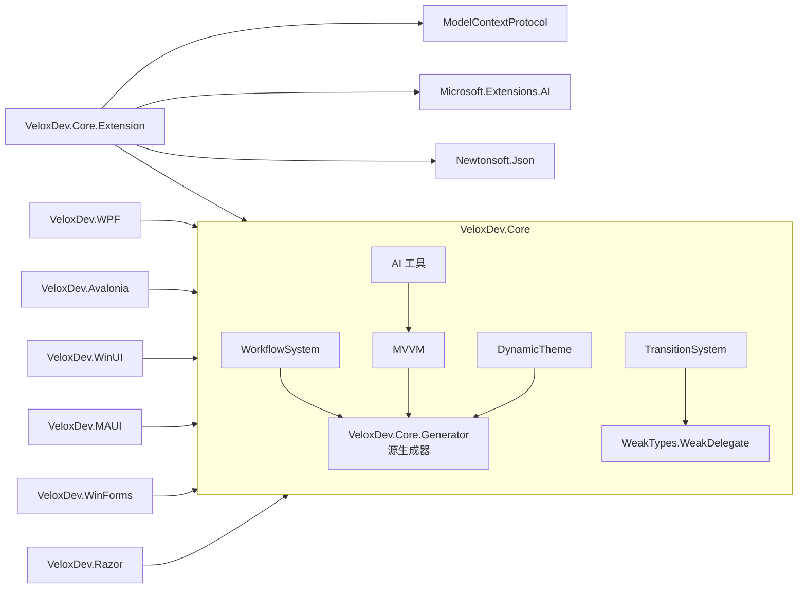

# 00 · 文件结构

## 仓库布局

```
VeloxDev/
├── Src/
│   ├── Core/
│   │   ├── VeloxDev.Core/                 ← 核心引擎（多目标框架）
│   │   │   ├── WorkflowSystem/            ← 工作流编辑器：Templates、StandardEx、CompilerEx、SelectorEx
│   │   │   ├── TransitionSystem/          ← 动画引擎 + NativeSamplers/
│   │   │   ├── DynamicTheme/              ← 主题切换（ThemeManager、ThemeCache）
│   │   │   ├── MVVM/                      ← VeloxProperty/VeloxCommand 运行时 + IVeloxCommand
│   │   │   ├── AspectOriented/            ← AOP 代理（#if NET）
│   │   │   ├── AI/                        ← 代理属性 + 反射工具
│   │   │   ├── TimeLine/                  ← MonoBehaviour 帧循环（MonoBehaviourManager）
│   │   │   ├── WeakTypes/                 ← WeakQueue/WeakStack/WeakCache/WeakDelegate
│   │   │   └── Interfaces/                ← 公共 API 契约（WorkflowSystem、TransitionSystem、...）
│   │   ├── VeloxDev.Core.Extension/       ← 工作流代理（AI.Workflow）、MCP、ComponentModelEx 序列化
│   │   ├── VeloxDev.Core.Test/            ← MSTest 单元测试
│   │   └── VeloxDev.Core.Extension.Test/  ← 扩展单元测试
│   ├── Adapters/                          ← 各 GUI 适配器
│   │   ├── VeloxDev.WPF/                  ← WPF（Attached/Workflow 行为、PlatformAdapters）
│   │   ├── VeloxDev.Avalonia/             ← Avalonia
│   │   ├── VeloxDev.WinUI/                ← WinUI 3
│   │   ├── VeloxDev.MAUI/                 ← .NET MAUI
│   │   ├── VeloxDev.WinForms/             ← Windows Forms
│   │   └── VeloxDev.Razor/                ← Razor / Blazor
│   ├── Generators/
│   │   └── VeloxDev.Core.Generator/       ← Roslyn 源生成器（WorkflowBuilder、MVVM、Command、AOP、Theme、MonoBehaviour）
│   └── Templates/                         ← dotnet new 项模板（WPF/Avalonia/WinUI/MAUI/WinForms/Razor）
├── Examples/                              ← 示例（主要证据）
│   ├── Workflow/   WPF · Avalonia · WinUI · MAUI · WinForms · Blazor + Common/Lib
│   ├── Transition/ WPF · Avalonia · WinUI · WinForms · MAUI · Blazor
│   ├── Theme/      WPF · Avalonia
│   ├── MVVM/       WPF · Avalonia
│   ├── AOP/        WPF · Avalonia
│   └── MonoBehaviour/ WPF
├── Docs/
│   └── VeloxDev.Docs/                     ← CloudGlyph Wiki 仓库（内容、技能、应用）
├── Assets/                                ← 共享资源
├── TestResults/                           ← 测试输出
└── VeloxDev.slnx
```

## 项目到文件夹映射

| 项目 | 路径 | 职责 |
|---|---|---|
| `VeloxDev.Core` | `Src/Core/VeloxDev.Core` | 所有功能核心；多目标 `netstandard2.0; netframework4.6.1; net5.0; netcoreapp3.0` |
| `VeloxDev.Core.Extension` | `Src/Core/VeloxDev.Core.Extension` | 工作流代理（AI 工具）、MCP 作用域、JSON 序列化（`netstandard2.0`） |
| `VeloxDev.Core.Generator` | `Src/Generators/VeloxDev.Core.Generator` | Roslyn 增量生成器（analyzer 包，`netstandard2.0`） |
| `VeloxDev.WPF` | `Src/Adapters/VeloxDev.WPF` | WPF 适配器（`UseWPF`） |
| `VeloxDev.Avalonia` | `Src/Adapters/VeloxDev.Avalonia` | Avalonia 适配器 |
| `VeloxDev.WinUI` | `Src/Adapters/VeloxDev.WinUI` | WinUI 3 适配器（`UseWinUI`） |
| `VeloxDev.MAUI` | `Src/Adapters/VeloxDev.MAUI` | .NET MAUI 适配器（`UseMaui`） |
| `VeloxDev.WinForms` | `Src/Adapters/VeloxDev.WinForms` | Windows Forms 适配器（`UseWindowsForms`） |
| `VeloxDev.Razor` | `Src/Adapters/VeloxDev.Razor` | Razor/Blazor 适配器（Razor SDK） |
| `VeloxDev.*.Templates` | `Src/Templates` | `dotnet new` 项模板 |

## 适配器内部布局（以 `VeloxDev.Avalonia` 为例）

```
VeloxDev.Avalonia/
├── Attached/Workflow/               ← XAML 附加行为（命名空间 VeloxDev.WorkflowSystem.AttachedBehaviors）
│   ├── WorkflowSurfaceBehavior.cs   ← 表面宿主、平移、视口 → Helper.Viewport
│   ├── WorkflowNodeDragBehavior.cs  ← 拖拽 → MoveCommand
│   ├── WorkflowSlotConnectionBehavior.cs ← 指针按下/抬起 → Send/ReceiveConnectionCommand
│   ├── WorkflowSlotLayoutBehavior.cs ← 布局后重算槽锚点
│   ├── WorkflowCanvasTransformBehavior.cs
│   ├── ViewPool.cs / ViewManager.cs ← 池化虚拟化 ItemsSource
│   ├── WorkflowMinimapOverlay.cs
│   └── IWorkflowGridDecorator.cs / IWorkflowMinimapOverlay.cs
├── PlatformAdapters/                ← 过渡/主题平台接线
│   ├── Interpolator.cs
│   ├── Samplers/                    ← 按类型采样器（+ FrameUpdaters/ 供 WPF/Jalium 原地修改）
│   ├── Transition.cs / TransitionScheduler.cs / TransitionInterpreter.cs
│   ├── TransitionEffect.cs / TransitionEffects.cs / State.cs
│   ├── ThemeValueConverters.cs
│   └── UIThreadInspector.cs
└── GlobalUsings.cs
```

## 核心引擎依赖


