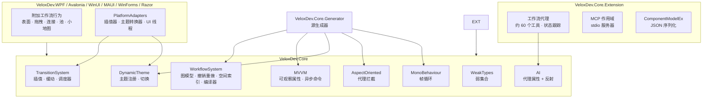

# 01 · 功能结构

## 功能 → 项目 → 依赖

Wiki 围绕**功能**而非目录组织。功能是项目对外暴露的一组内聚能力——可独立描述、使用和验证。下表是跨「快速开始、API、SE 分析」三个维度使用的权威映射。

| 功能 | 所属项目 | 公共 API 面（摘要） | 依赖 | 证据 |
|---|---|---|---|---|
| **工作流系统** | `VeloxDev.Core`（序列化来自 `VeloxDev.Core.Extension`） | `[WorkflowBuilder.*]`、`IWorkflowTreeViewModel` 家族、`CompilerEx`、`SelectorEx`、`StandardEx`、`SpatialGridHashMap` | Roslyn 生成器 | Demo + Test |
| **工作流代理** | `VeloxDev.Core.Extension` | `WorkflowAgentScope`、`WorkflowAgentToolkit`（约 60 个工具）、`McpScope`、`VeloxDev.AI` | `Microsoft.Extensions.AI`、`ModelContextProtocol` | Test + README + Demo |
| **MVVM** | `VeloxDev.Core` | `VeloxPropertyAttribute`、`VeloxCommandAttribute`、`VeloxCommand`、`IVeloxCommand` | Roslyn 生成器 | Demo + Test |
| **过渡动画** | `VeloxDev.Core` + 适配器 | `Eases`、`Transition<T>`、`InterpolatorCore`、`TransitionSchedulerCore`、原生插值器 | `System.Numerics`、`System.Drawing` | Demo + Test |
| **动态主题** | `VeloxDev.Core` + 适配器 | `ThemeManager`、`ThemeConfigAttribute`、`IThemeObject`、转换器 | 过渡引擎 | Demo + Test |
| **AOP** | `VeloxDev.Core`（`#if NET`） | `ProxyEx`、`ProxyInstance`、`AopCache`、`IAspectOriented` | `DispatchProxy`、生成器 | Demo + Test |
| **MonoBehaviour** | `VeloxDev.Core` | `MonoBehaviourManager`、`MonoBehaviourAttribute`、`IMonoBehaviour` | Roslyn 生成器 | Demo + Test |
| **弱引用类型** | `VeloxDev.Core` | `WeakDelegate`、`WeakQueue`、`WeakStack`、`WeakCache` | — | Test |
| **平台适配器** | 6 个适配器 + `Src/Templates` | 附加工作流行为、各平台过渡/主题接线、`dotnet new` 模板 | 各框架 SDK | README + Demo + 源码 |

## 模块职责边界

## 入口点

| 场景 | 入口类型 | 位置 |
|---|---|---|
| 构建工作流编辑器 | `tree.AsAgentScope()` / `[WorkflowBuilder.Tree<T>]` | `Examples/Workflow/Common/Lib` |
| 为属性做动画 | `target.Snapshot(...)` / `Transition.Execute(...)` | `Examples/Transition/*` |
| 切换主题 | `ThemeManager.Transition<Light>(...)` | `Examples/Theme/*` |
| 运行异步命令 | 分部方法上的 `[VeloxCommand]` | `Examples/MVVM/*` |
| 拦截节点执行 | `ProxyEx.CreateProxy(...)` + `SetProxy(...)` | `Examples/AOP/*` |
| 基于 tick 的模拟 | `[MonoBehaviour]` + `MonoBehaviourManager.Start()` | `Examples/MonoBehaviour/*` |
| 安装预制视图 | `dotnet new wpf-v-node -n NodeView ...` | `Src/Templates` |
