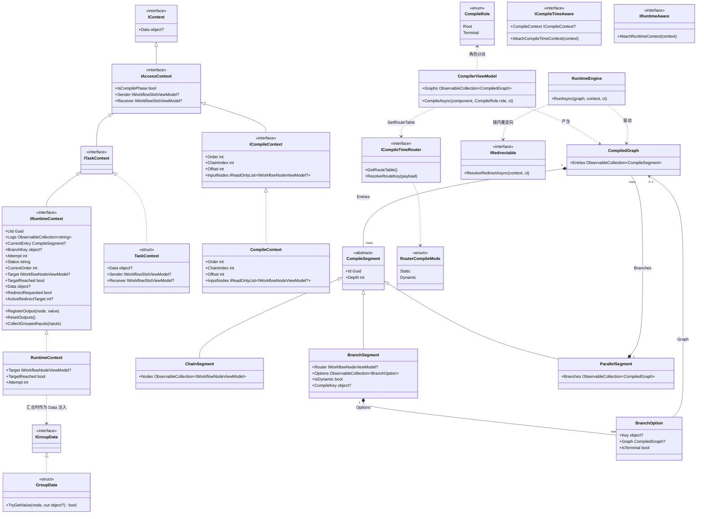
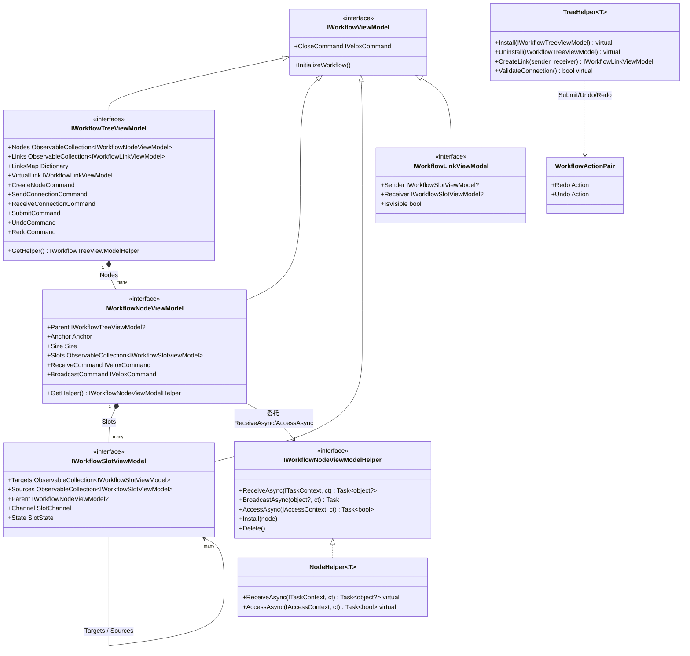
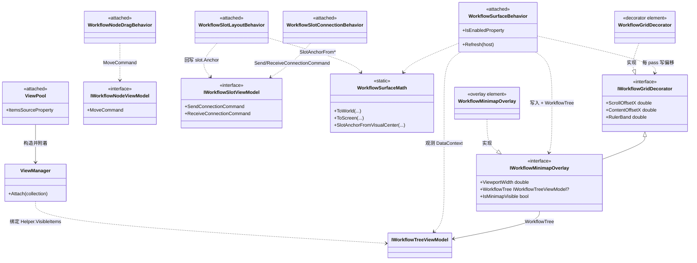

# Workflow System — 设计模式 — 类图

三张 Mermaid 类图刻画当前架构。图 A 是**核心 / 执行模型**（CompilerEx 编译→运行机制与贯穿每个节点的上下文体系）；图 B 是**组件模型**（VM 接口 + Helper + 对外拓扑）；图 C 是**适配器 / 附加行为侧**（各框架画布如何承载该 VM 树）。每个类型均存在于真实源码，来源见各图后的路径。

## A. 核心 / 执行模型（CompilerEx）

`CompilerViewModel.CompileAsync(node, CompileRole)` 是统一编译入口：固定每个节点的身份（Order）并经 `AccessAsync` 做静态边校验；`RuntimeEngine.RunAsync` 随后以运行时会话驱动不可变段。

来源：`CompilerEx/Compile/CompilerViewModel.cs`（第 24-57 行入口、第 59-232 行正向分解）、`CompilerEx/Compile/CompilerViewModel.Reverse.cs`（祖先锥编译）、`CompilerEx/Runtime/RuntimeEngine.cs`、`CompilerEx/Compile/Model/*.cs`、`CompilerEx/Runtime/Model/*.cs`、`Interfaces/WorkflowSystem/IContext.cs`、`IAccessContext.cs`、`ITaskContext.cs`、`WorkflowSystem/TaskContext.cs`。演示实现 `ControllerViewModel`/`EnumSelectorNodeViewModel` 在 `Examples/Workflow/Common/Lib/ViewModels/Workflow/`。

## B. 组件模型（VM 接口 + Helper）

编辑器树由四个 VM 接口组成；每个接口配对一个*Helper*（模板方法 / 命令模式）。节点暴露编译器消费的拓扑：`Slots` → `Targets`/`Sources` 边。

来源：`Interfaces/WorkflowSystem/IWorkflow*.cs`、`Templates/Helpers/TreeHelper.cs`、`Templates/Helpers/NodeHelper.cs`、`Templates/WorkflowBuilder.cs`。

## C. 适配器 / 附加行为侧（attached behaviors）

每套 GUI 适配器（WPF / WinUI / MAUI / WinForms / Avalonia / Jalium / Razor）都以**并行实现**的附加行为把上述 VM 树接到各自画布，共享命名空间 `VeloxDev.WorkflowSystem.AttachedBehaviors`。附加行为是“适配器”：消费 Core VM 的命令，并把界面位移回写为 Core 几何。

`WorkflowSurfaceBehavior`（×7）是画布协调器：从宿主 `DataContext as IWorkflowTreeViewModel` 读取 VM，每 pass 推送 `tree.GetHelper().Viewport` + `Layout.ViewportOffset`、调 `tree.SetVirtualizeInset(left: ruler, top: ruler)`，并把位移写入实现 `IWorkflowGridDecorator`/`IWorkflowMinimapOverlay` 的命名部件。手势行为消费 Core 命令：拖拽 → `MoveCommand`，连线 → `Send/ReceiveConnectionCommand`（配合 `SetPointerCommand`/`ResetVirtualLinkCommand`），槽布局 → 用 `WorkflowSurfaceMath.SlotAnchorFrom*` 回写 `slot.Anchor`。`ViewPool` → `ViewManager` 是对象池/视图物化器：`ItemsSource` 绑定 `Helper.VisibleItems`，按运行时类型复用视图并以其 `Anchor`/`Size` 定位。标尺装饰元素仅 Jalium 与 Razor 适配器自带（`WorkflowGridDecorator`），其余由宿主提供 `PART_GridDecorator` 命名部件；小地图元素在六个适配器实现 Core `IWorkflowMinimapOverlay`。

*代表源码：`Src/Adapters/VeloxDev.WPF/Attached/Workflow/*.cs`（`WorkflowSurfaceBehavior.cs` 第 12 行起、`ViewPool.cs` 第 12 行起、`ViewManager.cs` 第 13 行起、`WorkflowNodeDragBehavior.cs` 第 11 行起、`WorkflowSlotConnectionBehavior.cs` 第 8 行起、`WorkflowSlotLayoutBehavior.cs` 第 13 行起、`WorkflowMinimapOverlay.cs` 第 19 行起）；Core 契约 `Interfaces/WorkflowSystem/IWorkflowGridDecorator.cs`、`IWorkflowMinimapOverlay.cs`；坐标 `WorkflowSystem/GUI/Math/WorkflowSurfaceMath.cs`。*
