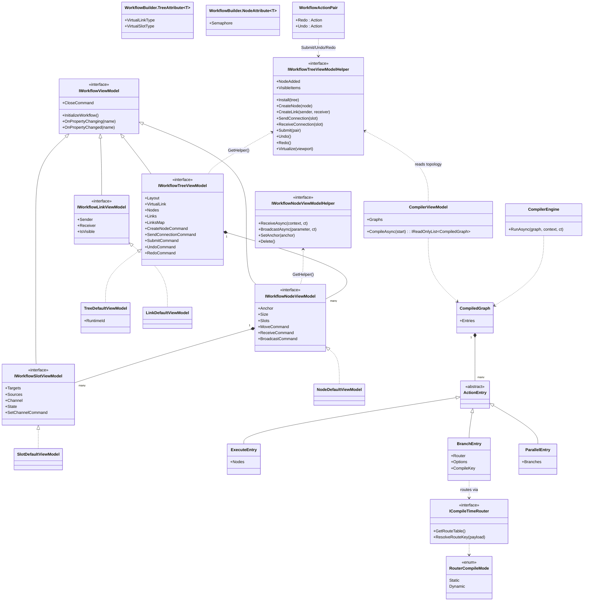

# Workflow System — 设计模式 — Class Diagram

```mermaid
classDiagram
    class IWorkflowViewModel {
        <<interface>>
        +InitializeWorkflow()
        +OnPropertyChanging(name)
        +OnPropertyChanged(name)
        +CloseCommand
    }
    class IWorkflowTreeViewModel {
        <<interface>>
        +Layout
        +VirtualLink
        +Nodes
        +Links
        +LinksMap
        +CreateNodeCommand
        +SendConnectionCommand
        +SubmitCommand
        +UndoCommand
        +RedoCommand
    }
    class IWorkflowTreeViewModelHelper {
        <<interface>>
        +NodeAdded
        +VisibleItems
        +Install(tree)
        +CreateNode(node)
        +CreateLink(sender, receiver)
        +SendConnection(slot)
        +ReceiveConnection(slot)
        +Submit(pair)
        +Undo()
        +Redo()
        +Virtualize(viewport)
    }
    class IWorkflowNodeViewModel {
        <<interface>>
        +Anchor
        +Size
        +Slots
        +MoveCommand
        +ReceiveCommand
        +BroadcastCommand
    }
    class IWorkflowNodeViewModelHelper {
        <<interface>>
        +ReceiveAsync(context, ct)
        +BroadcastAsync(parameter, ct)
        +SetAnchor(anchor)
        +Delete()
    }
    class IWorkflowSlotViewModel {
        <<interface>>
        +Targets
        +Sources
        +Channel
        +State
        +SetChannelCommand
    }
    class IWorkflowLinkViewModel {
        <<interface>>
        +Sender
        +Receiver
        +IsVisible
    }
    class TreeDefaultViewModel {
        +RuntimeId
    }
    class NodeDefaultViewModel
    class SlotDefaultViewModel
    class LinkDefaultViewModel
    class `WorkflowBuilder.TreeAttribute~T~` {
        +VirtualLinkType
        +VirtualSlotType
    }
    class `WorkflowBuilder.NodeAttribute~T~` {
        +Semaphore
    }
    class WorkflowActionPair {
        +Redo : Action
        +Undo : Action
    }
    class CompilerViewModel {
        +CompileAsync(start) : IReadOnlyList~CompiledGraph~
        +Graphs
    }
    class CompiledGraph {
        +Entries
    }
    class CompilerEngine {
        +RunAsync(graph, context, ct)
    }
    class ActionEntry {
        <<abstract>>
    }
    class ExecuteEntry {
        +Nodes
    }
    class BranchEntry {
        +Router
        +Options
        +CompileKey
    }
    class ParallelEntry {
        +Branches
    }
    class ICompileTimeRouter {
        <<interface>>
        +GetRouteTable()
        +ResolveRouteKey(payload)
    }
    class RouterCompileMode {
        <<enum>>
        Static
        Dynamic
    }

    IWorkflowViewModel <|-- IWorkflowTreeViewModel
    IWorkflowViewModel <|-- IWorkflowNodeViewModel
    IWorkflowViewModel <|-- IWorkflowSlotViewModel
    IWorkflowViewModel <|-- IWorkflowLinkViewModel
    IWorkflowTreeViewModel <|.. TreeDefaultViewModel
    IWorkflowNodeViewModel <|.. NodeDefaultViewModel
    IWorkflowSlotViewModel <|.. SlotDefaultViewModel
    IWorkflowLinkViewModel <|.. LinkDefaultViewModel
    IWorkflowTreeViewModelHelper <.. IWorkflowTreeViewModel : GetHelper()
    IWorkflowNodeViewModelHelper <.. IWorkflowNodeViewModel : GetHelper()
    IWorkflowTreeViewModel "1" *-- "many" IWorkflowNodeViewModel
    IWorkflowNodeViewModel "1" *-- "many" IWorkflowSlotViewModel
    IWorkflowTreeViewModelHelper <.. CompilerViewModel : reads topology
    CompilerViewModel ..> CompiledGraph
    CompiledGraph "1" *-- "many" ActionEntry
    ActionEntry <|-- ExecuteEntry
    ActionEntry <|-- BranchEntry
    ActionEntry <|-- ParallelEntry
    BranchEntry ..> ICompileTimeRouter : routes via
    ICompileTimeRouter ..> RouterCompileMode
    CompilerEngine ..> CompiledGraph
    WorkflowActionPair ..> IWorkflowTreeViewModelHelper : Submit/Undo/Redo
```
