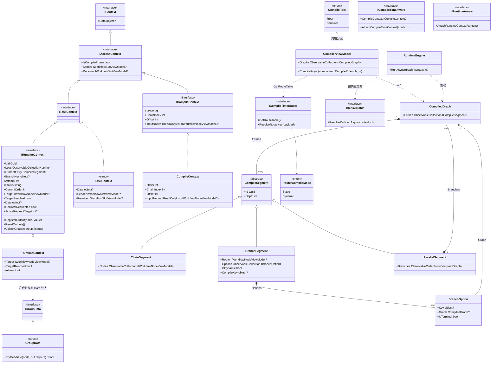

# Workflow System — 类图：核心 / 执行模型

## A. 核心 / 执行模型（CompilerEx）

`CompilerViewModel.CompileAsync(node, CompileRole)` 是统一编译入口：固定每个节点的身份（Order）并经 `AccessAsync` 做静态边校验；`RuntimeEngine.RunAsync` 随后以运行时会话驱动不可变段。

来源：`CompilerEx/Compile/CompilerViewModel.cs`（第 24-57 行入口、第 59-249 行正向分解）、`CompilerEx/Compile/CompilerViewModel.Reverse.cs`（祖先锥编译）、`CompilerEx/Runtime/RuntimeEngine.cs`、`CompilerEx/Compile/Model/*.cs`、`CompilerEx/Runtime/Model/*.cs`、`Interfaces/WorkflowSystem/IContext.cs`、`IAccessContext.cs`、`ITaskContext.cs`、`WorkflowSystem/TaskContext.cs`。演示实现 `ControllerViewModel`/`EnumSelectorNodeViewModel` 在 `Examples/Workflow/Common/Lib/ViewModels/Workflow/`。
