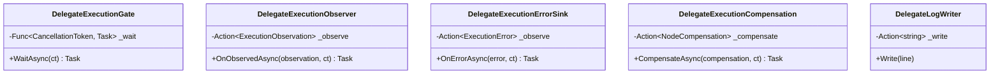

# 工作流系统 — 运行时能力层的类图

2026-09-27 加入的那一层，用类图表示。七个宿主接缝挂在具体的 `RuntimeContext` 上（而不是挂在 `IRuntimeContext` 上），每个都有随库实现；引擎经一个私有的 `Session()` 助手读取它们，该助手同时会拆开扇出分支的 `BranchRuntimeContext`。

这张图能看出两件成员表看不出的事：

- **左边的东西除开那几个小契约之外，不依赖右边的任何东西。** `RuntimeContext` 从不提到 `TextWriterLogWriter` 或 `ExponentialBackoffRetry`；`RuntimeEngine` 只提到接口。
- **`BranchRuntimeContext` 实现了 `IRuntimeContext`，但不带那些能力属性。** 它是扇出分支的门面，刻意只暴露 `Session`，好让引擎透过它拿到宿主真正的会话。

```mermaid
classDiagram
    class IRuntimeContext {
        <<interface>>
        +Uid Guid
        +Logs ObservableCollection~string~
        +Attempt int
        +Status string
        +Target IWorkflowNodeViewModel?
        +TargetReached bool
        +Data object?
        +RedirectRequested bool
        +EndedWithError bool
        +PendingRedirectTarget int?
        +ActiveRedirectTarget int?
        +RegisterOutput(node, value)
        +ResetOutputs()
        +CollectGroupedInputs(inputs) IReadOnlyDictionary
    }
    class RuntimeContext {
        +IsCompilePhase bool
        +ExecutionGate IExecutionGate?
        +Observer IExecutionObserver?
        +RetryPolicy INodeRetryPolicy?
        +ErrorSink IExecutionErrorSink?
        +Compensation IExecutionCompensation?
        +CheckpointStore IExecutionCheckpointStore?
        +LogWriter ILogWriter?
        +MaxRetainedLogs int?
        +MaxParallelBranches int?
        +Outcome RunOutcome
        +Next() int
        +LogWriteFailed event
        +SnapshotLogs() string[]
        +Snapshot() ExecutionCheckpoint
    }
    class BranchRuntimeContext {
        <<internal>>
        +IsCompilePhase bool
        +Data object?
        +RedirectRequested bool
        +PendingRedirectTarget int?
        +Session IRuntimeContext
    }
    class RuntimeEngine {
        +RunAsync(graph, context, ct, resumeFrom) Task
    }
    class IExecutionGate {
        <<interface>>
        +WaitAsync(ct) Task
    }
    class IExecutionObserver {
        <<interface>>
        +OnObservedAsync(observation, ct) Task
    }
    class INodeRetryPolicy {
        <<interface>>
        +NextRetryAsync(failure, ct) Task~TimeSpan?~
    }
    class IExecutionErrorSink {
        <<interface>>
        +OnErrorAsync(error, ct) Task
    }
    class IExecutionCompensation {
        <<interface>>
        +CompensateAsync(compensation, ct) Task
    }
    class IExecutionCheckpointStore {
        <<interface>>
        +SaveAsync(checkpoint, ct) Task
        +LoadAsync(ct) Task~ExecutionCheckpoint?~
    }
    class ILogWriter {
        <<interface>>
        +Write(line)
    }
    class ManualExecutionGate {
        +IsPaused bool
        +Pause()
        +Resume()
    }
    class TextWriterLogWriter {
        +Path string?
        +For(path) TextWriterLogWriter
    }
    class ExponentialBackoffRetry {
        +MaxAttempts int
    }
    class InMemoryCheckpointStore {
        +HasCheckpoint bool
        +Clear()
    }
    class ExecutionCheckpoint {
        +Attempt int
        +ActiveRedirectTarget int?
        +Data object?
        +Outputs Dictionary~string, object?~
        +Shape List~string~
        +Types List~string~
        +Rekey(checkpoint, target) ExecutionCheckpoint
    }
    class RunOutcome {
        <<enum>>
        Unknown
        Completed
        Cancelled
        Failed
    }
    class ExecutionObservation {
        <<record struct>>
        +Kind ExecutionObservationKind
        +Node IWorkflowNodeViewModel?
        +Detail string?
        +Attempt int
        +Elapsed TimeSpan
    }
    class ExecutionError {
        <<record struct>>
        +Phase ExecutionFailurePhase
        +Node IWorkflowNodeViewModel?
        +Message string
        +Error Exception?
        +Level ExecutionReportLevel
    }
    class NodeFailure {
        <<record struct>>
        +Node IWorkflowNodeViewModel
        +Error Exception
        +RetryNumber int
        +Elapsed TimeSpan
    }
    class NodeCompensation {
        <<record struct>>
        +Node IWorkflowNodeViewModel
        +Output object?
        +Order int
    }

    IRuntimeContext <|.. RuntimeContext
    IRuntimeContext <|.. BranchRuntimeContext
    RuntimeContext ..> IExecutionGate : ExecutionGate
    RuntimeContext ..> IExecutionObserver : Observer
    RuntimeContext ..> INodeRetryPolicy : RetryPolicy
    RuntimeContext ..> IExecutionErrorSink : ErrorSink
    RuntimeContext ..> IExecutionCompensation : Compensation
    RuntimeContext ..> IExecutionCheckpointStore : CheckpointStore
    RuntimeContext ..> ILogWriter : LogWriter
    RuntimeContext ..> ExecutionCheckpoint : Snapshot
    RuntimeContext ..> RunOutcome : Outcome
    BranchRuntimeContext ..> IRuntimeContext : Session
    RuntimeEngine ..> RuntimeContext : "cast via Session()"
    RuntimeEngine ..> IRuntimeContext : drives
    RuntimeEngine ..> ExecutionCheckpoint : resumeFrom
    IExecutionGate <|.. ManualExecutionGate
    IExecutionObserver <|.. DelegateExecutionObserver
    IExecutionErrorSink <|.. DelegateExecutionErrorSink
    IExecutionCompensation <|.. DelegateExecutionCompensation
    ILogWriter <|.. DelegateLogWriter
    ILogWriter <|.. TextWriterLogWriter
    INodeRetryPolicy <|.. ExponentialBackoffRetry
    IExecutionCheckpointStore <|.. InMemoryCheckpointStore
    ExecutionObservation ..> IExecutionObserver : parameter of
    ExecutionError ..> IExecutionErrorSink : parameter of
    NodeFailure ..> INodeRetryPolicy : parameter of
    NodeCompensation ..> IExecutionCompensation : parameter of
```

## 委托适配器

七个契约里有五个还附带一个 `Delegate*` 适配器，整个方法体就是一次调用。它们存在是因为宿主通常已经有现成逻辑（对 `ObservableCollection.Add` 的一个 lambda、一个计数器、一行日志）：

每个构造函数在委托为 `null` 时抛 `ArgumentNullException`，每个返回 `Task` 的方法体都是 `Task.CompletedTask` —— 委托是同步的，await 只是为了让契约整齐划一的仪式。

*源码：`Src/Core/VeloxDev.Core/WorkflowSystem/CompilerEx/Runtime/Contracts/*.cs`、`Runtime/Model/*.cs`、`Runtime/RuntimeEngine.cs`。接缝行为由 `Src/Core/VeloxDev.Core.Test/WorkflowSystem/CompilerEx/Execution{Gate,Observer,Retry,ErrorSink,Compensation,Checkpoint}Tests.cs`、`ParallelExecutionTests.cs`、`CompilerLogWriterTests.cs` 钉住。*
