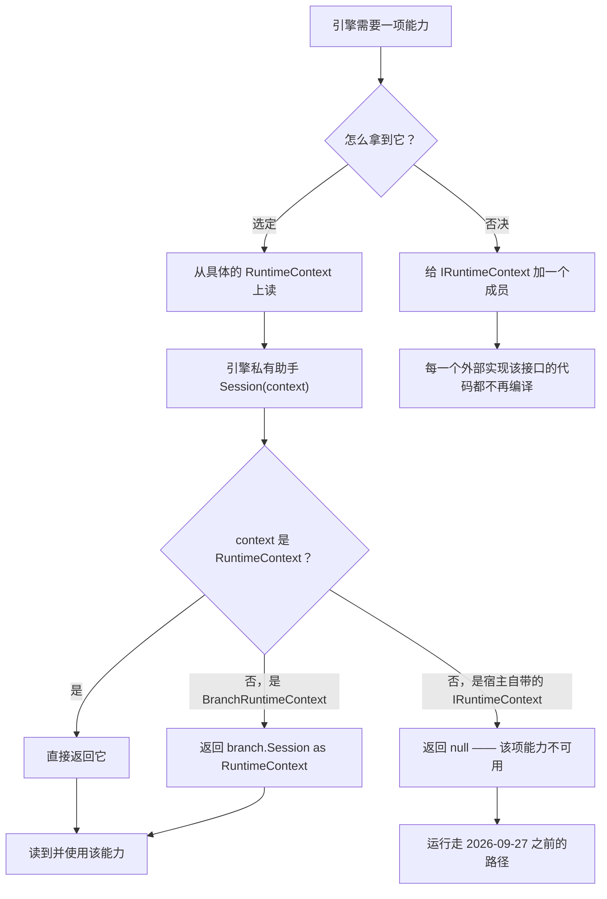

# 工作流系统 — 设计模式 — 策略家族（宿主能力）

2026-09-27 那一层是**策略模式**用了七次，外加**空对象**作为它们每一个的默认实现。这里没有新机制：编译期的路由器（`ICompileTimeRouter`）与运行期的重定向（`IRedirectable`）本来就已经是策略，这一层只是把同一个想法扩到「宿主可能想控制的那几处」。

## 家族全貌

| 在一次运行里的角色 | 策略接口 | 随库策略 | 配在哪 |
|---|---|---|---|
| 把运行握在节点边界 | `IExecutionGate` | `ManualExecutionGate`、`DelegateExecutionGate` | `RuntimeContext.ExecutionGate` |
| 看时间线 | `IExecutionObserver` | `DelegateExecutionObserver` | `.Observer` |
| 决定抛出后能不能再来一次 | `INodeRetryPolicy` | `ExponentialBackoffRetry` | `.RetryPolicy` |
| 把失败当作数据收下 | `IExecutionErrorSink` | `DelegateExecutionErrorSink` | `.ErrorSink` |
| 撤销失败运行的成果 | `IExecutionCompensation` | `DelegateExecutionCompensation` | `.Compensation` |
| 持久化运行的位置 | `IExecutionCheckpointStore` | `InMemoryCheckpointStore`（Core）、`FileCheckpointStore`（扩展包） | `.CheckpointStore` |
| 把日志导走 | `ILogWriter` | `TextWriterLogWriter`、`DelegateLogWriter` | `.LogWriter` |

每一个都是**一个方法**（存储是两个 —— 它必须能读回自己写下的东西），且每一个实现都可以在运行前通过给会话设一个属性就换掉。

## 为什么挂在具体类上而不是契约上

这是那个值得当作**决定**来读、而不是当作遗漏来读的设计取舍。



源码给出的理由有三条：

1. **给已发布的接口加成员是破坏性变更。** `IRuntimeContext` 是宿主可能实现的契约。为了一项按定义可选的功能加九个成员，会让每一个这样的实现都编译不过。
2. **它们是宿主*策略*，不是会话状态。** `MaxParallelBranches` 与 `MaxRetainedLogs` 说的是宿主更愿意怎么做，不是运行现在在哪。`IRuntimeContext` 描述的是后者。
3. **代价是明确且有界的。** 自带 `IRuntimeContext` 实现的宿主得到的就是不限流、无观察、2026-09-27 之前的行为 —— `Session()` 返回 `null`，每一处读取都短路。这是写在文档里的取舍，不是意外。

`Session()` 还会**拆开扇出分支**，这正是这些接缝能在最要紧的地方生效的原因：

```csharp
private static RuntimeContext? Session(IRuntimeContext context)
    => context switch
    {
        RuntimeContext session => session,
        BranchRuntimeContext branch => branch.Session as RuntimeContext,
        _ => null,
    };
```

没有这层拆解，配在会话上的门或观察者会在 `ParallelSegment` 内部静默失效 —— 而那恰好是一张宽图最耗时间的地方（`ExecutionGateTests.AClosedGate_AlsoHoldsTheBranchesOfAFanOut` 钉住了这一点）。

## 空对象作为默认

**每个接缝的默认都是 `null`，而 `null` 意味着「表现得像这个功能不存在」—— 不是「做点合理的事」。** 引擎检查 `session?.X is not { } x` 然后提前返回；没有默认观察者、没有默认重试、没有默认写入器。

这很重要，因为它把兼容性声明从「表决心」变成了**可测试的**：所有接缝都不设置时，运行产出与这一层存在之前**同样的日志行**与**同样的驱动次数**。这条声明写在源码里（基于 `Session()` 的读取、没有默认实例），并由既有的整套测试不改一行继续通过来印证。

空对象在这里带出两个后果，都是刻意的：

- **能力为 `null` 不是错误。** 没有诊断、没有 `[Warning]`、结果里没有元数据。会话只是没有意见。
- **能力坏掉也不致命。** 抛异常的观察者、接收器、存储、补偿器或写入器都会被记日志并丢弃（`[Observer]`、`[ErrorSink]`、`[Checkpoint]`、`[Compensation]`、`LogWriteFailed`）。唯一的例外是 `AttachRuntimeContext`，它被注入在失败纪律**之内**，所以抛出会结束整轮而不是静默跳过该节点 —— 差别在于：跳过一个节点改变的是图*做了什么*，而丢掉一条观察改变的只是你*知道什么*。

## 家族之上的门面

`RuntimeContext` 就是那个门面：宿主在一个对象上设九个属性，引擎从一处全部读到。demo 正是在一个方法里这么做的（`WorkflowDemoSession.ConfigureRun`），而那正是这个门面被设计出来的形态 —— 一个地方，陈述宿主对「这里的一次运行该是什么样」的策略。

*源码：`Src/Core/VeloxDev.Core/WorkflowSystem/CompilerEx/Runtime/RuntimeEngine.cs`（`Session` 第 672-678 行及各处读取点）、`Runtime/Model/RuntimeContext.cs`、`Runtime/Model/*.cs`。Demo：`Examples/Workflow/Common/Lib/ViewModels/Workflow/WorkflowDemoSession.cs`。测试：`CompilerEx/Execution*Tests.cs`。*
