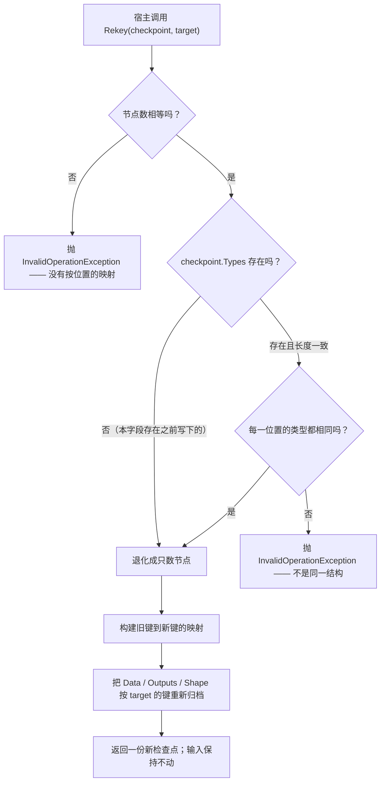

# 工作流系统 — 设计模式 — 备忘录（检查点）

`ExecutionCheckpoint` 是**备忘录（Memento）**模式：一份运行内部状态的快照，对宿主而言足够不透明（放着就行、存下来也行），而恢复路径由发起者（`RuntimeContext`）自己掌握。

模式惯常的三个角色在这里对应得很整齐：

| 角色 | 这里是谁 |
|---|---|
| **发起者（Originator）** | `RuntimeContext` —— 它产出备忘录，也知道怎么用一份备忘录恢复自己 |
| **备忘录（Memento）** | `ExecutionCheckpoint` —— 一份普通、可序列化的文档 |
| **看管者（Caretaker）** | `IExecutionCheckpointStore` —— 它保存备忘录且从不窥探内容；何时保存、何时要回来由宿主决定 |

## 快照的边界

备忘录恰好捕捉一次恢复需要的东西，边界划在这里有两个理由：

```csharp
return new ExecutionCheckpoint
{
    Attempt = Attempt,
    ActiveRedirectTarget = ActiveRedirectTarget,
    Data = Normalize(Data, nodes),
    Outputs = outputs,
    Shape = nodes is null ? [] : [.. nodes.Select(entry => entry.Key)],
    Types = nodes is null ? [] : [.. nodes.Select(entry => entry.Node.GetType().Name)],
};
```

| 字段 | 为什么在备忘录里 |
|---|---|
| `Attempt` | 它同时是产物登记表的趟戳。恢复必须**原样**保留它 —— 加一会把铺回去的产物降级成陈旧产物，汇合点会立刻读不到它们。 |
| `ActiveRedirectTarget` | 告诉产物收集器哪些「被跳过」的节点是契约保留前缀，而不是陈旧分支。 |
| `Data` | 快照时刻的链式载荷 —— 下一个节点本该收到的东西。 |
| `Outputs` | 登记表本身，好让下游的汇合点仍能聚合恢复回来的上游。 |
| `Shape` | 图里节点的键，按驱动顺序 —— 让恢复安全的那个指纹。 |
| `Types` | `Shape` 背后的节点类型，好让原来的图对象已经不在时 `Rekey` 仍有结构可查。 |

会话里其它东西刻意**不**进备忘录：`Uid` 与 `Logs` 是会话身份（恢复出来的是新的一轮运行，日志也是新的），`IsRunning`/`Status`/`CurrentOrder`/`NodeIndex`/`BranchKey` 是引擎会重写的瞬时位置，而那些能力对象是宿主策略，由新会话自己配置。

## 窄接口，以及唯一一件事它不是

`ExecutionCheckpoint` 暴露的是**属性而不是行为** —— 只有一个静态方法。这是备忘录的纪律：看管者可以存下它、交回它，但不能让发起者拿它做任何事。

`Rekey` 是那唯一一处刻意的例外，而且它是一个**守卫**而不是一个操作：



它存在是因为检查点按 `RuntimeId` 归档，而从序列化回来的图全是新 id —— 所以对它恢复会被拒绝。拒绝是对的（那确实是不同的节点对象）；`Rekey` 是宿主的显式选择，说的是*我知道，映射在这里*。它检查的是**结构而不是身份** —— 节点数，以及驱动顺序上的节点类型 —— 这能抓住另一张图，却抓不住一张形状相同、但部件被改名成恰好对得上的其它类型的图。两**代**图之间的迁移是宿主自己写的事。

## 拒绝恢复才是模式在正常工作

这里最重要的行为是一次失败，值得把它当成设计选择、而不是局限来讲：

> **检查点会被拒绝，而不是被猜。** `RunAsync` 在**碰会话之前**就把 `Shape` 与图自身的节点键比对，不符即抛。不符时 `Status` 仍是 `"Idle"`、`IsRunning` 是 `false` —— 会话从不谎称跑过。

一份可能被套到错误发起者身上的备忘录，比没有备忘录更糟：它会拿别人的载荷驱动错的节点，给出一个看似合理却错误的答案。所以这里的模式通过让备忘录**自我描述**（`Shape` + `Types`）并把检查放在恢复路径上来换取安全。

## 空间与时间

备忘录是 $O(V + R)$ —— shape、types，加上每个已登记产物一条。这就是它写在**每个节点之后**、而不是每趟重算的原因，也是随库的文件存储要在信号量后串行的原因：扇出的分支是交错的，所以即使没有东西跑在第二个线程上，也可能同时有两次保存在飞。

*源码：`Src/Core/VeloxDev.Core/WorkflowSystem/CompilerEx/Runtime/Model/ExecutionCheckpoints.cs`（`ExecutionCheckpoint` 第 26-185 行、`InMemoryCheckpointStore` 195-224）；`Runtime/Model/RuntimeContext.cs`（`Snapshot` 183-207、`Normalize` 224-234）；`Runtime/RuntimeEngine.cs`（`RequireSameShape` 613-628、`Restore` 632-649）。扩展包：`Src/Core/VeloxDev.Core.Extension/CheckpointEx.cs`。测试：`CompilerEx/ExecutionCheckpointTests.cs`、`VeloxDev.Core.Extension.Test/Serialization/ExecutionCheckpointSerializationTests.cs`。*
