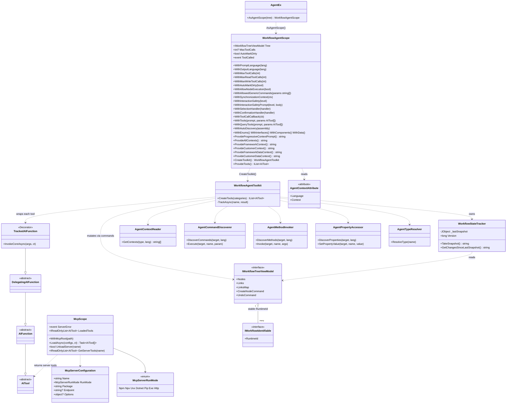

# Workflow Agent — 设计模式 — Class Diagram

```mermaid
classDiagram
    class AgentEx {
        +AsAgentScope(tree) WorkflowAgentScope
    }
    class WorkflowAgentScope {
        +IWorkflowTreeViewModel Tree
        +int? MaxToolCalls
        +bool AutoMarkDirty
        +event ToolCalled
        +WithPromptLanguage(lang)
        +WithOutputLanguage(lang)
        +WithMaxToolCalls(int)
        +WithMaxReadToolCalls(int)
        +WithMaxWriteToolCalls(int)
        +WithAutoMarkDirty(bool)
        +WithAllowNodeExecution(bool)
        +WithAllowedGenericCommands(params string[])
        +WithSynchronizationContext(ctx)
        +WithInteractionSafety(level)
        +WithInteractionSafetyPrompt(level, body)
        +WithSelectionHandler(handler)
        +WithConfirmationHandler(handler)
        +WithToolCallCallback(cb)
        +WithTools(prompt, params AITool[])
        +WithQueryTools(prompt, params AITool[])
        +WithAutoDiscovery(assembly)
        +WithEnums() WithInterfaces() WithComponents() WithData()
        +ProvideProgressiveContextPrompt() string
        +ProvideAllContexts() string
        +ProvideFrameworkContext() string
        +ProvideCustomerContext() string
        +ProvideFrameworkDataContext() string
        +ProvideCustomerDataContext() string
        +CreateToolkit() WorkflowAgentToolkit
        +ProvideTools() IList~AITool~
    }
    class WorkflowAgentToolkit {
        +CreateTools(categories) IList~AITool~
        -TrackAsync(name, result)
    }
    class TrackedAIFunction {
        <<Decorator>>
        +InvokeCoreAsync(args, ct)
    }
    class DelegatingAIFunction {
        <<abstract>>
    }
    class AIFunction {
        <<abstract>>
    }
    class AITool {
        <<abstract>>
    }
    class WorkflowStateTracker {
        -JObject _lastSnapshot
        +TakeSnapshot() string
        +GetChangesSinceLastSnapshot() string
        +long Version
    }
    class McpScope {
        +WithMcpRoot(path)
        +LoadAsync(configs, ct) Task~AITool[]~
        +event ServerError
        +IReadOnlyList~AITool~ LoadedTools
        +bool UnloadServer(name)
        +IReadOnlyList~AITool~ GetServerTools(name)
    }
    class McpServerConfiguration {
        +string Name
        +McpServerRunMode RunMode
        +string Package
        +string? Endpoint
        +object? Options
    }
    class McpServerRunMode {
        <<enum>>
        Npm Npx Uvx Dotnet Pip Exe Http
    }
    class IWorkflowTreeViewModel {
        <<interface>>
        +Nodes
        +Links
        +LinksMap
        +CreateNodeCommand
        +UndoCommand
    }
    class IWorkflowIdentifiable {
        <<interface>>
        +RuntimeId
    }
    class AgentContextAttribute {
        <<attribute>>
        +Language
        +Context
    }
    class AgentContextReader {
        +GetContexts(type, lang) string[]
    }
    class AgentCommandDiscoverer {
        +DiscoverCommands(target, lang)
        +Execute(target, name, param)
    }
    class AgentMethodInvoker {
        +DiscoverMethods(target, lang)
        +Invoke(target, name, args)
    }
    class AgentPropertyAccessor {
        +DiscoverProperties(target, lang)
        +SetPropertyValue(target, name, value)
    }
    class AgentTypeResolver {
        +ResolveType(name)
    }

    AgentEx ..> WorkflowAgentScope : AsAgentScope()
    WorkflowAgentScope ..> WorkflowAgentToolkit : CreateToolkit()
    WorkflowAgentToolkit ..> TrackedAIFunction : wraps each tool
    TrackedAIFunction --|> DelegatingAIFunction
    DelegatingAIFunction --|> AIFunction
    AIFunction --|> AITool
    WorkflowAgentToolkit ..> WorkflowStateTracker : owns
    WorkflowAgentToolkit ..> IWorkflowTreeViewModel : mutates via commands
    WorkflowStateTracker ..> IWorkflowTreeViewModel : reads
    WorkflowAgentToolkit ..> AgentContextReader
    WorkflowAgentToolkit ..> AgentCommandDiscoverer
    WorkflowAgentToolkit ..> AgentMethodInvoker
    WorkflowAgentToolkit ..> AgentPropertyAccessor
    WorkflowAgentToolkit ..> AgentTypeResolver
    WorkflowAgentScope ..> AgentContextAttribute : reads
    McpScope ..> McpServerConfiguration
    McpScope --> McpServerRunMode
    McpScope ..> AITool : returns server tools
    IWorkflowTreeViewModel "1" o-- "many" IWorkflowIdentifiable : stable RuntimeId
```
