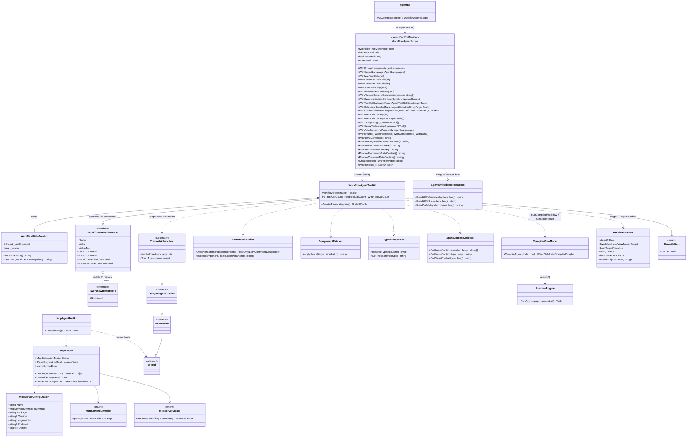

# Workflow Agent — 设计模式 — 类图

下图展示代理控制层真实的参与者集合。左侧是工作流控制核心（`WorkflowAgentScope` → `WorkflowAgentToolkit` → 受追踪工具 + 状态追踪器 + 内省辅助），右侧是 MCP 适配器表面，底部是 run/result 工具复用的 `CompilerEx` 执行模型。

关键结构事实：

- **一个作用域拥有一个工具包。** `WorkflowAgentScope` 是流畅构建者；`CreateToolkit()` 返回绑定到同一棵树的 `WorkflowAgentToolkit`（`WorkflowAgentToolkit.cs`，第 24-31 行）。工具包拥有唯一的 `WorkflowStateTracker`（`_tracker`，第 27 行）。
- **每个 `AIFunction` 都被装饰。** `CreateTools` 把每个内置及开发者注册的 `AIFunction` 包装进嵌套的 `TrackedAIFunction : DelegatingAIFunction`（`WorkflowAgentToolkit.cs`，第 178-242 行）。非 `AIFunction` 工具（原始 MCP 客户端工具）按原样加入。
- **撤销/重做栈保留在 Core。** 变更工具不伪造撤销条目——它们派发 `IWorkflow*ViewModel` 组件命令（`SetAnchorCommand`、`CreateNodeCommand`、`DeleteCommand`、`SendConnectionCommand`、……）。`ComponentPatcher` 拒绝任何有对应命令的属性。
- **run/result 复用编译器。** `RunCompiledWorkflow` 与 `GetNodeResult` 都汇入 `RunCompiledRoleAsync`：调用 `new CompilerViewModel().CompileAsync(node, role)`，再用 `new RuntimeEngine().RunAsync(graph, context, ct)`（`WorkflowAgentToolkit.cs`，第 1804-1861 行）。`CompileRole.Root` = 从起始节点开始的整条链；`CompileRole.Terminal` = 单个节点的祖先锥，设置 `RuntimeContext.Target`/`TargetReached`。
- **安全由代码强制。** `WithAllowNodeExecution` 与 `WithAllowedGenericCommands` 是工具读取的属性门；禁用时返回结构化 `error` 结果，而非提示词暗示。

> 源文件：`Src/Core/VeloxDev.Core.Extension/Agent/Workflow/WorkflowAgentScope.cs`、`.../Workflow/WorkflowStateTracker.cs`、`.../Workflow/Functions/WorkflowAgentToolkit.cs`、`.../Workflow/Functions/CommandInvoker.cs`、`.../Workflow/Functions/ComponentPatcher.cs`、`.../Workflow/Functions/TypeIntrospector.cs`、`.../Agent/MCP/McpScope.cs`、`.../Agent/MCP/McpAgentToolkit.cs`；`VeloxDev.Core.WorkflowSystem.CompilerEx` 中的编译类型位于 `Src/Core/VeloxDev.Core`。
