# 工作流代理 —— 设计模式 —— 类图

作用域及其协作者。类型类别层级见 [12 · 工具类别层级](../12_工具类别层级/index.md)。

```mermaid
classDiagram
    class AgentEx {
        +AsAgentScope(tree) WorkflowAgentScope
    }
    class WorkflowAgentScope {
        <<IAgentToolCallNotifier>>
        +IWorkflowTreeViewModel Tree
        +long Version
        +event Changed
        +AgentPipeline Pipeline
        +WithPromptLanguage(AgentLanguages)
        +WithOutputLanguage(AgentLanguages)
        +WithMaxToolCalls(int)
        +WithMaxReadToolCalls(int)
        +WithMaxWriteToolCalls(int)
        +WithAutoDiscovery(Assembly, AgentLanguages)
        +WithEnums() WithInterfaces() WithComponents() WithData()
        +WithTools(string?, params AITool[])
        +WithQueryTools(string?, params AITool[])
        +WithToolEnabled(string, bool)
        +SetToolEnabled(string, bool) bool
        +WithAllowNodeExecution(bool)
        +WithAllowedGenericCommands(params string[])
        +WithAutoMarkDirty(bool)
        +WithInteractionSafety(int)
        +WithInteractionSafetyPrompt(int, string)
        +WithSelectionHandler(Func~AgentSelectionEventArgs, Task~)
        +WithConfirmationHandler(Func~AgentConfirmationEventArgs, Task~)
        +WithToolApproval(bool)
        +WithSynchronizationContext(SynchronizationContext)
        +WithToolCallCallback(Func~AgentToolCallEventArgs, Task~)
        +WithLogWriter(ILogWriter) WithCheckpointStore(IExecutionCheckpointStore)
        +WithSessionConfiguration(Action~RuntimeContext~)
        +WithTranscript(AgentTranscript)
        +WithSkills(SkillScope) WithMcps(McpScope) WithSubAgents(SubAgentScope)
        +WithTodoTracking() WithAgentModes(AgentModeProviderOptions)
        +WithContextCompaction(int, int)
        +WithContextProvider(Func~WorkflowAgentScope, AIContextProvider~)
        +ProvideProgressiveContextPrompt() string
        +ProvideAllContexts() string
        +CreateToolkit() WorkflowAgentToolkit
        +ProvideTools(WorkflowToolCategory) IList~AITool~
        +CreateContextProviders() IReadOnlyList~AIContextProvider~
    }
    class WorkflowAgentToolkit {
        -WorkflowStateTracker _tracker
        -ToolCallLedger _ledger
        -Dictionary~string, CompiledRun~ _runs
        +CreateTools(WorkflowToolCategory) IList~AITool~
        +CreateAllTools(WorkflowToolCategory) IList~AITool~
        +CreateAccountingStage() IAgentPipelineStage
        +TryGetRun(handle, out run, out error) bool
    }
    class ToolCallLedger {
        +WorkflowAgentScope Owner
        +ToolCallLedger Outer
        +ToolCallLedger Root
        +Spend(bool isQuery)
        +Usage (int,int,int)
        +ResetChain()
    }
    class WorkflowStateTracker {
        -JObject _lastSnapshot
        -long _version
        +TakeSnapshot() string
        +GetChangesSinceLastSnapshot() string
    }
    class WorkflowAgentContextProvider {
        <<AIContextProvider>>
        -Render _published
        +StateKeys IReadOnlyList~string~
        -BuildContext() AIContext
    }
    class TrackedAIFunction {
        <<Decorator>>
        -InvokeCoreAsync(args, ct)
        -InvokeCoreInnerAsync(args, ct)
        -ReportAsync(result, outcome, elapsed, ct)
    }
    class WorkflowToolCategory {
        <<enum>>
        Query Mutation Execution Command Graph
        Layout Analytics State Composite Interaction All
    }
    class AgentPipeline {
        +Stages IReadOnlyList~IAgentPipelineStage~
        +Use(IAgentPipelineStage) AgentPipeline
        +PublishAsync(AgentEvent, ct) ValueTask
        +event StageFailed
    }
    class ToolPipeline {
        +MarshalTo Func~SynchronizationContext~
        +Refuse Func~string,string~
        +Confirm Func~string,CancellationToken,ValueTask~string~~
    }
    class TextPipeline {
        +OnEventAsync(event, next, ct) ValueTask
    }
    class AgentTranscript {
        +Entries ObservableCollection~AgentTranscriptEntry~
        +AppendReasoning(fragment) AgentTranscriptEntry
        +AddToolCall(name, result, outcome) AgentTranscriptEntry
        +ToMarkdown(options) string
    }
    class SkillScope {
        +long Version
        +WithSource(ISkillSource) SkillScope
        +CreateNarrowed(allowed) SkillScope
    }
    class McpScope {
        +long Version
        +McpSelfServiceLevel SelfServiceLevel
        +CreateGrantedView(source, servers, tools) McpScope
    }
    class SubAgentScope {
        +int MaxDepth
        +int SpawnBudget
        +TrySpawn(request, out refusal) string
    }
    class AgentDashboardViewModel {
        +Create(scope) AgentDashboardViewModel
        +SystemTools ObservableCollection~ToolMemberViewModel~
    }
    class AgentMemberViewModel {
        <<abstract>>
        +ApplyToScope(bool)
    }
    class CompilerViewModel {
        +CompileAsync(node, role) IReadOnlyList~CompiledGraph~
    }
    class RuntimeEngine {
        +RunAsync(graph, context, ct, resumeFrom) Task
    }
    class RuntimeContext {
        +RunOutcome Outcome
        +IExecutionGate ExecutionGate
        +bool IsRunning
        +SnapshotLogs() string[]
    }

    AgentEx ..> WorkflowAgentScope : AsAgentScope()
    WorkflowAgentScope *-- WorkflowAgentToolkit : CreateToolkit()
    WorkflowAgentScope --> ToolCallLedger : 拥有
    WorkflowAgentScope ..> WorkflowAgentContextProvider : CreateContextProviders()
    WorkflowAgentScope --> AgentPipeline
    WorkflowAgentScope --> SkillScope
    WorkflowAgentScope --> McpScope
    WorkflowAgentScope --> SubAgentScope
    WorkflowAgentToolkit *-- WorkflowStateTracker
    WorkflowAgentToolkit --> WorkflowToolCategory : CreateTools
    WorkflowAgentToolkit ..> TrackedAIFunction : 包装每个 AIFunction
    WorkflowAgentToolkit ..> CompilerViewModel : RunCompiledWorkflow / GetNodeResult
    CompilerViewModel ..> RuntimeEngine
    RuntimeEngine ..> RuntimeContext
    ToolCallLedger --> ToolCallLedger : Outer 链
    AgentPipeline o-- ToolPipeline
    AgentPipeline o-- TextPipeline
    TextPipeline ..> AgentTranscript
    AgentDashboardViewModel --> AgentMemberViewModel
    AgentDashboardViewModel ..> WorkflowAgentScope : 读写开关
```

关键结构事实：

- **一个作用域拥有一个工具包。** `CreateToolkit()` 返回绑定同一树的 `WorkflowAgentToolkit`，并按作用域缓存。工具包拥有一个 `WorkflowStateTracker` 与一个 `ToolCallLedger`。
- **账本是一条链。** 根作用域的账本没有 `Outer`；被派发的子代理在其工具包存在之前就设好 `ParentLedger`，因此 `Spend` 沿链上行，根的总数就是整棵树的总数。
- **每个 `AIFunction` 都被装饰。** `CreateTools` 把每个内置与开发者注册的 `AIFunction` 包装为 `TrackedAIFunction : DelegatingAIFunction`（命名空间 `VeloxDev.AI`，`internal sealed`）。非 `AIFunction` 工具按原样加入。
- **提供器是工具的唯一来源。** `CreateContextProviders()` 以固定顺序组合：压缩 → workflow → 技能 → MCP → 子代理 → todo → 模式 → 宿主工厂。
- **运行/结果复用编译器。** `RunCompiledWorkflow` / `GetNodeResult` / 运行句柄家族都经 `RunCompiledRoleAsync` 与 `StartCompiledAsync`，二者都调用 `new CompilerViewModel().CompileAsync(node, role)` 然后 `new RuntimeEngine().RunAsync(graph, context, ct)`。
- **子系统是收窄视图。** 派发会在同一树上构建*新的* `WorkflowAgentScope`，并交给它父级技能（`CreateNarrowed`）与 MCP 服务器（`CreateGrantedView`）的过滤视图，绝不共享父级自身对象。

> 源文件：`Src/Core/VeloxDev.Core.Extension/Agent/Workflow/{WorkflowAgentScope,WorkflowStateTracker,WorkflowAgentContextProvider}.cs`、`.../Workflow/Functions/{WorkflowAgentToolkit,ToolCallLedger,WorkflowToolCategory}.cs`、`.../TrackedAIFunction.cs`、`.../Pipelines/*`、`.../Skills/*`、`.../MCP/*`、`.../SubAgents/*`、`.../Dashboard/*`；编译类型位于 `Src/Core/VeloxDev.Core` 的 `VeloxDev.Core.WorkflowSystem.CompilerEx` 之下。
