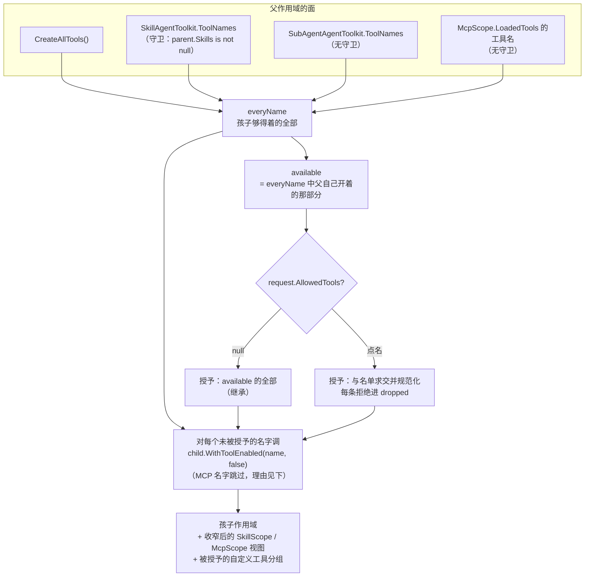

# 设计模式分析 — 工作流代理 — 子代理能力收窄

一次 spawn 把派发者能力的一份切片交给孩子，全部不变式只有一句话：**孩子的能力等于其父的，或者更少，绝不会更多**。真正有意思的设计问题不是这条规则，而是规则的**载体**。三条轴里有两条用「工具名清单」根本表达不出来，第三条也是在工具注册被重新分组之后才变得可表达的。本页讲的就是为什么每条轴由它现在的形式承载。

> 源码：`Src/Core/VeloxDev.Core.Extension/Agent/SubAgents/SubAgentScope.cs`（`TrySpawn`，第 387-606 行）；`Agent/Workflow/WorkflowAgentScope.cs`（第 251-296 行）；`Agent/Skills/SkillScope.cs`（第 353-378 行）；`Agent/MCP/McpScope.cs`（第 429-500 行）。测试：`Src/Core/VeloxDev.Core.Extension.Test/Agent/SubAgents/` 下的 `SubAgentNarrowingTests`、`SubAgentCapabilityGrantTests`。

## 为什么一份名单不够用

技能与 MCP 服务器由**各自的上下文提供器**贡献，数据层也各自独立 —— 两者都不在 `WorkflowAgentToolkit.CreateAllTools()` 里。所以一份工具名清单只能回答「这把工具在不在」，而 `load_skill` 在不在与**它能读到哪几个技能**是两个不同的问题。按名字把一个技能对孩子关掉是没有意义的；把加载器关掉则是把整条轴拿掉，而那不是收窄。答案是**视图**：父把自己的源 —— 照原样，或按请求收窄 —— 包一份交给孩子。

| 轴 | 载体 | 实现 | 「边界」体现在哪 |
|---|---|---|---|
| 工具 | 两份名单 | `TrySpawn` 里的 `available`（可授予）与 `everyName`（够得着） | 对每一个够得着却没被授予的名字调 `child.WithToolEnabled(name, false)` |
| 技能 | 收窄后的源 | `SkillScope.CreateNarrowed(allowed)` | 过滤在 **`Apply` 的最顶部**，所以之后的 `Refresh()` 不会把窄化长回来 |
| MCP 服务器 | 授予视图 | `McpScope.CreateGrantedView(parent, granted, grantedTools)` | `IsGrantedView = true`；`_loadedClients` / `_loadedConfigs` 故意留空 |
| 自定义工具 | 注册**分组** | `WorkflowAgentScope.GrantCustomToolsTo(child, granted)` | 被完全拒绝的组连用法说明一起消失 |

边界是**可执行的、不是被声明的**：孩子自己的 `ListSkills` 只列出它被授予的那几个，而对一个不在授予范围内的名字调 `load_skill` 会在**孩子内部**返回错误 —— `SubAgentCapabilityGrantTests.AGrantedSkill_ReachesTheChild_AndADeniedOneDoesNot` 断言的是工具自己的输出，不是视图自己的账。一个「自称已收窄却仍然什么都提供」的视图能通过更弱的断言，却过不了这一条。

> 上表中有一条是读源码*推断所得*、而非测试钉住的：`CreateNarrowed` 在 **`Apply` 最顶部**过滤，因此能扛过后来的 `Refresh()`。没有测试刷新过一个已收窄的技能源 —— 被钉住的是「视图在 spawn 那一刻恰好持有被授予的那份集合」（`AGrantedSkill_IsAView_NotAFilterOnTheParent`、`ASkillTheParentSwitchedOff_IsNotGrantable`）。

## 视图必须是单向的

持有不同授予的两个孩子由同一个父作用域服务，所以一个施加在共享源上的过滤器会让第二个孩子拿到第一个孩子的清单。`AGrantedSkill_IsAView_NotAFilterOnTheParent` 一次断言这三份集合。

MCP 那条的理由更硬：把父的 `McpScope` 直接交给孩子，就同时交给了它 `LoadMcpServers` 与 `UnloadMcpServer` —— 对「父自己的回合正被挂在其后」的那些进程的权力；而且 `WithMcps` 会**无条件顶掉**宿主在共享 `McpScope` 上设的确认处理器，N 个孩子各挂一次就各覆盖一次。所以视图**一个 client 都不持有**：销毁它不可能断开父的连接。`AGrantedView_OwesNothingToItsParentThatClosingItCouldTakeAway` 销毁视图后断言父的两台服务器仍在。

被授予的服务器**可用，也仅止于可用**：它的面就是该服务器自己的工具，加上 `ListMcpServers` 与 `DescribeMcpServer`；`LoadMcpServers` / `UnloadMcpServer` / `AddMcpServer` 结构性不存在。

## 两份名单，而且必须是两份

两份集合不是冗余，一个名字属于哪一份决定了它在为规则的哪一侧服务：

- `available` 是**告诉**模型它拿得到什么的那一份：父当前开启的工具。这里的一个名字必须在孩子上真的可调用，否则模型会围绕一个它并不具备的能力做计划。
- `everyName` 是孩子**否则够得着**的全部，**不过滤父自己的开关**。关停循环跑在这一份上，这正是「父自己关掉的工具不能经继承路径到达孩子」的原因 —— 一个持有父所没有的能力的孩子就是一次**扩权**，而这恰恰是本子系统存在要防止的事。`SubAgentNarrowingTests.AToolTheParentHasSwitchedOff_IsNotInherited` 是这条规则最锋利的形式，因为**没有人点过那把工具的名字**。

由于 `everyName` 收的是「孩子够得着的」而不是「父当前贡献的」，它的四个来源各自带着不同的守卫 —— 而且守卫不同是有理由的。技能名有 `parent.Skills is not null` 的守卫，因为它们是**父的**技能源贡献的。五个子代理工具名**无守卫**，因为 `child.WithSubAgents(grand)` 是无条件的：每个孩子都够得着它们，哪怕父自己没挂子系统。在这里照抄技能那行的守卫，正是让缺陷回来的那个写法。

那个缺陷值得记下来，因为它的症状恰好是规则的**反面**。五个名字漏在 `everyName` 之外时：省略 `allowedTools` 的 spawn 把它们全部留开，而**点名**了工具的 spawn 把它们全关掉 —— 于是模型只有在「没想过自己授予了什么」时才派得动，而它一旦认真考虑并点名，就派不动了；而且它问出来的答案是「本代理没有这个工具」，那也是假的。`SubAgentNarrowingTests.TheSubAgentTools_CanBeNamed_InAWhitelist` 现在把两侧都钉住。MCP 名字出于同一个结构原因被漏掉，但失败方向相反：点名一个 MCP 工具收到的正是那句拒绝，而那把工具明明是父开着、孩子也够得着的。`SubAgentCapabilityGrantTests.NamingAnMcpTool_IsNotARefusal` 在缺陷的原点钉住修法。

由此留下的一般规则：**`everyName` 少收一个来源，那个来源就只能表现为「省略时留着、点名时被判不存在」。** 增加第四条能力轴时要检查的是四个来源，不是三个。

## 一个开关只有一个取走点

MCP 名字是关停循环**唯一跳过**的源，理由是：一个 MCP 工具的开关键不是它的名字。它的键是 `server/tool`、落在 `McpScope` 上，所以把它的裸名交给 `WorkflowAgentScope.WithToolEnabled` 会**看起来像删除而实际什么都没删**。因此那条轴在它键所在的地方收窄 —— `CreateGrantedView` 的第三个参数 —— 而 `AWhitelistThatOmitsAnMcpTool_TakesItOffTheChildsSurface` 断言的是它真的离开了孩子的面，而不只是离开了授予清单。

## 上报是设计的一半

`dropped` 不是诊断信息，它是那份承诺的另一半。一个要了工具、相信自己有、并围绕它做了计划的模型，直到整轮跑废才会发现它不在 —— 所以每一次拒绝都要**指明撞的是哪堵墙**：本代理没有这个工具 / 父没连这台服务器 / 父的读或写档位更低 / 父不允许跑节点业务代码 / 父不在该命令的白名单里 / 授予了零个技能因而连技能工具一起收走。`ARequestTheParentCannotHonour_IsDroppedAndReported` 要求「被关掉的工具」与「根本不存在的工具」被**可区分地**上报，否则模型分不出这两者。

由「授权清单必须与孩子真实持有的集合相同」这条推论出两件事：

- 给孩子的是**收窄后的视图**而不是一份名单（技能与 MCP 皆然），正是为了让这两者不可能漂移；
- 被授予**零个**技能的孩子会丢掉技能工具（`ListSkills`、`load_skill`、`UnloadSkill`、`read_skill_resource`）—— 它们是从继承分支**回来**的，因为它们在父的面上；而一把背后没有技能可读的 `load_skill` 只会失败。`AnEmptySkillList_GrantsNone_AndTakesTheSkillToolsWithThem` 既断言工具消失，也断言有一行 `dropped` 解释原因。

同一条原则最隐晦的实例是交互工具：`RequestSelection` 与 `RequestConfirmation` 只在安全等级大于 0 **且**在**该作用域上**注册了处理器时才提供，而孩子是一个全新的对象。把这两个名字写进清单却不复制宿主的交互配置，清单里就会多出两把孩子在它自己的作用域上并不存在、也永远调不通的工具 —— 一个模型看得见却用不了的权限比没有权限更糟，因为它会围绕它做计划。所以 `WorkflowAgentScope.GrantInteractionTo` 把等级、各等级的提示词覆盖表与两个处理器一起随工具转交（`SubAgentBudgetTests.AChild_InheritsTheHostsInteractionConfiguration`）。⇒ **往常驻提示词里加一句关于孩子能力的话之前，先看 `GrantInteractionTo` 转交了哪些东西** —— 这个坑的散文那一半比代码那一半多活了一个版本。

## 知识不是权力

三条轴现在共用同一个默认值：**省略参数即继承父当前已开启的那一套**；传空数组表示一个都不给，那是与省略不同的请求。这份对称是刻意的 —— 更早的设计给三条轴三个不同的默认值（工具给只读的半面、技能给全部、MCP 给空集），各自都有一条言之成理的本地理由，而正是这份分歧让「省略参数意味着什么」这个问题不读源码就答不出来。现在描述这三条轴只需要一句话：**点名是唯一的减缩手段。**

> 交叉阅读：[构建者](../02_构建者/index.md) —— 被收窄所对照的那套流式 `With*` 表面；[门面](../03_门面/index.md) —— 授权清单所对照的工具包；[子代理树与消耗计量](../11_子代理树与消耗计量/index.md) —— 名册拿这次结果做了什么。
