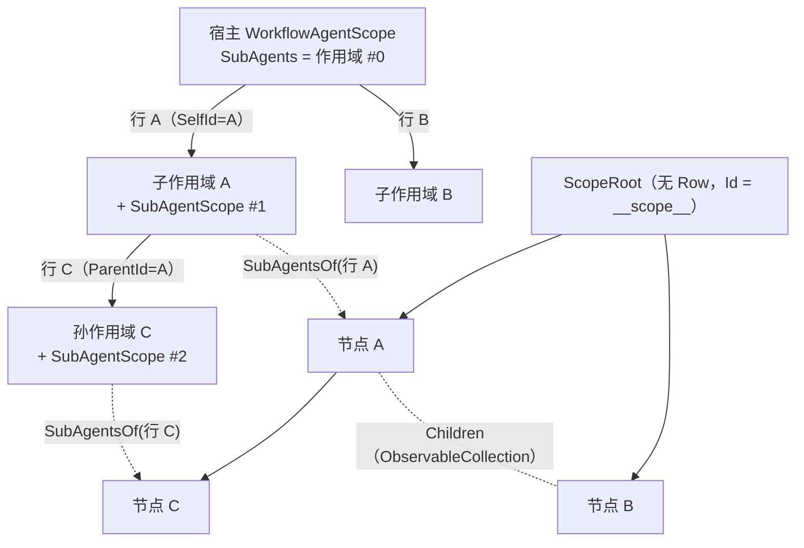
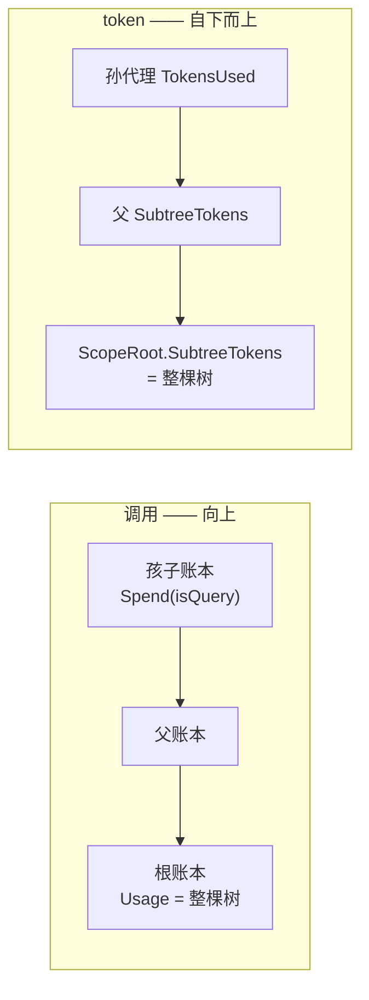

# 设计模式分析 — 工作流代理 — 子代理树与消耗计量

一旦存在一棵代理树，有两样东西必须**推导**出来而不能只存一份：**谁是谁的父**，以及**这棵树花了多少**。前者是一份刻意保持扁平的数据的投影；后者同时朝两个方向走 —— 调用沿账本链**向上**汇总，token 沿树视图模型**自下而上**汇总。本页讲这两者各自为何是现在这个形状，以及树面板所依赖的那一条并发假设、和它唯一不成立的地方。

> 源码：`Agent/SubAgents/SubAgentScope.cs`、`.../SubAgentTreeViewModel.cs`、`Agent/Workflow/Functions/ToolCallLedger.cs`。测试：`Src/Core/VeloxDev.Core.Extension.Test/Agent/SubAgents/` 下的 `SubAgentHierarchyTests`、`SubAgentMetricsTests`、`SubAgentTreeViewModelTests`。

## 一棵由扁平名册投影出来的作用域树

每个被派发的孩子都拿到**自己的** `WorkflowAgentScope`（由 `parent.Tree.AsAgentScope()` 构建）、**自己的** `SubAgentScope`，以及自己的 transcript。子系统对孩子是**无条件**挂上的 —— 包括到达深度上限时 —— 所以唯一阻止孙代理的是 `CanSpawn` 那道闸，而不是「没挂」。这正是孩子的简报能说出它**为什么**不能派发、而不是留一个它看不见的空洞的原因。

名册是**扁平的、按作用域各一份**的，而这是一条刻意的隔离机制而不是实现上的省事：一个作用域只装它自己发出的东西，所以兄弟的句柄在这里不解析 —— 它单纯不存在。`SubAgentDispatchTests.AChildSeesItsOwnChildren_AndNobodyElses` 断言偷看兄弟的孩子会被拒。

扁平名册无法靠查找指认自己的父，所以这条边在 spawn 时被写下来：spawn 把自己的行 id 记进子作用域的 `SelfId`，此后该作用域的每个孩子都以它作为 `ParentId`。于是树**只凭行**就能建起来，而 `SubAgentTreeViewModel` 是若干份名册的投影，不是第二个事实源 —— 除重建之外没有任何东西会就地改它。

由此推出两条容易写错的身份规则：

- **深度是绝对的**，从宿主的作用域量起、每层不重置：根的孩子是深度 1，孙代理是深度 2。
- **会话状态键按子系统实例各一个**（一个 `Guid`），绝不用工作流作用域的 `StateDiscriminator`。后者派生自树，而父与子坐在同一棵树上 —— 于是它恰好会在唯一一对绝对不能撞的提供器上撞。`SubAgentHierarchyTests.TwoScopes_NeverShareAStateKey` 与 `TwoProvidersOverOneScope_DoShareAKey` 把两个方向都钉住：两个子系统不能共享，而同一个子系统上的两个提供器**必须**共享。

## 计量同时朝两个方向走

**调用向上汇总，而这正是这棵树安全的原因。** `ToolCallLedger.Spend` 自增本层，然后调 `Outer?.Spend(isQuery)`，所以任何一层的 `Usage` 都是**它这棵子树**的总量，而 `Root` 就是最顶上的账本。孩子的作用域拿父的账本当作自己的外层账本，这正是把「任意深度」变成「由根的额度界定」的那一步：根的上限是唯一必须耗尽的计数器。两口独立的锅会让父得以给每个孩子各自完整的剩余，整棵树的实际开销就无界了。零回归那一侧同样是承载语义的 —— 根作用域的账本没有 `Outer`，此时每个成员逐字退化成它替换掉的那三个计数器，所以从未挂过子系统的宿主观察不到任何变化（`SubAgentBudgetTests.WithoutAnySubAgents_TheAccountingIsTheScopesOwn`）。

重置是刻意**不对称**的。`ResetChain` 清掉本层以及**其上**每一层，所以孩子的一次成功重置会重开整个会话，而父的重置清不到孩子那一层已经发出的授权。这不是遗漏：授予是 spawn 那一刻的既成事实，而「继续做」的答案是新建一个孩子，而不是一个在模型背后被悄悄放宽的子限额。`SubAgentBudgetTests.TheParentsReset_ReopensTheTree_WithoutRewritingAGrantAlreadyMade` 与 `ASpentChild_ReportsUpward_RatherThanWaitingToBeUnstuck` 把这两半一起钉住。

**token 自下而上汇总，而且只有树算得出来。** 接缝就是 `SubAgentScope.RunAsync` 里的那一行：`AgentResponse.Usage` 是整条链上唯一存在 token 计数的地方 —— 五个管理工具、transcript 与流水线事件都没有 token 概念（`CallUsage` 是**调用次数**，两者绝不能混）。每一行存的是**它自己**的消耗；整棵树的求和由 `RecomputeAggregates` 算，它在节点的孩子填好之后才被调用，所以递归在构造上就是自下而上的。

这两个数字被刻意分开：`SubAgentTreeNodeViewModel.TokensUsed` 是节点自身的消耗，`SubtreeTokens` 是合计，而 `ShowSubtreeTokens` 只在节点**既有自身的实测值、又有花得更多的后代**时为真。只报自身数字的父会藏起它底下的工作；报合计的父则会让整列无法求和。

另外三个较小的决定属于同一条「不要造数字」的原则：

- 提供器不上报用量时行留 `null` 而不是 `0`；`HasTokens` 正是用来让「没测过」与「花了 0」在界面上不是一件事。
- 被取消或抛异常的孩子其 token 字段留 `null` —— 那两条路径本该读到的 response 已经不存在，写一个数字就是编的。
- 作用域自身的消耗**库测不出来、也不该测**：那是宿主那段对话产生的。`SubAgentTreeNodeViewModel.ScopeTokens` 是宿主填的字段，未填时顶节点退回去显示子树合计 —— 一个诚实的数字，而不是替宿主猜一个。由于宿主通常在树建好之后才填它，它的变更钩子**重算**合计而不只是发通知。

时长是**算出来的**而不是存的（`FinishedAt ?? Now - StartedAt`），而且库**不持有计时器**：会跳的面板与会活的进程寿命不同，在库里起一个计时器对两者都不归属。`TickElapsed()` 就是宿主用自己已有的时钟去推的那一下。

## 重建闸门：一条假设，以及它唯一不成立的地方

`SubAgentTreeViewModel` 假设重建**只发生在一条线程**上 —— 创建它的那条 —— 而合并队列只负责把重建**投递**到那条线程。在有 `SynchronizationContext` 时这成立：每个作用域的 `Changed` 处理器 post 一次排空。

但当没有可投递的上下文时（无头宿主，以及套件里的每一个测试）它**不成立**。此时重建**就在触发变化的那个作用域所在的线程上内联执行**，于是同一瞬间完成的两个孩子就是两条线程同时进 `Fill` 改同一个 `ObservableCollection`。这不是罕见的交错：这就是一次扇出按构造会发生的事 —— 而它造成的损坏会以「某个不相干的孩子无辜失败」的形式暴露在别处，而不是在这里。所以有那道内部 `_rebuildGate`：合并标志的检查、`Rebuild`、以及 `Dispose`（唯一第三处同时改根集合、扁平列表与订阅集合的地方）都要过它。

同一个问题的镜像落在库里而不是面板里。孩子在一条线程池线程上跑，而它父的回合挂在 UI 线程上；两个作用域的图编辑之间**唯一**的串行化来源，就是它们都经过同一个上下文。设计的答案是**把宿主的 `SynchronizationContext` 转交给孩子**（`child.WithSynchronizationContext(parent.UIContext)`，设在 `WithSubAgents` **之前**，因为后者会继续把它往下传），而不是收回变更权限：孩子仍然串行化到同一个泵上，只是这个事实由继承表达，不再由拒绝表达。已记录下来的代价是一个完全没有上下文的宿主：它的孩子现在也能改图，而没有任何东西替它们串行化。`SubAgentNarrowingTests.WithNoUIContext_TheSurfaceIsStillTheParentsOwn` 与 `TheUIContext_ChangesNothingAboutWhatIsGranted` 钉住的是活下来的那条不变式 —— **有没有上下文，授出面逐字相同**；上下文决定一次调用在**哪里**跑，绝不决定孩子**能不能**发起它。

另外两条推论同属「面板只是一个视图」：

- `Dispose` 只退订，**不取消任何东西** —— 关掉一个面板不是对面板所展示的工作作出的决定。取消是 `SubAgentScope.Cancel` 或作用域自己 `DisposeAsync` 的事。
- 计数随节点一起走，因为 `Rebuild` 在销毁之后早返回，留下来的一个总数永远无法被刷新回一致。

## 整个设计所依赖的执行模型

以上一切都假设：孩子运行期间宿主 UI 线程是自由的。一次 spawn 发生在一次工具调用内部，而那个工体被组合宿主编组到了那条线程上，所以同步的孩子会按住它走完孩子整段对话 —— 这就是 `SpawnSubAgent` 返回句柄、而运行被交给线程池的原因，也是为什么这个工具的形状（即便工作本身是即时的也是异步）是模型在 schema 里读到的**契约**而不是实现细节。`SubAgentDispatchTests.ASpawnReturns_BeforeTheChildHasAnswered` 与 `SeveralChildren_AreInFlightAtOnce` 断言了这条性质；而 UI 线程**自身是否自由**至今仍只有理论论证，因为套件里没有任何替身能证明它。

> 交叉阅读：[子代理能力收窄](../10_子代理能力收窄/index.md) —— 孩子究竟拿到了什么；[数据流分析 — 子代理派发](../../../03_数据流分析/01_工作流代理/06_子代理派发/index.md) —— 产出这些行的那个时序。
