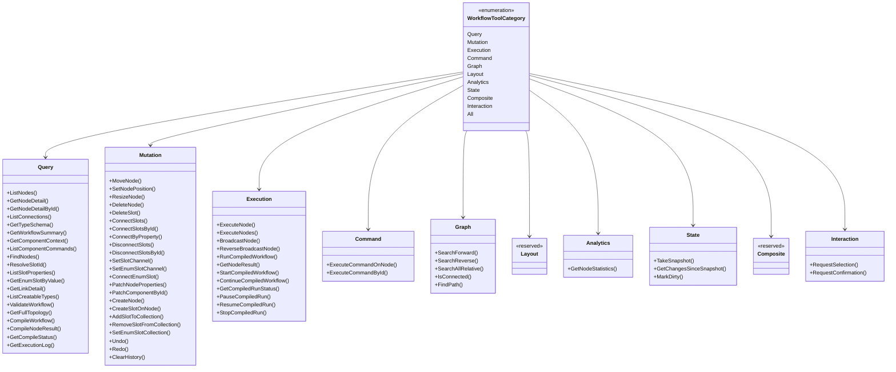

# 工作流代理 —— 设计模式 —— 工具类别层级

`WorkflowToolCategory` 是一个 `[Flags]` 枚举；每个标志选择 `WorkflowAgentToolkit.CreateAllTools` 构建的一组工具。两组是**保留且为空**的。下面的类图展示该枚举及它选择的十个分组。

> 源：`Src/Core/VeloxDev.Core.Extension/Agent/Workflow/Functions/WorkflowToolCategory.cs`（枚举）与 `WorkflowAgentToolkit.CreateAllTools`（分组）。

## 数量

| 标志 | 值 | 工具数 |
|---|---|---|
| `Query` | `1 << 0` | 20 |
| `Mutation` | `1 << 1` | 23 |
| `Execution` | `1 << 2` | 12 |
| `Command` | `1 << 3` | 2 |
| `Graph` | `1 << 4` | 5 |
| `Layout` | `1 << 5` | **0（保留）** |
| `Analytics` | `1 << 6` | 1 |
| `State` | `1 << 7` | 3 |
| `Composite` | `1 << 8` | **0（保留）** |
| `Interaction` | `1 << 9` | 至多 2 |

两个交互处理器都配置时 **68 个内置工具**（20 + 23 + 12 + 2 + 5 + 0 + 1 + 3 + 0 + 2）。`ResetToolCallLimit` 无条件添加；开发者注册的工具与子系统工具加入所请求的任何标志。

## 为何两组为空

- **`Layout` 保留。** 多节点对齐经 `MoveNode` / `SetNodePosition` 逐节点完成（各一条 `SetAnchorCommand`），因此一个打包的布局工具只会坐在命令管线之旁而非之内。
- **`Composite` 保留。** 每个操作都是单次组件命令步骤，因此框架的撤销/重做栈绝不被打包的多步手势绕过或重复提交。

标志仍然存在，使宿主可以无错传入它们，也让枚举记录下这一决定。

## 为何 `Interaction` 是有条件的

仅当 `WithInteractionSafety(level)` > 0 **且**配置了相应处理器（`WithSelectionHandler` / `WithConfirmationHandler`）时才填充 `Interaction` —— 因此同一个 `All` 取值会因宿主配置而给出不同的工具数。`CreateTools(categories)` 是决定什么到达模型的唯一位置：它在类别标志之上应用逐工具开关，而 `CreateAllTools`（internal）返回宿主 UI 枚举的未过滤表面。

**预期结果：** `scope.ProvideTools(WorkflowToolCategory.Query)` 恰好返回 20 个 Query 工具（加上任何自定义/子系统工具与 `ResetToolCallLimit`）；把 `Layout` 或 `Composite` 加进掩码不改变任何东西。
