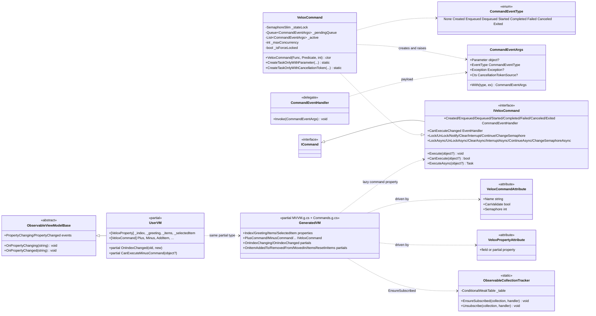
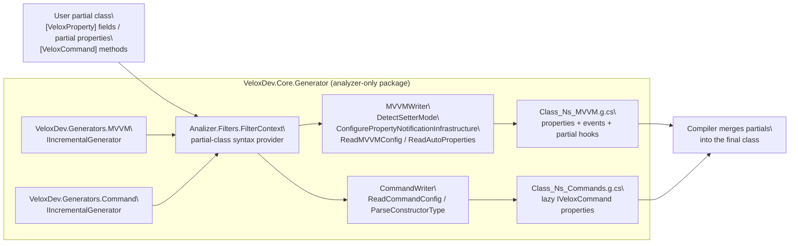

# 设计模式 — MVVM

`mvvm` 功能是「**源码生成器 + 命令运行时**」的配对。运行时位于 `Src/Core/VeloxDev.Core/MVVM/**`（命名空间 `VeloxDev.MVVM`），提供 `IVeloxCommand`、`VeloxCommand`、`CommandEventArgs`/`CommandEventType`/`CommandEventHandler` 与 `ObservableCollectionTracker`。Roslyn 源码生成器位于 `Src/Generators/VeloxDev.Core.Generator/**`（类 `VeloxDev.Generators.MVVM` 与 `VeloxDev.Generators.Command`，以纯 analyzer NuGet 包 `VeloxDev.Core.Generator` 分发），把带 `[VeloxProperty]` 的字段 / partial 属性与带 `[VeloxCommand]` 的方法转换为可观察属性与懒创建的命令属性。

## 模型类图



## 源生成流水线

两个生成器都是 `IIncrementalGenerator`（`MVVM.cs` 第 12-13 行，`Command.cs` 第 12-13 行），并为每个带注解的 `partial` 类注册一次源码输出。共享流水线：



每个写入器实现 `ICodeWriter`，仅当 `CanWrite()` 为真时为每个类产出一个 `.g.cs` 文件：`MVVMWriter` 面向携带 `[VeloxProperty]` 的类（另含工作流默认视图模型），`CommandWriter` 面向携带 `[VeloxCommand]` 的类。输出文件名由类与命名空间派生，例如 WPF 示例的 `MainWindowViewModel_Demo_MVVM.g.cs` 与 `MainWindowViewModel_Demo_Commands.g.cs`。

## 模式对照表

| # | 模式 | 参与者 | 位置 |
|---|---|---|---|
| 1 | 源生成（代码生成） | `VeloxDev.Generators.MVVM`、`VeloxDev.Generators.Command`、`Analizer.Filters`、`MVVMWriter`、`CommandWriter`、`MVVMPropertyFactory` | `Src/Generators/VeloxDev.Core.Generator/{MVVM.cs, Command.cs, Base/Analizer.cs, Writers/MVVMWriter.cs, Writers/CommandWriter.cs}` |
| 2 | 命令 | `IVeloxCommand : ICommand`、`VeloxCommand`（信号量 + 队列 + 生命周期事件） | `Src/Core/VeloxDev.Core/Interfaces/MVVM/IVeloxCommand.cs`、`Src/Core/VeloxDev.Core/MVVM/VeloxCommand.cs` |
| 3 | 观察者（INPC + 生命周期事件） | 生成的属性、`OnPropertyChanging/OnPropertyChanged`、`ObservableViewModelBase`、8 个命令生命周期事件 | `MVVMWriter.cs`、`VeloxCommand.cs`、`Examples/MVVM/WPF/Demo/ObservableViewModelBase.cs` |
| 4 | 模板方法（partial 钩子） | 生成的 `OnXxxChanging/OnXxxChanged`、集合 partial、`CanExecuteXxxCommand` | `Base/Analizer.cs`（`MVVMPropertyFactory.GenerateViewModel`、`GenerateCollectionMembers`）、`CommandWriter.cs` |
| 5 | 适配器（与宿主框架共存） | `MVVMWriter.DetectSetterMode` 与 `ConfigurePropertyNotificationInfrastructure` | `MVVMWriter.cs` 第 42-89、198-258 行 |
| 6 | 弱引用注册表 | `ObservableCollectionTracker`（`ConditionalWeakTable`） | `Src/Core/VeloxDev.Core/MVVM/ObservableCollectionTracker.cs` |

## 识别的模式

### 1. 源生成（Roslyn 增量生成器）

`Analizer.Filters.FilterContext`（Base/Analizer.cs 第 15-23 行）注册一个语法提供器，其谓词选出每个 `partial class` 声明；两个生成器共用同一个提供器。对每个类，`MVVMWriter`（Writers/MVVMWriter.cs）分析 `[VeloxProperty]` **字段**（`ReadMVVMConfig`，第 91-115 行）与 **partial 属性**（`ReadAutoProperties`，第 117-141 行），并通过 `MVVMPropertyFactory` 各产出一个可观察属性。`CommandWriter`（Writers/CommandWriter.cs）读取 `[VeloxCommand]` 方法（`ReadCommandConfig`，第 19-77 行），按位置参数再按命名参数解析 `name`/`canValidate`/`semaphore`，在自动命名时去掉 `Async` 后缀，并按签名选择构造函数/工厂（`ParseConstructorType`，第 78-116 行）。

默认 setter 形态（无宿主框架的普通字段属性）由 `MVVMPropertyFactory.GetSetterBodyLines`（Base/Analizer.cs 第 287-307 行）生成，`OnPropertyChanging`/`OnPropertyChanged` 由 `MVVMWriter` 的 `SetteringBody`/`SetteredBody` 注入（第 108-109、134-135 行）：

```csharp
if(global::System.Object.Equals(_index, value)) return;
var old = _index;
OnPropertyChanging(nameof(Index));
OnIndexChanging(old, value);
_index = value;
OnIndexChanged(old, value);
OnPropertyChanged(nameof(Index));
```

生成器还会判断类型自身是否需要暴露通知面。`ConfigurePropertyNotificationInfrastructure`（MVVMWriter.cs 第 198-258 行）沿类及其基类向上查找：若层级中既无 `PropertyChanging`/`PropertyChanged` 事件，也无 `OnPropertyChanging`/`OnPropertyChanged(string)` 方法，则生成事件、两个方法，并为类型追加 `INotifyPropertyChanging`/`INotifyPropertyChanged`（第 856-864 行）。若基类已提供，生成的 setter 直接调用继承的方法——这正是示例无需改动即可复用本地 `ObservableViewModelBase` 的原因。

### 2. 命令模式（IVeloxCommand）

`IVeloxCommand : ICommand`（`Src/Core/VeloxDev.Core/Interfaces/MVVM/IVeloxCommand.cs`）在 `ICommand` 之上增加异步执行、生命周期事件与并发控制——`ExecuteAsync`、`CanExecute`、`Notify`，以及 `Lock`、`UnLock`、`Clear`、`Interrupt`、`Continue`、`ChangeSemaphore` 各自的同步与 `Async` 成对方法。`VeloxCommand`（`Src/Core/VeloxDev.Core/MVVM/VeloxCommand.cs`）是具体引擎：`SemaphoreSlim _stateLock` 保护队列状态，`_active` 为运行中集合，`_pendingQueue` 存放等待中的调用，`_maxConcurrency`（来自 `semaphore` 特性参数，默认 1）限制并行数。`CanExecute` 把用户谓词与强制锁结合：`(_canExecute?.Invoke(parameter) ?? true) && !_isForceLocked`（第 126 行）。`ExecuteAsync`（第 139-174 行）要么立即启动，要么入队并触发 `Enqueued`，要么——在强制锁定时——取消来项并触发 `Canceled`。每个生成的 `XxxCommand` 属性懒创建 `VeloxCommand`，把 `command:` 绑定到带注解的方法；当 `canValidate` 开启时把 `canExecute:` 绑定到 partial `CanExecuteXxxCommand`（CommandWriter.cs 第 152-186 行）。

### 3. 观察者模式（INPC + 命令生命周期事件）

`VeloxCommand` 暴露八个生命周期事件——`Created`/`Enqueued`/`Dequeued`/`Started`/`Completed`/`Failed`/`Canceled`/`Exited`——以及 `CanExecuteChanged`（VeloxCommand.cs 第 92-101 行）。`ExecuteCoreAsync` 在调用用户方法前触发 `Started`，随后按结果触发 `Completed`/`Canceled`/`Failed`，`Exited` 由 `OnExecutionCompletedAsync` 触发（第 176-222 行）。处理器收到 `CommandEventArgs`，其 `EventType` 携带当前阶段。生成的观察属性遵循经典 `INotifyPropertyChanging`/`INotifyPropertyChanged` 观察者契约：setter 调用 `OnPropertyChanging`/`OnPropertyChanged`，示例基类将其实现为事件调用（`Examples/MVVM/WPF/Demo/ObservableViewModelBase.cs`，第 11-19 行）。集合属性还通过 `ObservableCollectionTracker` 订阅 `CollectionChanged`，使字段初始化器（`= []`）永远不会产生未订阅的事件泄漏。

### 4. 模板方法模式（partial 钩子）

生成器发射 `partial void` 声明，并在生成骨架的固定点调用它们。对每个属性，它在赋值前发射 `OnXxxChanging(oldValue, newValue)`、在赋值后发射 `OnXxxChanged(oldValue, newValue)`（`MVVMPropertyFactory.GenerateViewModel`，Base/Analizer.cs 第 397-442 行）；用户在手写部分实现 partial 方法体。对 `INotifyCollectionChanged` 属性，`GenerateCollectionMembers`（第 575-700 行）还发射 `OnItemAddedToXxx`/`OnItemRemovedFromXxx`/`OnItemMovedInXxx`/`OnItemsResetInXxx`，由生成的 `OnXxxCollectionChanged` 按 `NotifyCollectionChangedAction` 的 switch 分发。命令可执行性使用同一技巧：`canValidate: true` 生成 `partial bool CanExecuteXxxCommand(object? parameter)`，用户必须实现（CommandWriter.cs 第 167 行）。示例在 `MainWindowViewModel.cs` 填充这些钩子（`OnIndexChanged` 位于第 34-38 行；集合 partial 位于第 181-212 行）。

### 5. 适配器模式（与宿主框架共存）

生成器不强制基类，而是适配带注解类型已经继承的通知基础设施。`MVVMWriter.DetectSetterMode`（第 42-89 行）识别 CommunityToolkit.Mvvm（`[ObservableObject]`）、Prism（`BindableBase` 上的 `SetProperty(ref T, T, string)`）、ReactiveUI（`IReactiveObject`）与 Caliburn.Micro（`NotifyOfPropertyChange(string)`），并把生成的 setter 切换到调用宿主框架的 `SetProperty` / `RaiseAndSetIfChanged` / `NotifyOfPropertyChange`，而非自行触发事件（`GetSetterBodyLines` 的 `SetterMode` 分支，Base/Analizer.cs 第 308-365 行）。`ConfigurePropertyNotificationInfrastructure` 同样在基类方法存在时转发，仅当无人提供时才生成事件。同一个写入器也驱动 WorkflowSystem 的默认视图模型（例如 `TreeDefaultViewModel`）：检测到工作流接口/slot 类型时注入相应的 slot 生命周期调用。

### 6. 弱引用注册表（ObservableCollectionTracker）

`ObservableCollectionTracker`（Src/Core/VeloxDev.Core/MVVM/ObservableCollectionTracker.cs）让 `CollectionChanged` 订阅即使在字段用 `= []` 直接赋值（绕过生成的 setter）时也保持激活。`ConditionalWeakTable<object, Entry>` 以集合身份为键跟踪条目，因此条目随集合一并回收——无泄漏。`Entry` 按 `(Method, Target)` 身份去重（`MethodTargetEqualityComparer`，第 96-114 行），即使每次 getter 访问都为生成的方法组构造新的委托实例，重复的 getter 访问也保持幂等。

> 源引用：`Src/Generators/VeloxDev.Core.Generator/{MVVM.cs, Command.cs, Base/Analizer.cs, Writers/MVVMWriter.cs, Writers/CommandWriter.cs}`、`Src/Core/VeloxDev.Core/MVVM/{VeloxCommand.cs, ObservableCollectionTracker.cs}`、`Src/Core/VeloxDev.Core/Interfaces/MVVM/IVeloxCommand.cs`、`Src/Core/VeloxDev.Core/WorkflowSystem/Templates/ViewModels/TreeDefaultViewModel.cs`、`Examples/MVVM/WPF/Demo/{MainWindowViewModel.cs, ObservableViewModelBase.cs}`。
