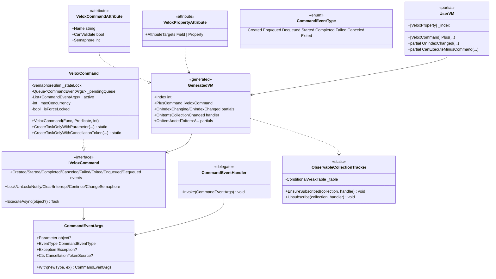

# 设计模式 — MVVM



## 模式对照表

| # | 模式 | 参与者 | 位置 |
|---|---|---|---|
| 1 | 源生成 / 代码生成 | `MVVM`、`Command` 生成器，`MVVMWriter`、`CommandWriter`、`MVVMPropertyFactory` | `Src/Generators/VeloxDev.Core.Generator/{MVVM.cs, Command.cs, Writers/MVVMWriter.cs, Writers/CommandWriter.cs, Base/Analizer.cs}` |
| 2 | 观察者（PropertyChanged + 生命周期事件） | `VeloxCommand`（9 个事件）、生成的属性、`ObservableViewModelBase` | `Src/Core/VeloxDev.Core/MVVM/VeloxCommand.cs`、`Examples/MVVM/WPF/Demo/ObservableViewModelBase.cs` |
| 3 | 命令 | `IVeloxCommand : ICommand`、`VeloxCommand`（队列 + 信号量） | `Src/Core/VeloxDev.Core/MVVM/VeloxCommand.cs` |
| 4 | 模板方法（partial 钩子） | 生成的 `OnXxxChanging/OnXxxChanged`、集合 partial | `Src/Generators/VeloxDev.Core.Generator/Base/Analizer.cs`（`GenerateViewModel`、`GenerateCollectionMembers`） |
| 5 | 弱引用注册表 | `ObservableCollectionTracker`（`ConditionalWeakTable`） | `Src/Core/VeloxDev.Core/MVVM/ObservableCollectionTracker.cs` |
| 6 | 适配器（与宿主框架共存） | `MVVMWriter.DetectSetterMode` → `SetProperty` / `RaiseAndSetIfChanged` / `NotifyOfPropertyChange` | `Src/Generators/VeloxDev.Core.Generator/Writers/MVVMWriter.cs` |

## 识别的模式

### 1. 源生成 / 代码生成（Roslyn 增量生成器）

`MVVM` 与 `Command` 实现 `IIncrementalGenerator`（`MVVM.cs` 第 12-13 行；`Command.cs` 第 12-13 行），并从 `partial` 类声明注册源输出（`Analizer.Filters.FilterContext`）。每个写入器为每个类产出一个 `.g.cs` 文件。默认模式下的 setter 形状（`Base/Analizer.cs`，`GetSetterBodyLines`，第 287-307 行）：

```csharp
if(global::System.Object.Equals(_index, value)) return;
var old = _index;
OnPropertyChanging(nameof(Index));
OnIndexChanging(old, value);
_index = value;
OnIndexChanged(old, value);
OnPropertyChanged(nameof(Index));
```

### 2. 观察者模式（PropertyChanged + 命令生命周期事件）

`VeloxCommand` 暴露八个生命周期事件 — `Created`/`Enqueued`/`Dequeued`/`Started`/`Completed`/`Failed`/`Canceled`/`Exited` — 以及 `CanExecuteChanged`（`VeloxCommand.cs`，第 92-101 行）。`ExecuteCoreAsync` 在调用前触发 `Started`，随后触发 `Completed`/`Canceled`/`Failed`，再触发 `Exited`（第 176-204 行）。生成的属性通过 `OnPropertyChanging`/`OnPropertyChanged` 触发 `PropertyChanging`/`PropertyChanged`，示例基类将其实现为事件调用（`Examples/MVVM/WPF/Demo/ObservableViewModelBase.cs`，第 11-19 行）。

### 3. 命令模式（IVeloxCommand）

`IVeloxCommand : ICommand` 增加异步执行与并发控制。`ExecuteAsync` 先检查强制锁，然后在容量允许时立即启动（`_active.Count < _maxConcurrency`），否则入队（`_pendingQueue.Enqueue`）并触发 `Enqueued`（`VeloxCommand.cs`，第 139-174 行）。`TryStartPendingAsync` 在容量释放后排空队列（第 349-377 行）。`CanExecute` 结合用户谓词与强制锁：`(_canExecute?.Invoke(parameter) ?? true) && !_isForceLocked`（第 126 行）。

### 4. 模板方法模式（partial 钩子）

生成的代码声明 `partial void OnXxxChanging/OnXxxChanged` 以及集合 partial `OnItemAddedToXxx`/`OnItemRemovedFromXxx`/`OnItemMovedInXxx`/`OnItemsResetInXxx`；用户提供实现，生成的骨架在 setter / 集合处理器的固定位置调用它们。示例填充了这些钩子（`Examples/MVVM/WPF/Demo/MainWindowViewModel.cs`，第 33-36 行与 178-209 行）。

### 5. 弱引用注册表（ObservableCollectionTracker）

`ObservableCollectionTracker` 让 `CollectionChanged` 订阅即使在字段直接赋值（`= []`）时也保持激活。`ConditionalWeakTable<object, Entry>` 以集合身份为键，因此条目随集合一并回收 — 无泄漏。`Entry` 按 `(Method, Target)` 身份去重（`MethodTargetEqualityComparer`），使重复的 getter 访问保持幂等（原因见 API 参考页）。

### 6. 适配器 / 通知基类适配

生成器不强制基类，而是适配已存在的通知基础设施。如果类或基类已声明 `OnPropertyChanging`/`OnPropertyChanged` 字符串方法，生成的代码就调用它们而不是生成事件（`MVVMWriter.ConfigurePropertyNotificationInfrastructure`，第 198-258 行）。框架基类由 `DetectSetterMode` 检测（第 42-89 行），并使用其 `SetProperty`/`RaiseAndSetIfChanged`/`NotifyOfPropertyChange`。这正是示例无需改动即可复用本地 `ObservableViewModelBase` 的原因。

> 源引用：`Src/Generators/VeloxDev.Core.Generator/{MVVM.cs, Command.cs, Writers/MVVMWriter.cs, Writers/CommandWriter.cs, Base/Analizer.cs}`、`Src/Core/VeloxDev.Core/MVVM/{VeloxCommand.cs, ObservableCollectionTracker.cs}`、`Src/Core/VeloxDev.Core/Interfaces/MVVM/IVeloxCommand.cs`、`Examples/MVVM/WPF/Demo/{MainWindowViewModel.cs, ObservableViewModelBase.cs}`。
