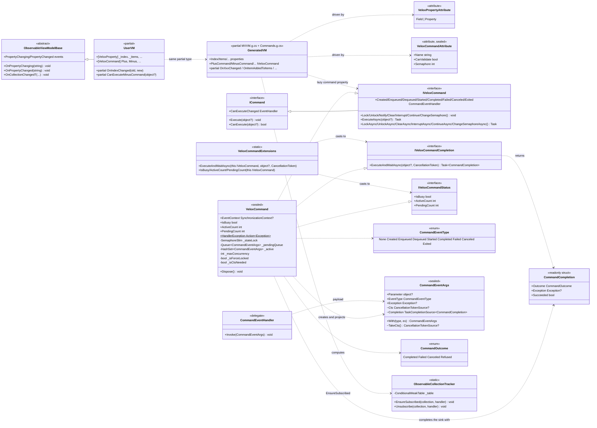
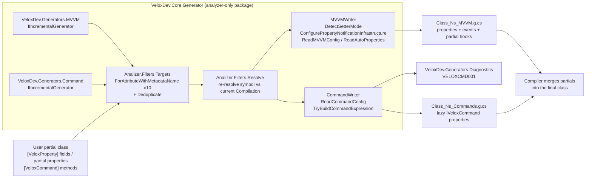

# 设计模式分析 — MVVM

`mvvm` 特性是**生成器 + 命令运行时**的组合。运行时位于 `Src/Core/VeloxDev.Core/MVVM/**` 与 `Src/Core/VeloxDev.Core/Interfaces/MVVM/**`，命名空间为 `VeloxDev.MVVM`，提供 `VeloxPropertyAttribute`、`VeloxCommandAttribute`、`IVeloxCommand`、`IVeloxCommandCompletion`、`IVeloxCommandStatus`、`VeloxCommand`、`VeloxCommandExtensions`、`CommandEventArgs` / `CommandEventType` / `CommandEventHandler` / `CommandOutcome` / `CommandCompletion`，以及 `ObservableCollectionTracker`。位于 `Src/Generators/VeloxDev.Core.Generator/**` 的 Roslyn 源生成器（类 `VeloxDev.Generators.MVVM` 与 `VeloxDev.Generators.Command`，以仅含分析器的包 `VeloxDev.Core.Generator` 发布）把 `[VeloxProperty]` 字段 / partial 属性与 `[VeloxCommand]` 方法变成可观察属性与懒加载命令属性。

## 模型类图


```mermaid
classDiagram
    direction LR
    class VeloxPropertyAttribute {
        <<attribute>>
        Field | Property
    }
    class VeloxCommandAttribute {
        <<attribute, sealed>>
        +Name string
        +CanValidate bool
        +Semaphore int
    }
    class ICommand {
        <<interface>>
        +Execute(object?) void
        +CanExecute(object?) bool
        +CanExecuteChanged EventHandler
    }
    class IVeloxCommand {
        <<interface>>
        +Created/Enqueued/Dequeued/Started/Completed/Failed/Canceled/Exited CommandEventHandler
        +Lock/Unlock/Notify/Clear/Interrupt/Continue/ChangeSemaphore() void
        +ExecuteAsync(object?) Task
        +LockAsync/UnlockAsync/ClearAsync/InterruptAsync/ContinueAsync/ChangeSemaphoreAsync() Task
    }
    class IVeloxCommandCompletion {
        <<interface>>
        +ExecuteAndWaitAsync(object?, CancellationToken) Task~CommandCompletion~
    }
    class IVeloxCommandStatus {
        <<interface>>
        +IsBusy bool
        +ActiveCount int
        +PendingCount int
    }
    class VeloxCommand {
        <<sealed>>
        +EventContext SynchronizationContext?
        +IsBusy bool
        +ActiveCount int
        +PendingCount int
        +HandlerException Action~Exception~$
        +Dispose() void
        -SemaphoreSlim _stateLock
        -Queue~CommandEventArgs~ _pendingQueue
        -HashSet~CommandEventArgs~ _active
        -int _maxConcurrency
        -bool _isForceLocked
        -bool _isCtsNeeded
    }
    class VeloxCommandExtensions {
        <<static>>
        +ExecuteAndWaitAsync(this IVeloxCommand, object?, CancellationToken)
        +IsBusy/ActiveCount/PendingCount(this IVeloxCommand)
    }
    class CommandEventType {
        <<enum>>
        None Created Enqueued Dequeued Started Completed Failed Canceled Exited
    }
    class CommandEventArgs {
        <<sealed>>
        +Parameter object?
        +EventType CommandEventType
        +Exception Exception?
        +With(type, ex) CommandEventArgs
        ~Cts CancellationTokenSource?
        ~TakeCts() CancellationTokenSource?
        ~Completion TaskCompletionSource~CommandCompletion~
    }
    class CommandEventHandler {
        <<delegate>>
        +Invoke(CommandEventArgs) void
    }
    class CommandOutcome {
        <<enum>>
        Completed Failed Canceled Refused
    }
    class CommandCompletion {
        <<readonly struct>>
        +Outcome CommandOutcome
        +Exception Exception?
        +Succeeded bool
    }
    class ObservableCollectionTracker {
        <<static>>
        +EnsureSubscribed(collection, handler) void
        +Unsubscribe(collection, handler) void
        -ConditionalWeakTable _table
    }
    class ObservableViewModelBase {
        <<abstract>>
        +PropertyChanging/PropertyChanged events
        +OnPropertyChanging(string) void
        +OnPropertyChanged(string) void
        +OnCollectionChangedT(...) void
    }
    class UserVM {
        <<partial>>
        +[VeloxProperty] _index, _items, ...
        +[VeloxCommand] Plus, Minus, ...
        +partial OnIndexChanged(old, new)
        +partial CanExecuteMinusCommand(object?)
    }
    class GeneratedVM {
        <<partial MVVM.g.cs + Commands.g.cs>>
        +Index/Items/... properties
        +PlusCommand/MinusCommand/... IVeloxCommand
        +partial OnXxxChanged / OnItemAddedToItems / ...
    }

    ICommand <|-- IVeloxCommand
    VeloxCommand ..|> IVeloxCommand
    VeloxCommand ..|> IVeloxCommandCompletion
    VeloxCommand ..|> IVeloxCommandStatus
    VeloxCommand ..> CommandEventType
    VeloxCommand ..> CommandEventArgs : creates and projects
    VeloxCommand ..> CommandOutcome : computes
    VeloxCommand ..> CommandCompletion : completes the sink with
    CommandEventHandler ..> CommandEventArgs : payload
    IVeloxCommandCompletion ..> CommandCompletion : returns
    VeloxCommandExtensions ..> IVeloxCommandCompletion : casts to
    VeloxCommandExtensions ..> IVeloxCommandStatus : casts to
    GeneratedVM ..> IVeloxCommand : lazy command property
    GeneratedVM ..> ObservableCollectionTracker : EnsureSubscribed
    GeneratedVM ..> VeloxPropertyAttribute : driven by
    GeneratedVM ..> VeloxCommandAttribute : driven by
    UserVM ..> GeneratedVM : same partial type
    ObservableViewModelBase <|-- UserVM
```

> 来源：`Src/Core/VeloxDev.Core/MVVM/VeloxCommand.cs` 第 20-31 行（枚举）、56-58（类头）、223-283（事件 / 属性）、855-917（`CommandEventArgs`）；`Src/Core/VeloxDev.Core/MVVM/CommandCompletion.cs` 第 6-29（`CommandOutcome`）、45-59（`CommandCompletion`）；`Src/Core/VeloxDev.Core/Interfaces/MVVM/*.cs`；`Src/Core/VeloxDev.Core/MVVM/VeloxCommandExtensions.cs` 第 34-72 行。

## 源生成流水线

两个生成器都是 `IIncrementalGenerator`，并共用同一个语法 provider。来自 `Src/Generators/VeloxDev.Core.Generator/Base/Analizer.cs`：

- 第 82 行 —— `TriggerAttributes` 列出能把类拉进 writer 的十个特性 —— 四个 `WorkflowBuilder` 特性、`DefaultAnchor`、`DefaultSize`、`Tickable`、`AspectOriented`，以及 MVVM 的两个：`VeloxDev.MVVM.VeloxPropertyAttribute` 与 `VeloxDev.MVVM.VeloxCommandAttribute`；
- 第 35 行 —— `GeneratorTarget`，一个持有 partial 声明与类型键的 readonly 结构体，刻意**不含** `ISymbol`；
- 第 107 行 —— `Targets` 为每个触发特性注册一个 `ForAttributeWithMetadataName` provider 并拼接；
- 第 142 行 —— `Resolve` 针对当前编译重新解析每个目标的符号。


```mermaid
flowchart LR
    P1["User partial class\n[VeloxProperty] fields / partial properties\n[VeloxCommand] methods"] --> F
    subgraph GEN["VeloxDev.Core.Generator (analyzer-only package)"]
        direction TB
        G1["VeloxDev.Generators.MVVM\nIIncrementalGenerator"] --> F
        G2["VeloxDev.Generators.Command\nIIncrementalGenerator"] --> F
        F["Analizer.Filters.Targets\nForAttributeWithMetadataName x10\n+ Deduplicate"] --> R["Analizer.Filters.Resolve\nre-resolve symbol vs current Compilation"]
        R --> W1["MVVMWriter\nDetectSetterMode\nConfigurePropertyNotificationInfrastructure\nReadMVVMConfig / ReadAutoProperties"]
        R --> W2["CommandWriter\nReadCommandConfig\nTryBuildCommandExpression"]
    end
    W2 --> D["VeloxDev.Generators.Diagnostics\nVELOXCMD001"]
    W1 --> O1["Class_Ns_MVVM.g.cs\nproperties + events + partial hooks"]
    W2 --> O2["Class_Ns_Commands.g.cs\nlazy IVeloxCommand properties"]
    O1 --> P2["Compiler merges partials\ninto the final class"]
    O2 --> P2
```

每个 writer 都通过 `Writers/WriterBase.cs` 实现 `ICodeWriter`（`Src/Generators/VeloxDev.Core.Generator/Base/ICodeWriter.cs` 第 6-11 行：`Initialize`、`CanWrite`、`Write`、`GetFileName`），并且只有在 `CanWrite()` 为真时才为每个类产出一个 `.g.cs` 文件 —— `MVVMWriter.CanWrite`（第 845 行）针对带 `[VeloxProperty]` 的类（或工作流组件），`CommandWriter.CanWrite`（第 243 行）针对带 `[VeloxCommand]` 的类。

## 模式地图

| # | 模式 | 参与者 | 位置 |
|---|---|---|---|
| 1 | 源生成（codegen） | `VeloxDev.Generators.MVVM`、`VeloxDev.Generators.Command`、`Analizer.Filters`（`Targets` / `Resolve`）、`MVVMWriter`、`CommandWriter`、`MVVMPropertyFactory` | `Src/Generators/VeloxDev.Core.Generator/{MVVM.cs, Command.cs, Base/Analizer.cs, Writers/MVVMWriter.cs, Writers/CommandWriter.cs}` |
| 2 | 命令模式 | `IVeloxCommand : ICommand`、`VeloxCommand`（容量 + 队列 + 生命周期事件） | `Src/Core/VeloxDev.Core/Interfaces/MVVM/IVeloxCommand.cs`、`Src/Core/VeloxDev.Core/MVVM/VeloxCommand.cs` |
| 3 | 观察者（INPC + 生命周期事件） | 生成的属性、`OnPropertyChanging` / `OnPropertyChanged`、`ObservableViewModelBase`、8 个命令生命周期事件 | `Writers/MVVMWriter.cs`、`VeloxCommand.cs` 第 228-242 行、`Examples/MVVM/WPF/Demo/ObservableViewModelBase.cs` |
| 4 | 模板方法（partial 钩子） | 生成的 `OnXxxChanging` / `OnXxxChanged`、集合 partial、`CanExecuteXxxCommand` | `Base/Analizer.cs`（`MVVMPropertyFactory`）、`CommandWriter.cs` 第 292 行 |
| 5 | 适配器（与宿主框架共存） | `MVVMWriter.DetectSetterMode` | `Writers/MVVMWriter.cs` 第 42 行 |
| 6 | 弱引用注册表 | 使用 `ConditionalWeakTable` 的 `ObservableCollectionTracker` | `Src/Core/VeloxDev.Core/MVVM/ObservableCollectionTracker.cs` |
| 7 | 接口隔离 + 选择加入扩展 | `IVeloxCommandCompletion`、`IVeloxCommandStatus`、`VeloxCommandExtensions` | `Src/Core/VeloxDev.Core/Interfaces/MVVM/IVeloxCommand{Completion,Status}.cs`、`VeloxCommandExtensions.cs` |
| 8 | Promise / 可等待结果（Future） | `ExecuteAndWaitAsync`、`CommandCompletion`、内部 `Completion` 槽 | `VeloxCommand.cs` 第 452-471、891、899-900 行 |
| 9 | 无事件对应物的哨兵值 | `CommandOutcome.Refused` | `CommandCompletion.cs` 第 22-28 行 |

## 已识别的模式

### 1. 源生成（Roslyn 增量生成器）

`Analizer.Filters.Targets`（第 107 行）为每个 `TriggerAttributes` 条目注册 `ForAttributeWithMetadataName` provider，并按类型键对结果去重。特性以符号而非名称匹配，因此完全限定名与别名写法都能识别，且不携带任何触发特性的类根本不会到达 writer。随后 `Resolve`（第 142 行）针对当前编译重新解析每个符号 —— 因为在被缓存的转换里捕获的符号会在别的文件被编辑后过期。

`MVVMWriter` 读取 `[VeloxProperty]` **字段**（`ReadMVVMConfig`，第 91 行）与 **partial 属性**（`ReadAutoProperties`，第 117 行），各自经 `MVVMPropertyFactory` 产出一个可观察属性。`CommandWriter.ReadCommandConfig`（第 43 行）读取 `[VeloxCommand]` 方法，先按位置再按具名覆盖解析 `name` / `canValidate` / `semaphore`，并按键签名选择构造方式（`TryBuildCommandExpression`，第 133 行）。

默认 setter 形态（普通字段、无宿主框架）由 `Base/Analizer.cs` 中 `MVVMPropertyFactory.GetSetterBodyLines` 产出，`OnPropertyChanging` / `OnPropertyChanged` 由 `MVVMWriter` 注入：

```csharp
// Source: Generated — CounterViewModel_QuickStart_Mvvm_MVVM.g.cs, the Count property
if(global::System.Object.Equals(this._count, value)) return;
var old = this._count;
OnPropertyChanging(nameof(Count));
OnCountChanging(old, value);
this._count = value;
OnCountChanged(old, value);
OnPropertyChanged(nameof(Count));
```

生成器还决定类型自身是否需要暴露通知面。`ConfigurePropertyNotificationInfrastructure`（`MVVMWriter.cs` 第 198 行）遍历类及其基类：若层级中任何位置都没有 `PropertyChanging` / `PropertyChanged` 事件、也没有 `OnPropertyChanging` / `OnPropertyChanged(string)` 方法，它就生成这两个事件、两个方法，并把两个接口加到该类型上。若基类已提供，生成的 setter 就直接调用继承来的方法 —— 这正是演示可以原样复用本地 `ObservableViewModelBase` 的原因。

### 2. 命令模式（`IVeloxCommand`）

`IVeloxCommand : ICommand` 在 `ICommand` 之上增加了异步执行、生命周期事件与并发控制。`VeloxCommand`（`VeloxCommand.cs` 第 56-833 行）是具体引擎：`_stateLock`（`SemaphoreSlim(1,1)`，第 195 行）保护 `_pendingQueue`（第 196 行）与 `_active`（第 198 行），`_maxConcurrency`（第 200 行）限制并行运行数。`CanExecute` 把用户谓词与强制锁结合：

```csharp
// Source: Src/Core/VeloxDev.Core/MVVM/VeloxCommand.cs, lines 407-408
public bool CanExecute(object? parameter)
    => (_canExecute?.Invoke(parameter) ?? true) && !_isForceLocked;
```

`ExecuteCore`（第 474 行）要么加入 `_active` 并启动、要么入队并触发 `Enqueued`、要么在被强制锁定时取消该项的取消源并触发 `Canceled`，随后调用 `item.Complete(CommandOutcome.Refused, null)`（第 519 行）。整个设计赖以成立的不变式就写在源码自己的注释里（第 192-194 行）：**持 `_stateLock` 期间不得运行任何用户代码**，因为该锁不可重入。

### 3. 观察者模式（INPC + 命令生命周期事件）

`VeloxCommand` 暴露八个生命周期事件外加 `CanExecuteChanged`（第 225-242 行）。`ExecuteCoreAsync`（第 533 行）在调用方法体前触发 `Started`，随后按结局触发 `Completed` / `Canceled` / `Failed`，而 `Exited` 由 `OnExecutionCompletedAsync`（第 594 行）触发。处理器收到 `CommandEventArgs`，其 `EventType` 携带阶段。生成的可观察属性遵循经典的 `INotifyPropertyChanging` / `INotifyPropertyChanged` 观察者契约。集合属性另外经 `ObservableCollectionTracker` 订阅 `CollectionChanged`，于是字段初始化器（`= []`）绝不会留下未订阅的事件。

抛异常的订阅者会被隔离，而不是任由它干扰管线：

```csharp
// Source: Src/Core/VeloxDev.Core/MVVM/VeloxCommand.cs, lines 316-326
private void Invoke(CommandEventHandler handler, CommandEventArgs args)
{
    try
    {
        handler(args);
    }
    catch (Exception ex)
    {
        ReportHandlerException(ex);
    }
}
```

### 4. 模板方法模式（partial 钩子）

生成器产出 `partial void` 声明，并在生成骨架的固定位置调用它们。对每个属性，它在赋值前发出 `OnXxxChanging(oldValue, newValue)`、赋值后发出 `OnXxxChanged(oldValue, newValue)`；由你在类的手写部分实现这些 partial 体。对 `INotifyCollectionChanged` 属性，`GenerateCollectionMembers`（第 754 行）还生成 `OnItemAddedToXxx` / `OnItemRemovedFromXxx` / `OnItemMovedInXxx` / `OnItemsResetInXxx`，由生成的 `OnXxxCollectionChanged` 按 `NotifyCollectionChangedAction` 分派。命令的可执行性用同一招：`canValidate: true` 生成一个必须由用户实现的 `partial bool CanExecuteXxxCommand(object? parameter)`。

### 5. 适配器模式（与宿主框架共存）

生成器不强制基类，而是适配被标注类型已经继承的通知基础设施。`MVVMWriter.DetectSetterMode`（第 42 行）识别 CommunityToolkit.Mvvm、Prism、ReactiveUI 与 Caliburn.Micro，并让生成的 setter 改调宿主的 `SetProperty` / `RaiseAndSetIfChanged` / `NotifyOfPropertyChange`，而不是自己触发事件。`ConfigurePropertyNotificationInfrastructure` 同样转发到既有的基类方法，或仅在无人提供时才生成事件。同一个 writer 也支撑 WorkflowSystem 的默认视图模型。

### 6. 弱引用注册表（`ObservableCollectionTracker`）

即便后备字段用 `= []` 直接赋值，`ObservableCollectionTracker` 也能让 `CollectionChanged` 订阅存活。`ConditionalWeakTable<object, Entry>`（第 17 行）以集合身份为键存放追踪条目，因此条目随集合一起被回收 —— 不泄漏。`Entry` 按 `(Method, Target)` 身份去重（`MethodTargetEqualityComparer`，第 100 行）：

```csharp
// Source: Src/Core/VeloxDev.Core/MVVM/ObservableCollectionTracker.cs, lines 104-109
public bool Equals(Delegate? x, Delegate? y)
{
    if (ReferenceEquals(x, y)) return true;
    if (x is null || y is null) return false;
    return x.Method == y.Method && ReferenceEquals(x.Target, y.Target);
}
```

没有它，每次读取 getter 都会把 method group 产生的新委托重复订阅一遍。

### 7. 接口隔离与选择加入扩展

接口发布之后才新增的两项能力 —— 可等待结果与繁忙读模型 —— 各自放在独立接口上而不是 `IVeloxCommand` 上，正是为了让既有的手写实现者不被破坏。`VeloxCommandExtensions` 是从“生成属性所声明的 `IVeloxCommand` 类型”取到它们的那层适配，并在实现未选择加入时明确报错而不是去猜：

```csharp
// Source: Src/Core/VeloxDev.Core/MVVM/VeloxCommandExtensions.cs, lines 74-88
private static IVeloxCommandStatus Status(IVeloxCommand command)
{
    if (command is null)
    {
        throw new ArgumentNullException(nameof(command));
    }

    return command as IVeloxCommandStatus
        ?? throw new NotSupportedException(Unsupported(nameof(IVeloxCommandStatus)));
}
```

### 8. Promise / 可等待结果

`ExecuteAndWaitAsync`（第 452 行）给每次执行挂上一个 `TaskCompletionSource<CommandCompletion>` 槽，存放在该项内部的 `Completion` 槽上（`VeloxCommand.cs` 第 891 行）。结局在 `ExecuteCoreAsync` 内部算出，而不是从事件推断 —— 第 537 行的注释说明了原因：*“等结果的 sink 不能依赖『有人订阅了 Failed』”* —— 而 `Complete`（第 899 行）在每次执行都必经的 `finally` 中恰好收尾一次：

```csharp
// Source: Src/Core/VeloxDev.Core/MVVM/VeloxCommand.cs, lines 895-900
internal bool TryMarkCancelReported() => Interlocked.Exchange(ref _cancelReported, 1) == 0;

internal void Complete(CommandOutcome outcome, Exception? exception)
    => Completion?.TrySetResult(new CommandCompletion(outcome, exception));
```

另注意第 890 行：`CommandEventArgs.With` 产生的副本刻意**不**携带该槽，因此一次投影无法替别人收尾等待。

### 9. 刻意没有事件对应物的哨兵值

`CommandOutcome.Refused` 是事件模型唯一无法表达的结局，源码在它的声明处就写明了：

```csharp
// Source: Src/Core/VeloxDev.Core/MVVM/CommandCompletion.cs, lines 22-28
/// <summary>
/// The call never ran because the command was locked. This one has no matching
/// <see cref="CommandEventType"/> member: a refused call raises
/// <see cref="CommandEventType.Canceled"/> and never reaches <see cref="CommandEventType.Exited"/>, so
/// <see cref="CommandEventType"/> alone cannot tell a refusal apart from a cancellation.
/// </summary>
Refused,
```

这正是模式 8 存在的设计理由：事件流是广播，而广播回答不了“针对某个调用方”的问题。

## 模式到源码索引

| 模式 | 主要源码 |
|---|---|
| 源生成 | `Src/Generators/VeloxDev.Core.Generator/{Base/Analizer.cs, Writers/MVVMWriter.cs, Writers/CommandWriter.cs}` |
| 命令 | `Src/Core/VeloxDev.Core/MVVM/VeloxCommand.cs` 第 56-833 行、`Interfaces/MVVM/IVeloxCommand.cs` |
| 观察者 | `VeloxCommand.cs` 第 225-242、316-326 行、`Examples/MVVM/WPF/Demo/{MainWindowViewModel.cs, ObservableViewModelBase.cs}` |
| 模板方法 | `Base/Analizer.cs`（`MVVMPropertyFactory`，第 394-780 行）、`Writers/CommandWriter.cs` 第 292 行 |
| 适配器 | `Writers/MVVMWriter.cs` 第 42-89、198-258 行 |
| 弱引用注册表 | `Src/Core/VeloxDev.Core/MVVM/ObservableCollectionTracker.cs` |
| 接口隔离 | `Interfaces/MVVM/IVeloxCommandCompletion.cs`、`Interfaces/MVVM/IVeloxCommandStatus.cs`、`VeloxCommandExtensions.cs` |
| Promise / 可等待 | `VeloxCommand.cs` 第 452-471、890-900 行 |
| 拒绝哨兵 | `CommandCompletion.cs` 第 22-28 行 |
