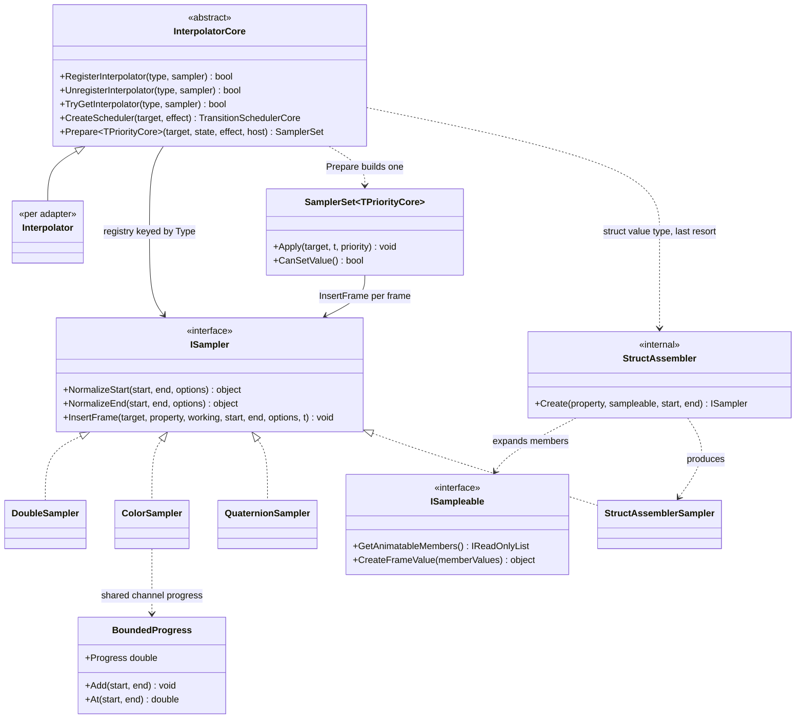

# 设计模式 — 过渡动画：采样器策略

引擎的值插值侧：一个属性的类型如何被映射到那个知道怎么插值它的东西，以及一个自身无采样器的值类型如何照样被动画。

## 类图

> 来源：`Src/Core/VeloxDev.Core/TransitionSystem/Sampling/Interpolator.cs`、`SamplerSet.cs`、`StructAssembler.cs`、`BoundedProgress.cs`、`NativeSamplers/*.cs`、`Interfaces/TransitionSystem/ISampler.cs`、`ISampleable.cs`。

## 模式：Strategy（`ISampler`）

`ISampler` 是值插值策略。核心在**准备时调用一次** `NormalizeStart` / `NormalizeEnd` 以固定精确端点值，随后用 `InsertFrame(target, property, ref working, start, end, options, t)` 计算中间帧。`t` 进来时已缓动且未被夹取，因此实现把 `t <= 0` / `t >= 1` 当作端点写入（对数值采样器，则是一次恰好复现端点的线性插值）。

契约承载三条实现规则，各有其理由：

- **无状态单例，绝不修改 `start` / `end`** —— 端点与记录它们的过渡声明共享，修改就污染声明。引用类型采样器使用每次动画复用的 `working` 暂存（首个中间帧时经 `ref` 惰性创建、之后复用），因此常见快路径每采样零分配。
- **端点是插值器的事，不是循环的事** —— 循环只保证每趟*最后*一帧恰好是 `t = 1`（正向）或 `t = 0`（反向），因此采样器永远不必依赖 `Ease(1)` 恰为 `1`。
- **`options` 是唯一的逐属性通道** —— 角度采样器（`DoubleSampler`、`QuaternionSampler`）从中读 `RotationDirection`；其余忽略它。

## 模式：Registry + 解析链（`InterpolatorCore`）

注册表是一个私有的 `ConcurrentDictionary<Type, ISampler>`，只经 `RegisterInterpolator` / `UnregisterInterpolator` / `TryGetInterpolator` 触达。私有持有是刻意的：能触达字典的调用方可以整体替换它（丢掉静态构造函数播下的每一项默认）或清空它。

`RegisterInterpolator` 是原子的后写胜出（`AddOrUpdate`）。`TryGetInterpolator` **不是**精确匹配；它分三段解析：

1. 精确类型；
2. 它的基类，最近优先；
3. 它的接口，多个命中时取全名按序（ordinal）最小者。

这条链存在，是因为框架属性常常声明为适配器注册类型的子类 —— 一个声明为 `LinearGradientBrush` 的属性对 WPF 注册的 `Brush` —— 所以只做精确匹配会让它不被动画、并被报为不可采样。接口排最后且其决胜显式写死，因为反射自身的顺序未被规定：两个匹配的接口*哪一个*胜出是任意的，但「每次都是同一个」不是。

这条链每个属性每次动画走一次，位于 `Prepare` 内 —— 绝不逐帧。这就是整个设计：`SamplerSet` 持有已解析的采样器，帧路径完全不做类型解析。

## 模式：三个位置上的 Null Object

- WPF 注册的是**抽象基类** `Effect` 而不是具体的 `DropShadowEffect`。注册具体类型会让所有声明为 `Effect` 的路径（WPF 自己的 `UIElement.Effect` 依赖属性就是这么声明的）查不到、静默不被采样 —— 与上面那条链要吸收的错误同一个，只是高一层。
- 类型解析不到任何东西的属性被**跳过并经 `Warn` 报出**，而不是当作 `null` 插值。跳过让其余属性保持正确，`Warn` 让这次跳过可观测。
- `StructAssembler.Create` 在无法装配时（成员采样器解析不到、成员值缺失、访问失败）回答 `null`。`null` 保持为一次跳过 —— 装配器绝不向 `Prepare` 抛异常。

## 模式：值类型的 Composite 策略（`ISampleable` + `StructAssembler`）

`ISampleable` **不是**采样器，且是**仅值类型**的契约：一个结构体声明它的哪些成员可动画（`GetAnimatableMembers`）、如何从插值后的成员重建该值（`CreateFrameValue`）。这种类型且无注册采样器的属性作为整体被动画：`StructAssembler.Create` 解析每个成员的采样器与当前值，产出一个 `StructAssemblerSampler`，它用各成员自己的采样器插值、再调 `CreateFrameValue` —— 一个编译期构造函数调用，运行时零反射。

捕获背后的机制值得点名：`StructAssemblerSampler` **不**把成员写到目标上（对结构体那会落在装箱副本上）。它给每个成员采样器传一个私有的 `CaptureProperty : ITransitionProperty`，其 `SetValue` 只记录值，随后从记录的数组装配结构体。这就是 Composite 模式 —— 一个本身由若干 `ISampler` 组成的 `ISampler`，以一个私有 `ITransitionProperty` 作为让成员写入不落到真实目标上的接缝。

引用类型**不**被展开：`Prepare` 只在 `PropertyType.IsValueType` 时才伸手取 `ISampleable`，而解析不到任何东西的引用类型末端会被 `Execute` 事先拒绝（`TransitionPathUnsampleableException`），而不是当作什么都没动画。

## 模式：受限通道的分组策略（`BoundedProgress`）

`BoundedProgress` 是个小的值类型助手，但它编码了一个设计决定：共享同一个界的一组通道**按同一个进度**移动，因此过冲无法扭曲该值。`ColorSampler` 给 R/G/B 一个 `[0, 255]` 进度、让 alpha 保留完整缓动时间；`SizeSampler` / `SizeFSampler` / `RectangleSampler` / `RectangleFSampler` 给宽/高一个 `[0, +∞)` 进度。`Add` 只会*收紧*，因此加通道的顺序无关，该组剩余的过冲被丢弃，而不是让某个通道离开它的范围。

来源：`Src/Core/VeloxDev.Core/TransitionSystem/Sampling/Interpolator.cs`、`SamplerSet.cs`、`StructAssembler.cs`、`BoundedProgress.cs`、`NativeSamplers/{ColorSampler,SizeSampler,RectangleSampler,SizeFSampler,RectangleFSampler}.cs`、`Src/Adapters/VeloxDev.WPF/PlatformAdapters/Interpolator.cs`、`Src/Core/VeloxDev.Core.Test/TransitionSystem/{InterpolatorCoreTests,EaseOvershootTests,SamplerConformanceTests}.cs`、`Examples/Transition/AUTO TEST/Conformance/ClosedForm.cs`。
