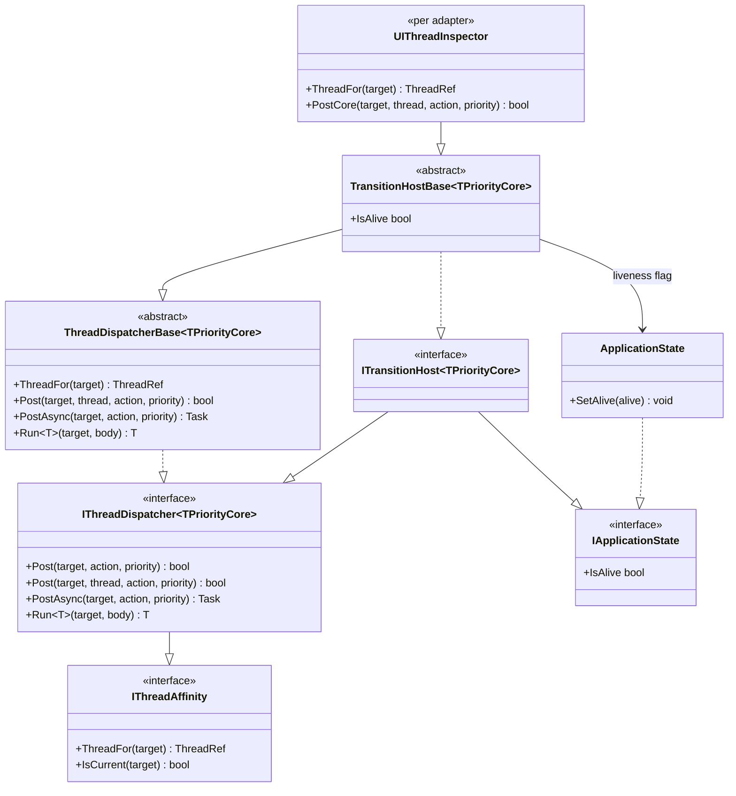

# 设计模式 — 过渡动画：宿主与时间轴

使引擎在边缘处与平台无关的两条接缝：它向**宿主**索取什么，以及它向**时钟**索取什么。

## 宿主接缝 —— 类图

> 来源：`Src/Core/VeloxDev.Core/Interfaces/TransitionSystem/ITransitionHost.cs`、`Src/Core/VeloxDev.Core/Threading/{IThreadDispatcher,ThreadDispatcherBase,ThreadRef,NonPriority}.cs`、`Src/Core/VeloxDev.Core/Lifetime/IApplicationState.cs`、`Src/Core/VeloxDev.Core/TransitionSystem/TransitionHostBase.cs`、`Src/Adapters/*/PlatformAdapters/UIThreadInspector.cs`。

### 模式：用组合取代胖接口；用模板方法取代派生

`ITransitionHost<TPriorityCore>` **不新增任何成员**。它组合 `IThreadDispatcher<TPriorityCore>`（后者又组合 `IThreadAffinity`）与 `IApplicationState`，于是适配器只声明一个接口，而底下两个子系统仍可各自替换 —— 也于是非动画的消费者可以只取时钟或只取存活标志。

底下 `ThreadDispatcherBase<TPriorityCore>` 是**模板方法**：宿主只提供 `ThreadFor`、`IsCurrentThread`、`PostCore`，基类一次实现 `Post`、`PostAsync`、`Run<T>`，于是没有宿主能与别的宿主派生出不同行为。骨架里有三处承重：

- **调用方已在目标线程上时 `Post` 就地运行。** `Post(target, thread, action, priority)` 是 `IsCurrentFor(target, thread) ? RunInline(action) : PostCore(target, thread, action, priority)` —— 因此常见情形（UI 线程上的一次 `Execute`）完全不需要派发。
- **`PostAsync` 只在动作被接纳时才等。** 完成源是一个 `TaskCompletionSource`；静默丢弃动作的宿主会让它永不完成，所以基类返回 `false` 而不是永远等下去。这是每个动画唯一的一次 `await` —— `Awake` —— 且它必须在 `Prepare` 读取目标之前完成。
- **`InternalPriority` 有默认值而非必须，而携带优先级的宿主必须重写它。** 对没有优先级的宿主 `default(NonPriority)` 就是全部答案，但 `default(DispatcherPriority)` 是 `Inactive`，会把一次阻塞的 `Run<T>` 排到所有普通消息之后。

### 模式：「没有线程」的 Null Object（`ThreadRef.None`）

`ThreadRef` 包装宿主用来标识线程的任何东西（一个 `Dispatcher`、`DispatcherQueue`、`IDispatcher`、`SynchronizationContext`），并给「没有线程拥有它」一个**名字**，而不是每个调用方都要强制转换的 `null`。`ThreadFor` 绝不抛异常 —— 答不上来的宿主返回 `None`，那只是让该目标失去 UI 线程帧节奏器。若从一个*确实*会抛的宿主进入写路径，逐帧看与动画失败无法区分，这就是接口写明那里什么都不能抛的原因。

## 节奏接缝 —— `FramePacerCore`

`FramePacerCore` 是决定下一帧*何时*发生的**模板方法**，而采样循环决定这一帧*走到多远*。这个分工就是要害：时间轴是计时权威，唤醒只是提醒，所以醒晚了画出的是一帧走得更远的画面而不是错的帧。

| 骨架成员 | 基类掌握的不变行为 |
|---|---|
| `Schedule(continuation, interval, token)` | 先发布续体（`Volatile.Write`）再武装 —— 顺序如此，使一个已经到期的定时器不能在续体挂上之前 tick。挂起的续体被**替换**而不是排队（一个循环拥有一个节奏器）。 |
| `Arm(interval)` | 子类钩子：启动或重新武装宿主的等待。 |
| `Disarm()` | 子类钩子：结束它。必须容忍未武装时调用且不得分配 —— 它每帧调用一次。 |
| `Fire()` | **先** disarm，再恰好一次调用挂起的续体（`Interlocked.Exchange`）。顺序要紧：重复等待不得在循环武装下一帧之前再次完成。 |
| `Dispose()` | disarm，然后**放行**（调用）任何挂起的续体。等待一个永不调用的续体的循环会永久搁浅，无异常、无帧。 |

基类存在是为了让两种失败成为不可能：一个两次调用续体的节奏器会双倍采样；一个从不调用它的会让循环永久停摆。两者从宿主侧都看不见，也都不值得逐平台重新推演。宿主重写这一对而不是实现接口：WPF/Avalonia/Jalium 等 `DispatcherTimer`，WinUI 等一个非重复的 `DispatcherQueueTimer`，MAUI 等一个重复的 `IDispatcherTimer`，WinForms 则把每一帧投递给目标控件，而 Razor 保留默认。每个重写在无答案时返回 `null` —— 没有可命名线程，或对 WinForms 而言目标不在当前线程上。

默认等待是 `Abstractions.ReusableTimerWait` —— 整条循环一个 `Timer`、整个动画一次取消登记，取代 `await Task.Delay(interval, token)` 每次等待一个 `DelayPromise` 加一次回调登记。

## 时钟接缝 —— `VeloxDev.Timing`

引擎从 `ITimeSource` 读时间、绝不读框架时钟，这是一个有三个后果的设计决定：

- **暂停是被排除而不是被跳过的。** 一个暂停期间干脆不前进的源使这种排除成为构造性的。之前的设计用墙钟测量、同时另有一个标志说「别计数」，于是产生了恢复后的 delta 尖峰；这里两口时钟是同一口。
- **一趟可以停摆。** `IsAdvancing` 被表述为**不变量**（`true` 蕴含位置正在移动），而不是关于 `IsPaused` 与 `Rate` 的公式，因为停止供给的宿主会冻结位置而不暂停任何东西。停摆信号绑定在该谓词上，因此停摆的消费者零唤醒、也不会在 `while (!IsAdvancing)` 上空转。
- **时间是共享的。** 多个消费者锚定在同一条绝对时间轴上；单个消费者的趟是它上面的一个*锚点*（`TransitionRun.PassAnchor`），不是重置，因此在一个消费者上开启一趟不会移动任何其他消费者。

`TimerCore`（注册表）与 `InterpolatorCore`（采样器注册表）被刻意塑造成同一形状：一个私有字典、一个公开的 register/unregister/try-get 三元组、原子的后写胜出，以及调用方永远看不到的键。两者存在都是为了让平台在**契约**之下替换实现，且两者都不外发自己的字典。

来源：`Src/Core/VeloxDev.Core/Interfaces/TransitionSystem/ITransitionHost.cs`、`Src/Core/VeloxDev.Core/Threading/*.cs`、`Src/Core/VeloxDev.Core/Lifetime/IApplicationState.cs`、`Src/Core/VeloxDev.Core/TransitionSystem/{TransitionHostBase,FramePacerCore,ReusableTimerWait,TransitionInterpreter,TransitionRun}.cs`、`Src/Core/VeloxDev.Core/Timing/*.cs`、`Src/Core/VeloxDev.Core/Interfaces/Timing/*.cs`、`Src/Adapters/*/PlatformAdapters/{UIThreadInspector,TransitionInterpreter}.cs`。
