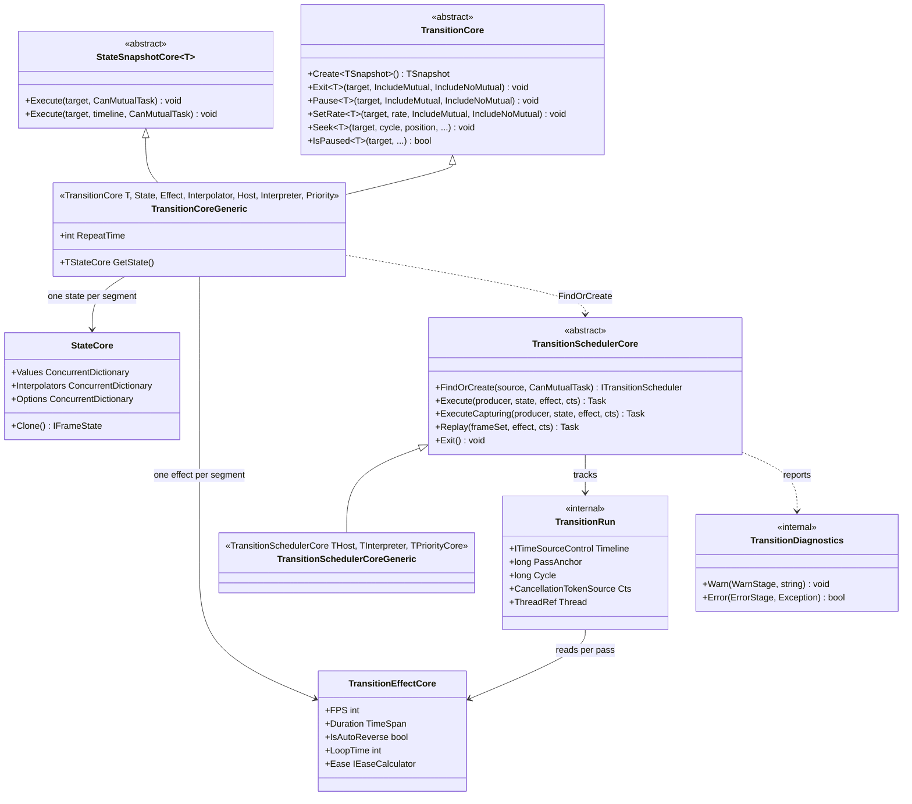

# 设计模式 — 过渡动画：构建器与调度器

声明侧（一个同时是分段链的构建器）与执行侧（每目标一个调度器，以及让一趟能被后来的控制调用找到的那些注册表）。

## 类图 —— 构建器、链、调度器

> 来源：`Src/Core/VeloxDev.Core/TransitionSystem/{Effects/Transition,Effects/TransitionEffect,Runtime/TransitionDiagnostics,Runtime/TransitionRun,Runtime/TransitionScheduler,State/State,State/StateSnapshot}.cs`。

## 模式：同时是 Composite 的流式构建器

`Transition<T>.Create()` 返回一个对象，同时是静态入口、构建器与执行器。`.Property(expr, value, options)` 与 `.Effect(...)` 各自返回同一个构建器，因此一个流式表达式*读起来*就像配置。

它实际构建的是**一个分段列表**：`.Await(span)`、`.Then()`、`.AwaitThen(span)`（`StateSnapshotCore` 上的 `TransitionCoreEx` 扩展）分配**下一个**分段并经 `next` 字段链接它，于是同一个构建器表达式描述的是一条有序链 —— 每一环都携带自己的 `State`、`Effect`、`Interpolator` 与前置延时。`Execute` 随后遍历这条链。这就是 Composite 模式：链与单个分段由同一段代码消费，因为「容器」只是一条指向下一个的链。

把分段做成数据而非行为，有两件事随之而来：

- **建好的链可复用且构造上就基本安全** —— `CoreExecute` 运行前克隆每段的 effect（`effect.Clone()`），因此一个静态 `Animation0` 可以在任意多个目标上反复执行，演示正是这么做的。
- **`RepeatTime` 是逐分段的整数，不是包装对象。** `Repeat(count)` 把它被调用的那个分段上的 `RepeatTime` 写进去，`CoreExecute` 通过遍历 `repeats[]` 展开循环 —— 于是循环不需要新类型，而「这个循环包裹哪些分段」仅由链序回答（一个分段的循环包裹从首段**到它自己**的链）。

## 模式：以目标为弱键的注册表

`TransitionSchedulerCore` 持有两张静态表与一张私有锁表：

| 表 | 类型 | 为何是这个形状 |
|---|---|---|
| `MutualSchedulers` | `ConditionalWeakTable<object, ITransitionSchedulerCore>` | 每目标一个**互斥**调度器，随目标回收。`GetValue` 原子安装它 —— `TryGetValue` 后再 `Add` 会竞态，而输家的 `Add` 会抛。 |
| `NoMutualSchedulers` | `ConditionalWeakTable<object, ConcurrentDictionary<ITransitionSchedulerCore, byte>>` | 某目标上*当前*存在的**并发**调度器，作为一个集合。动画从多个线程各自登记/注销（后台 `Task.Run`、UI 线程点击），普通 `List` 无同步地增删会丢条目 —— 那会让 `Exit` 漏掉调度器并留下仍在跑的动画。 |
| `TargetLocks`（私有） | `ConditionalWeakTable<object, SemaphoreSlim>` | 串行化一个目标的**控制面** —— 「进入」（建 token、登记动画）对「离开」（取消其上一切存活者）。只在同步记账期间持有，绝不跨过动画主体，因此不会与帧要去的 UI 线程死锁，同一目标上的非互斥动画也仍并发运行。 |

两张调度器表的区别是一条设计陈述而不是实现细节：互斥表是*目标整个生命期的缓存*（所以 `TryGetMutualScheduler` 回答的是「这个目标是否跑过互斥动画」），而非互斥表是*活状态*（一趟结束时条目被移除）—— 这就是为什么 `AUTO TEST` 套件从 `TryGetNoMutualScheduler` 读**数组长度**而不是那个布尔值。

## 模式：两阶段运行，使重复是重放而不是重读

`Execute` 与 `ExecuteCapturing` 共用主体；`ExecuteCapturing` 只是把它准备的那套 `SamplerSet` 交还，而 `Replay(frameSet, effect)` 让一个分段*再次针对那同一套集合*运行。`Repeat` 是这一对的唯一调用方，理由是一条正确性论证而不是优化：

- 准备一个分段会读**目标当前值**作为起点，因此重新准备一个重复的分段会从上次迭代停下处起步 —— 终点不同于起点的链会倒退；
- 某段写着更早分段都没碰过的属性，会一趟比一趟漂。

重放让每次迭代完全相同并钉住端点。它刻意**不**重触发的是 `Awake`：`Awake` 是把目标置入该段起始状态的钩子，而一次重放*定义*为完全不依赖目标状态。`Start`、`Update`、`LateUpdate`、`Completed` 与诊断确实会触发，因此一次重放与任何其他趟一样可观测。

## 模式：生命周期的 Observer，诊断另开一条通道

`TransitionEffectCore` 暴露九个 `WeakDelegate` 承载的事件。七个是生命周期（`Awaked`、`Start`、`Update`、`LateUpdate`、`Canceled`、`Completed`、`Finally`）；两个是**诊断**（`Warn`、`Error`），它们存在是因为引擎的失败模式是沉默：一个在 UI 线程上从采样器逃出的异常没有调用方接得住，而抛异常的回调不能让宿主进程倒下。

`TransitionDiagnostics` 是内部的居中者：

- 它是**一次运行作用域**的对象（每次 `Prepare` / 每条循环创建），因此「每个阶段至多报一次」是按运行计的 —— 一个逐帧发生的情况报一次之后便安静；
- 它把 `Warn` / `Error` 经 effect 的事件*以及*一行 `Debug.WriteLine` 送出，因此即便无人监听，一次运行也会报告；
- 它每次上报构造一个带类型的实参（`Warn` 用 `TransitionEventArgs<WarnStage, string>`，`Error` 用 `TransitionEventArgs<ErrorStage, Exception>`），并先把运行的 `Loop` / `Cycle` 抄上去再触发，诊断处理器因此看得到运行的位置；
- 它尊重 `TransitionEventArgs.Handled`：置位的处理器即要求终止该趟，`TransitionDiagnostics` 就把该趟自己的 `Handled` 标志翻起来。

这也正是采样循环把每个回调与每次 `apply` 都包进 `Report` / `ReportMarshaling` 的原因：要点不是吞掉异常，而是把它转成一次报告加上该趟的**正常**取消路径，使 `Canceled` 与 `Finally` 仍然触发、循环自身的资源仍然释放。`InvokeError` 刻意不调 `Debug.Fail` —— 那会在无交互宿主中直接终止进程，而那正是本通道存在要防的事。

来源：`Src/Core/VeloxDev.Core/TransitionSystem/{Effects/Transition,Effects/TransitionEffect,Runtime/TransitionDiagnostics,Runtime/TransitionRun,Runtime/TransitionScheduler,State/State,State/StateSnapshot}.cs`、`Src/Core/VeloxDev.Core/TransitionSystem/Effects/TransitionEx.cs`、`Src/Core/VeloxDev.Core.Test/TransitionSystem/{ChainRepeatTests,TransitionSchedulerExitTests,NoMutualSchedulerRegistryTests,TransitionDiagnosticsTests}.cs`、`Examples/Transition/WPF/Demo/MainWindow.xaml.cs`。
