# 设计模式 — 过渡动画

Transition（过渡动画）是一个与框架无关的动画引擎。它的核心位于 `Src/Core/VeloxDev.Core/TransitionSystem/**`（抽象/泛型的「核心」类型在 `VeloxDev.TransitionSystem.Abstractions` 命名空间，引擎契约在 `Src/Core/VeloxDev.Core/Interfaces/TransitionSystem/**`，原生采样器在 `TransitionSystem/NativeSamplers/**`）。它感知 UI 线程，但不对接任何具体 UI 栈。每个 UI 框架通过 `Src/Adapters/VeloxDev.*/PlatformAdapters` 下的平台适配器包接入（WPF、Avalonia、WinUI、MAUI、WinForms、Razor、Jalium），每个平台由 `Examples/Transition/**` 下的 Demo 验证。

核心的泛型家族已合并为**一套**，优先级以**类型参数** `TPriorityCore` 贯穿：携带优先级的适配器填入框架分发器优先级（WPF/Avalonia/Jalium → `DispatcherPriority`，WinUI → `DispatcherQueuePriority`），无优先级的适配器（MAUI/WinForms/Razor）填入标记结构体 `NonPriority`。

## 核心类图

```mermaid
classDiagram
    class TransitionCore~T,TState,TEffect,TInterp,TInspector,TInterpreter,TPriority~ {
        <<fluent builder + generic entry>>
        +Create() TSnapshot
        +Execute(target, values, CanMutualTask) void
        +GetState() TState
        +CoreExecute(target, CanMutualTask) void
        +CoreAwaitThen(span) / CoreThen()
    }
    class TransitionCore {
        <<abstract, static entry>>
        +Exit(target, IncludeMutual, IncludeNoMutual) void
    }
    class StateSnapshotCore~TTarget~ {
        <<fluent builder base>>
        +Execute(target, CanMutualTask) void
        +Exit(target, IncludeMutual, IncludeNoMutual) void
    }
    class IFrameState {
        <<interface>>
        +Values / Interpolators / Options ConcurrentDictionary
        +Clone() IFrameState
    }
    class StateCore {
        +Clone() IFrameState
    }
    class TransitionProperty {
        +Path string
        +Segments IReadOnlyList~PropertyInfo~
        +GetValue(target) object?
        +SetValue(target, value) bool
    }
    class InterpolatorCore {
        <<abstract>>
        +NativeInterpolators ConcurrentDictionary~Type, ISampler~
        +TryGetInterpolator(type) bool
        +RegisterInterpolator(type, sampler) bool
        +CreateScheduler(target, effect) TransitionSchedulerCore?
        +Prepare~TPriority~(target, state, effect, inspector) SamplerSet
    }
    class ISampler {
        <<interface>>
        +NormalizeStart(start, end, options) object?
        +NormalizeEnd(start, end, options) object?
        +InsertFrame(target, property, ref working, start, end, options, t) void
    }
    class ISampleable {
        <<interface>>
        +GetAnimatableMembers() IReadOnlyList~ITransitionProperty~
        +CreateFrameValue(memberValues) object?
    }
    class StructAssembler {
        <<internal static>>
        +Create(property, sampleable, start, end) ISampler?
    }
    class SamplerSet~TPriorityCore~ {
        +Apply(target, t, priority) void
        +CanSetValue() bool
    }
    class TransitionSchedulerCore {
        <<abstract>>
        +MutualSchedulers / NoMutualSchedulers ConditionalWeakTable
        +FindOrCreate(source, CanMutualTask) scheduler
        +Execute(producer, state, effect, cts) Task
        +Exit() void
    }
    class TransitionInterpreterCore {
        <<abstract>>
        +Args TransitionEventArgs
        +Execute(target, samplerSet, effect, cts) Task
        +ArmNextFrame(continuation, interval, token) void
        +Exit() / Dispose()
    }
    class ITransitionSchedulerCore {
        <<interface>>
    }
    class ITransitionInterpreter~TPriorityCore~ {
        <<interface>>
        +Args TransitionEventArgs
    }
    class TransitionEffectCore {
        +FPS / Duration / IsAutoReverse / LoopTime
        +Ease IEaseCalculator
        +events Awaked Start Update LateUpdate Canceled Completed Finally
    }
    class IEaseCalculator {
        <<interface>>
        +Ease(t) double
    }
    class Eases {
        <<static>>
        +Default IEaseCalculator
        +Sine / Quad / Cubic / Quart / Quint
        +Expo / Circ / Back / Elastic / Bounce
    }
    class UIThreadInspectorCore {
        <<abstract>>
        +IsAppAlive() bool
        +IsUIThread() bool
        +ProtectedInvoke(target, action, priority) bool
        +ProtectedInvokeAsync(target, action, priority) Task~bool~
        +ProtectedGetValue(target, property) object?
    }
    class IUIThreadInspectorCore {
        <<interface>>
    }

    TransitionCore~T,TState,TEffect,TInterp,TInspector,TInterpreter,TPriority~ --|> StateSnapshotCore~TTarget~ : extends
    TransitionCore~T,TState,TEffect,TInterp,TInspector,TInterpreter,TPriority~ ..> TransitionCore : static Exit
    StateSnapshotCore~TTarget~ --> IFrameState : records values
    StateCore ..|> IFrameState
    StateCore --> TransitionProperty : dictionary keys
    InterpolatorCore ..> ISampler : registry & per-property override
    InterpolatorCore ..> SamplerSet~TPriorityCore~ : Prepare~TPriority~ builds
    InterpolatorCore ..> StructAssembler : value-type ISampleable
    InterpolatorCore ..> TransitionSchedulerCore : CreateScheduler (platform seam)
    StructAssembler ..> ISampleable : expands members
    StructAssembler ..> ISampler : produces StructAssemblerSampler
    SamplerSet~TPriorityCore~ --> ISampler : drives InsertFrame per frame
    SamplerSet~TPriorityCore~ --> IUIThreadInspectorCore : marshals writes
    TransitionSchedulerCore ..|> ITransitionSchedulerCore
    TransitionInterpreterCore ..|> ITransitionInterpreter~TPriorityCore~
    TransitionSchedulerCore --> TransitionInterpreterCore : instantiates one per Execute
    TransitionInterpreterCore --> SamplerSet : samples eased time
    TransitionInterpreterCore --> TransitionEffectCore : lifecycle events + Ease
    TransitionEffectCore --> IEaseCalculator : strategy
    Eases ..> IEaseCalculator : produces (Sine/Quad/... )
```



原生采样器实现 `ISampler`，位于 `TransitionSystem/NativeSamplers/*`：`DoubleSampler`、`FloatSampler`、`IntSampler`、`LongSampler`、`PointSampler`、`PointFSampler`、`SizeSampler`、`SizeFSampler`、`ColorSampler`、`RectangleSampler`、`RectangleFSampler`，以及（在 `netstandard2.0` 之外）`Vector2Sampler`、`Vector3Sampler`、`Vector4Sampler`、`QuaternionSampler`。

## 适配器侧类图（以 WPF 为例）

每个适配器用绑定到框架的子类填充核心的泛型参数。WPF 演示了带优先级的一档；同样的形状在每个适配器包里重复出现。

```mermaid
classDiagram
    class Transition {
        <<TransitionCore subclass, static Exit>>
    }
    class Transition~T~ {
        <<TransitionCore~T,State,TransitionEffect,Interpolator,UIThreadInspector,TransitionInterpreter,DispatcherPriority~>>
        +Create() Transition~T~
        +Property(lambda, value, options) Transition~T~
        +Effect(effect) / Effect(Action~TransitionEffect~) Transition~T~
    }
    class State {
        <<StateCore subclass>>
    }
    class Interpolator {
        <<InterpolatorCore subclass>>
    }
    class TransitionEffect {
        <<TransitionEffectCore~DispatcherPriority~>>
        +Priority DispatcherPriority = Render
    }
    class UIThreadInspector {
        <<UIThreadInspectorCore~DispatcherPriority~>>
        +ProtectedInvoke(target, action, DispatcherPriority) bool
    }
    class TransitionScheduler {
        <<TransitionSchedulerCore~UIThreadInspector,TransitionInterpreter,DispatcherPriority~>>
    }
    class TransitionInterpreter {
        <<TransitionInterpreterCore~TransitionEffect,DispatcherPriority~>>
    }

    Transition~T~ --|> TransitionCore~T,State,TransitionEffect,Interpolator,UIThreadInspector,TransitionInterpreter,DispatcherPriority~
    State --|> StateCore
    Interpolator --|> InterpolatorCore
    TransitionEffect --|> TransitionEffectCore~DispatcherPriority~
    UIThreadInspector --|> UIThreadInspectorCore~DispatcherPriority~
    TransitionScheduler --|> TransitionSchedulerCore
    TransitionInterpreter --|> TransitionInterpreterCore
    Transition --|> TransitionCore
```



来源：`Src/Core/VeloxDev.Core/TransitionSystem/Transition.cs`、`StateSnapshot.cs`、`State.cs`、`SamplerSet.cs`、`Interpolator.cs`、`TransitionScheduler.cs`、`TransitionInterpreter.cs`、`TransitionEffect.cs`、`StructAssembler.cs`、`TransitionProperty.cs`、`Src/Core/VeloxDev.Core/Interfaces/TransitionSystem/*.cs`、`Src/Adapters/VeloxDev.WPF/PlatformAdapters/*.cs`（以及同级的 `VeloxDev.{Avalonia,WinUI,MAUI,WinForms,Razor,Jalium}/PlatformAdapters` 目录）。

## 识别到的模式

### 1. 流式构建器 + 分段链（`Transition<T>`）

`Transition<T>.Create()` 返回适配器的 `Transition<T>` **自身**（构建器没有独立的快照类型），其类型化的 `.Property(expr, value, options)` 重载与 `.Effect(...)` 各自返回同一实例。`.Await(span)`、`.Then()` 与 `.AwaitThen(span)`（`TransitionCoreEx` 上的扩展方法）创建**下一个**分段并通过 `next` 指针链接它，因此一个构建器表达式实际上描述了一个有序的**分段列表**——每段各自带有 `State`、`Effect`、`Interpolator` 与前置延迟。`Execute(target, CanMutualTask)` 消费整条链。

```csharp
// Examples/Transition/WPF/Demo/MainWindow.xaml.cs（Animation0，LoadTravel = 200d）
private static readonly Transition<Rectangle> Animation0 =
    Transition<Rectangle>.Create()
        .Property(r => r.Opacity, 0)
        .Property(r => ((TranslateTransform)r.RenderTransform).X, LoadTravel)
        .Property(r => r.Fill, new SolidColorBrush(Colors.Orange))
        .Effect(new TransitionEffect()
        {
            Duration = TimeSpan.FromSeconds(2),
            IsAutoReverse = true,
            LoopTime = 2,
        });
```

### 2. 注册表（`InterpolatorCore.NativeInterpolators`）

`NativeInterpolators` 是一个静态 `ConcurrentDictionary<Type, ISampler>`——注册的是**按属性类型**的采样器，而非「sampleable」。`InterpolatorCore` 的静态构造函数种子化跨平台类型（数值、`System.Drawing` 几何、`System.Numerics`），每个适配器的 `Interpolator` 静态构造函数加入框架类型（例如 WPF 的 `Brush`、`Thickness`、`Transform`、`Color`、`Point3D`、`DropShadowEffect`）。`RegisterInterpolator` 使用原子 `AddOrUpdate`（后写胜出，无丢失更新）。

`TryGetInterpolator` 不再止步于精确匹配：它的解析顺序是**精确类型 → 基类（由近及远）→ 接口**，接口按完整名称（序数）排序——因为反射自身给出的顺序并没有保证。这样做的理由是框架属性常常声明为适配器所注册类型的子类：一个 `LinearGradientBrush` 属性对上 WPF 注册的 `Brush`，只做精确匹配会让这条路径**静默不动画**并被判为不可采样。Avalonia 则是接口那一档：它注册的是 `IBrush`、`ITransform`，具体画刷属性只有走接口腿才够得着。这趟遍历是**每个属性每次动画一次**，绝不按帧发生。`InterpolatorCoreTests` 把每条腿都钉住了（`TryGetInterpolator_FallsBackToABaseClass`、`_PrefersTheNearestBaseClass`、`_FallsBackToAnInterface`、`_PrefersABaseClassOverAnInterface`、`_WithTwoMatchingInterfaces_IsDeterministic`）。

`Prepare` 按下列顺序解析每个已记录的属性：`state.Interpolators` 里的按属性覆盖 → 按 `PropertyType` 查注册表 → 仅对**值类型**属性，当 `currentValue is ISampleable` → `StructAssembler.Create`。解析不到时：值类型属性被跳过（一个坏路径绝不会扭曲其它属性）；引用类型叶子在 `Execute` 阶段就被 `RejectUnsampleablePaths` 同步拒绝，抛 `TransitionPathUnsampleableException`。

### 3. `ISampleable` 成员展开 / 结构体装配

`ISampleable` **不是**采样器。**它只服务值类型（结构体）**：结构体实现它，用来声明它哪些成员是可动画的（`GetAnimatableMembers`），并声明如何用插值后的成员重建该值（`CreateFrameValue`）。引用类型**不实现**本接口，其复合值改用逐成员显式路径（`Property(x => x.Foo.Bar, end)`）或专用 `ISampler` 表达。值类型的 `ISampleable` 属性由 `StructAssembler` 整体动画（一个内部适配对象：用各自的 `ISampler` 插值每个成员，再通过结构体构造函数重建——运行时零反射）；成员采样器解析不全时返回 `null`，该属性被跳过。

### 4. 策略（缓动 + 采样）

`IEaseCalculator.Ease(double t)` 是由 `effect.Ease` 选择的缓动策略；`Eases` 是策略集（Sine/Quad/Cubic/… 各有 In/Out/InOut，另有 `Default` = 恒等）。`ISampler` 是值插值策略：核心在准备阶段调用一次 `NormalizeStart`/`NormalizeEnd` 固定精确端点值，再调用 `InsertFrame(target, property, ref working, start, end, options, t)` 计算中间帧。`t` 已由解释器缓动，且**刻意不钳制**——`Back`/`Elastic` 的定义就是越出 `[0,1]`，交给采样器自行决定（数值型可外推，其余则钉到端点）；每个采样器把 `t <= 0`/`t >= 1` 当作精确端点写入（绝不依赖 `Ease(1)` 恰为 `1`）。引用类型采样器复用每个动画一个的 `working` 暂存对象（绝不突变共享的 `start`/`end`，否则会污染快照）。

### 5. 模板方法 / 泛型策略管道

核心类固定算法骨架，把框架特定选择交给经由泛型参数注入的子类：

| 核心骨架 | 适配器填充的内容 |
|---|---|
| `TransitionCore<T, State, TEffect, TInterp, TInspector, TInterpreter, TPriority>` | `State`、`TransitionEffect`、`Interpolator`、`UIThreadInspector`、`TransitionInterpreter` 与优先级类型 |
| `StateSnapshotCore<…>` | 固定目标类型 `T`、`Execute` / `Exit` 的公开入口 |
| `TransitionSchedulerCore<TInspector,TInterpreter,TPriority>` | 每次 `Execute` 用（`new()` 的）具体 inspector/interpreter |
| `TransitionInterpreterCore<TEffect[,TPriority]>` | 采样循环的 `apply` 回调（带/不带分发器优先级的帧写入）与 `ArmNextFrame`——宿主可重写它改为在自己的渲染节拍上醒来 |
| `UIThreadInspectorCore[<TPriority>]` | 分发器编组、`IsAppAlive`/`IsUIThread` |
| `TransitionEffectCore[<TPriority>]` | 默认 `Priority`、默认 `FPS` |

### 6. 适配器（各平台包）

各适配器里的 `Transition<T>` / `State` / `Interpolator` / `TransitionEffect` / `TransitionScheduler` / `TransitionInterpreter` / `UIThreadInspector` 把引擎适配到一个 UI 栈：平台化 `Property` 重载（类型化到框架值类型，如 WPF 的 `Brush`、`Transform`、`CornerRadius`、`Point3D`）、框架采样器注册、分发器优先级类型化的效果，以及线程编组。

### 7. 调度器 + `ConditionalWeakTable` 缓存（`TransitionSchedulerCore`）

`MutualSchedulers` 是 `ConditionalWeakTable<object, ITransitionSchedulerCore>`——每个目标一个共享**互斥**调度器，随目标被回收（无泄漏）。`FindOrCreate(target, CanMutualTask)` 返回它，或在**非互斥**场景分配全新调度器：后者在**整次动画**期间（含分段之间的 `Await` 空档，而非仅某个分段）登记进 `NoMutualSchedulers`——每目标一个并发**集合**（`ConcurrentDictionary<ITransitionSchedulerCore, byte>`，普通 `List` 在无同步的并发增删下会丢条目，从而让 `Exit` 漏掉正在运行的动画），运行结束时移除。`SemaphoreSlim` 门控串行化调度器上的 `Execute`；每个调度器还持有目标的 `WeakReference`，因此结束的动画不会让目标保持存活。

### 8. 组合（多段时间线）

每个分段是持有 `State + Effect + Interpolator + delay` 的小对象，分段以 `next` 链接。`CoreExecute` 先沿链走一遍排空每段队列，再按顺序播放（尊重每段的 `Await` 延迟），从而构成复合时间线（见数据流分析）。

### 9. 观察者（效果生命周期事件）

`TransitionEffectCore` 暴露 `Awaked/Start/Update/LateUpdate/Canceled/Completed/Finally` 事件，由 `WeakDelegate`（无泄漏）支撑。处理器可把 `TransitionEventArgs.Handled` 置为 `true` 以终止时间线；解释器在每次采样前后触发 `Update`/`LateUpdate`，在运行收尾触发 `Completed`/`Canceled`/`Finally`。

### 10. 模板方法 / 诚实的 null 抽象工厂（`InterpolatorCore.CreateScheduler`）

`CreateScheduler(object target, ITransitionEffectCore effect)` 是 `InterpolatorCore` 上的公开 `virtual`，基类实现就是 `=> null`。它存在的原因是：Core 无法为一个只持有 `object` 的调用方写出 `Transition<T>` 的类型实参——主题系统用**一次**切换跨越运行时类型各不相同的许多目标，而组成一个调度器所需的 inspector、interpreter 与分发器优先级，恰恰只有平台知道。平台通过这道缝提供该组合；同时以 `null`（而不是抛异常）回答两种情况：「本平台尚未接入」与「这个效果不属于我」——后者与调度器自己在运行前会做的类型转换相互对应。调用方于是直接切换、不做动画，而不是启动一次什么也画不出来的运行。

七个适配器全部重写了它，各自填上自己本就携带的优先级类型：WPF/Avalonia/Jalium 为 `DispatcherPriority`，WinUI 为 `DispatcherQueuePriority`，MAUI/WinForms/Razor 为 `NonPriority`。每个实现都经由 `TransitionSchedulerCore<…>.FindOrCreate` 而不是直接构造调度器——只有那条路径会把调度器登记到目标名下，而正是这次登记让此后 `Transition.Pause`、`Seek`、`Exit` 能找到这个动画。

## 模式汇总

| 模式 | 出现位置 | 作用 |
|---|---|---|
| 流式构建器 + 链 | `Transition<T>` / `StateSnapshotCore.next` | 用描述性方式表达目标状态 + 分段时序，无需可变配置对象 |
| 注册表 | `InterpolatorCore.NativeInterpolators` + `TryGetInterpolator` | 运行时把属性类型映射到 `ISampler`；查找会先走基类（由近及远），再走按名称排序的接口 |
| `ISampleable` 组装 | `StructAssembler`（仅值类型） | 动画化注册表没有采样器的结构体（逐成员插值 + 构造函数重建） |
| 策略 | `IEaseCalculator`/`Eases`、`ISampler` | 无需改动引擎即可更换缓动曲线与逐类型插值 |
| 模板方法 / 策略 | `TransitionCore<…>` / `StateSnapshotCore`、`InterpolatorCore`、调度器/解释器/inspector/效果核心 | 固定骨架；适配器经泛型提供平台细节 |
| 模板方法 / 诚实 null 的抽象工厂 | `InterpolatorCore.CreateScheduler` + 各适配器的 `Interpolator` | 让只持有 `object` 的调用方拿到本平台的调度器组合；`null` 表示「不属于我」 |
| 适配器 | 各平台 `PlatformAdapters/*` | 把引擎桥接到一个 UI 框架的类型与分发器 |
| 调度器 + CWT 缓存 | `TransitionSchedulerCore` 互斥/非互斥表 | 每目标一个串行动画；无泄漏 |
| 组合 | `StateSnapshotCore.next` 链 | 组合多段时间线 |
| 观察者 | `TransitionEffectCore` 事件 + `WeakDelegate` | 无需轮询即可观察生命周期 |

来源：`Src/Core/VeloxDev.Core/TransitionSystem/*.cs`、`Src/Core/VeloxDev.Core/Interfaces/TransitionSystem/*.cs`、`Src/Core/VeloxDev.Core/TransitionSystem/NativeSamplers/*.cs`、`Src/Core/VeloxDev.Core.Test/TransitionSystem/InterpolatorCoreTests.cs`、`Src/Adapters/VeloxDev.{WPF,Avalonia,WinUI,MAUI,WinForms,Razor,Jalium}/PlatformAdapters/*.cs`、`Examples/Transition/WPF/Demo/MainWindow.xaml.cs`。

相关分析：[数据流 — 过渡动画](../../03_数据流分析/03_过渡动画/index.md) · [复杂度 — 过渡动画](../../04_复杂度分析/03_过渡动画/index.md)
