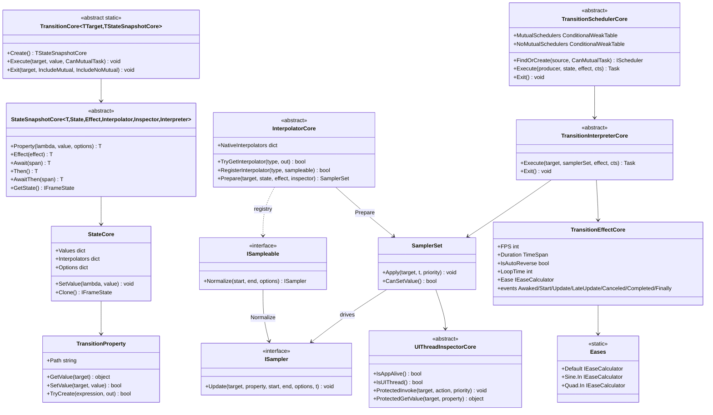

# 设计模式 — 过渡动画



## 识别到的模式

### 1. 流式构建器模式（`StateSnapshot`）

`Transition<T>.Create()` 返回 `StateSnapshot` 流式构建器。`.Property(lambda, value)`、`.Effect(...)`、`.Await(...)`、`.AwaitThen(...)`、`.Then()` 每个都返回同一快照供链式调用；`.Execute(target, CanMutualTask)` 消费它。分段通过 `next` 指针链接成列表，因此一个「构建器」实际描述一个**分段序列**。

```csharp
// Examples/Transition/WPF/Demo/MainWindow.xaml.cs
private static readonly Transition<Rectangle>.StateSnapshot Animation0 =
    Transition<Rectangle>.Create()
        .Property(r => r.Opacity, 0)
        .Property(r => ((TranslateTransform)r.RenderTransform).X, 800)
        .Property(r => r.Fill, new SolidColorBrush(Colors.Orange))
        .Effect(new TransitionEffect()
        {
            Duration = TimeSpan.FromSeconds(2),
            IsAutoReverse = true,
            LoopTime = 2,
        });
```

### 2. 注册表模式（`InterpolatorCore`）

全局 `ConcurrentDictionary<Type, ISampleable>`（`NativeInterpolators`）加 `RegisterInterpolator`/`TryGetInterpolator`/`UnregisterInterpolator`。`Prepare` 中的解析顺序：按属性自定义 `ISampleable`（`state.Interpolators`）→ 注册表 → 起始/结束值本身是 `ISampleable`，随后调用 `Normalize(start, end, options)` 得到无状态 `ISampler` 存入 `SamplerSet`。`RegisterInterpolator` 使用原子 `AddOrUpdate`（后写胜出，无丢失更新）。

### 3. 策略模式（缓动 + 采样器）

`IEaseCalculator.Ease(double t)` 策略来自 `Eases.*`（`Sine`、`Quad`、`Bounce`...）。`ISampler.Update(target, property, start, end, options, t)` 策略在归一化时间点直接更新属性（如 `DoubleSampler`、`ColorSampler`、`QuaternionSampler`）。缓动由解释器在**采样前**应用：它把归一化时间缓动并钳制到 `easedT ∈ [0,1]`，再让采样器更新 —— 不再有需要重新索引的预计算帧数组。

### 4. 模板方法模式（核心引擎）

核心类（6/7 泛型元数的 `StateSnapshotCore`、非泛型 `InterpolatorCore`、`TransitionSchedulerCore<TUIThreadInspector, TTransitionInterpreter[, TPriorityCore]>`、`TransitionInterpreterCore<TEffectCore[, TPriorityCore]>`、`UIThreadInspectorCore<TPriorityCore>`）定义算法骨架；每个**适配器**为其平台提供具体子类（`TransitionEffect` 优先级、`Interpolator` 采样器注册、`UIThreadInspector` 调度）。

### 5. 代理 / 适配器模式（平台适配器）

`UIThreadInspector` 包装各平台的分发器（`Application.Current.Dispatcher`、`Dispatcher.UIThread`、`DispatcherQueue.TryEnqueue`、`SynchronizationContext.Post`、`Control.Invoke/BeginInvoke`），使引擎可在任意线程启动动画并把帧写回 UI 线程。

### 6. 调度器 + `ConditionalWeakTable` 缓存

`TransitionSchedulerCore.MutualSchedulers` 是 `ConditionalWeakTable<object, ITransitionSchedulerCore>` —— 每个目标一个共享**互斥**调度器，随目标一起被 GC 回收（无泄漏）。`FindOrCreate(source, CanMutualTask)` 返回它，或在并行动画时返回一次性**非互斥**调度器（登记在 `NoMutualSchedulers`）。`SemaphoreSlim` 门控串行化互斥调度器上的执行。

### 7. 组合（状态分段）

`.AwaitThen(...)` 把快照链接成**分段链表**，每段有独立的 `State` + `Effect`；解释器按顺序播放，尊重每段的延迟、缓动与循环设置。

### 8. 观察者模式（效果生命周期事件）

`TransitionEffectCore` 暴露 `Awaked/Start/Update/LateUpdate/Canceled/Completed/Finally` 事件，由 `WeakDelegate`（无泄漏）支撑；`TransitionInterpreterCore` 在每次采样与完成/取消时触发它们。

## 模式汇总

| 模式 | 出现位置 | 作用 |
|---|---|---|
| 流式构建器 | `StateSnapshotCore` 链 | 用描述性方式表达目标状态 + 时序，无需可变配置对象 |
| 注册表 | `InterpolatorCore.NativeInterpolators` | 运行时把类型映射到 `ISampleable` |
| 策略 | `IEaseCalculator`/`Eases`、`ISampler` | 无需改动引擎即可更换缓动曲线与值插值 |
| 模板方法 | `InterpolatorCore`、`TransitionSchedulerCore`、`TransitionInterpreterCore`、`UIThreadInspectorCore` | 固定算法骨架；由适配器填充平台细节 |
| 适配器 / 代理 | 各平台的 `UIThreadInspector` | 用一个接口隐藏分发器差异 |
| 调度器 + CWT 缓存 | `TransitionSchedulerCore` 互斥/非互斥表 | 每目标一个串行动画；无泄漏 |
| 组合 | `StateSnapshotCore.next` 链 | 组合多段时间线 |
| 观察者 | `TransitionEffectCore` 事件 | 无需轮询即可观察生命周期 |

> 源码引用：`Src/Core/VeloxDev.Core/TransitionSystem/*.cs`、`Src/Core/VeloxDev.Core/Interfaces/TransitionSystem/*.cs`、`Src/Adapters/VeloxDev.{WPF,...}/PlatformAdapters/*.cs`、`Examples/Transition/WPF/Demo/MainWindow.xaml.cs`。
