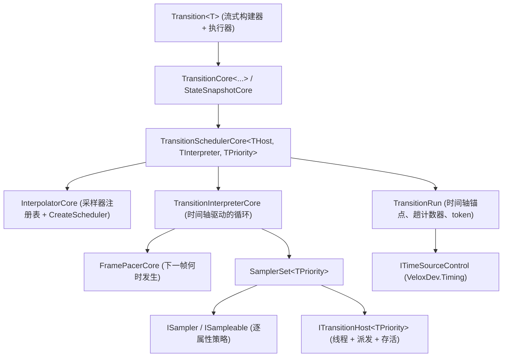

# 设计模式 — 过渡动画

过渡动画特性是一个与框架无关的动画引擎。它的核心位于 `Src/Core/VeloxDev.Core/TransitionSystem/**`（`VeloxDev.TransitionSystem.Abstractions` 命名空间里的抽象/泛型「core」类型、`Src/Core/VeloxDev.Core/Interfaces/TransitionSystem/**` 里的引擎契约、`TransitionSystem/NativeSamplers/**` 下的内置采样器），并建立在它脚下的另外两个 Core 子系统之上：时钟（`VeloxDev.Timing`）与宿主接缝（`VeloxDev.Threading` / `VeloxDev.Lifetime`）。它感知 UI 线程，但不引用任何具体 UI 栈。每个 UI 框架都经 `Src/Adapters/VeloxDev.*/PlatformAdapters` 下对应平台的适配器包到达（WPF、Avalonia、WinUI、MAUI、WinForms、Razor、Jalium），每个平台都有 `Examples/Transition/**` 下的演示演练。

核心是**单一泛型家族**：宿主的调度器优先级作为类型形参传递（`DispatcherPriority`、`DispatcherQueuePriority` 等），没有优先级的宿主用标记结构体 `NonPriority` 填充。WPF/Avalonia/Jalium/WinUI 传自己的优先级类型；MAUI/WinForms/Razor 传 `NonPriority`。

## 顶层形状

```mermaid
flowchart TD
    Builder["Transition&lt;T&gt; (流式构建器 + 执行器)"] --> Core["TransitionCore&lt;...&gt; / StateSnapshotCore"]
    Core --> Scheduler["TransitionSchedulerCore&lt;THost, TInterpreter, TPriority&gt;"]
    Scheduler --> Registry["InterpolatorCore (采样器注册表 + CreateScheduler)"]
    Scheduler --> Interp["TransitionInterpreterCore (时间轴驱动的循环)"]
    Interp --> Pacer["FramePacerCore (下一帧何时发生)"]
    Interp --> Set["SamplerSet&lt;TPriority&gt;"]
    Set --> Sampler["ISampler / ISampleable (逐属性策略)"]
    Set --> Host["ITransitionHost&lt;TPriority&gt; (线程 + 派发 + 存活)"]
    Scheduler --> Run["TransitionRun (时间轴锚点、趟计数器、token)"]
    Run --> Timeline["ITimeSourceControl (VeloxDev.Timing)"]
```

## 子页

- [sampler-strategy](00_采样器策略/index.md) —— 值插值策略集：`ISampler`、`InterpolatorCore` 注册表（及其解析顺序）、`ISampleable` + `StructAssembler`，以及 `BoundedProgress`。
- [host-and-timeline](01_宿主与时间轴/index.md) —— 宿主接缝（`ITransitionHost` / `IThreadDispatcher` / `TransitionHostBase`）、`FramePacerCore` 模板方法，以及其下的 `VeloxDev.Timing` 时钟。
- [builder-and-scheduler](02_构建器与调度器/index.md) —— 流式构建器 + 分段链、Composite timeline、调度器的注册表，以及 `Repeat` 的 `ExecuteCapturing` / `Replay` 对。

## 模式汇总

| 模式 | 出现在何处 | 作用 |
|---|---|---|
| 流式构建器 + 链 | `Transition<T>` / `TransitionCore<…>.next` | 描述目标状态与分段时序，无需可变配置对象 |
| Composite | `next` 链；`Repeat` | 组合多段 timeline，并支持嵌套循环 |
| Registry | `InterpolatorCore` 的 `RegisterInterpolator` / `TryGetInterpolator` | 运行时把属性类型映射到 `ISampler`；先最近基类，再按名排序的接口 |
| Strategy | `IEaseCalculator`/`Eases`、`ISampler`、`ISampleable` | 换缓动、换按类型的插值、换结构体装配而不改引擎 |
| Template Method / 策略 | `TransitionCore<…>`、`TransitionSchedulerCore<…>`、`TransitionInterpreterCore<…>`、`ThreadDispatcherBase<…>` | 固定骨架；适配器与宿主经泛型提供平台细节 |
| Adapter | 各平台 `PlatformAdapters/*`；`TransitionHostBase<…>` | 把引擎桥接到某个 UI 框架的类型、dispatcher 与定时器 |
| 带诚实 `null` 的抽象工厂 | `InterpolatorCore.CreateScheduler` | 给只持有 `object` 的调用方该平台的调度器组合 |
| 调度器注册表 + 弱缓存 | `TransitionSchedulerCore.MutualSchedulers` / `NoMutualSchedulers` | 每目标一条串行化动画；无泄漏 |
| Observer | `TransitionEffectCore` 事件 + `WeakDelegate` | 不轮询地观察生命周期（与诊断） |
| 停摆/唤醒（不用 monitor 的 monitor） | `ITimeSource.WaitWhileStalledAsync` + `ITimeSourceControl.Wake` | 停摆的消费者零唤醒；定位或停止仍能到达它 |
| Null Object | `ThreadRef.None`、`NonPriority`、`null` 的 `FramePacerCore` | 「没有线程」「没有优先级」「没有宿主节奏器」是值，不是失败 |

来源：`Src/Core/VeloxDev.Core/TransitionSystem/*.cs`、`Src/Core/VeloxDev.Core/Timing/*.cs`、`Src/Core/VeloxDev.Core/Threading/*.cs`、`Src/Core/VeloxDev.Core/Interfaces/TransitionSystem/*.cs`、`Src/Core/VeloxDev.Core.Test/TransitionSystem/*.cs`、`Src/Adapters/VeloxDev.{WPF,Avalonia,WinUI,MAUI,WinForms,Razor,Jalium}/PlatformAdapters/*.cs`、`Examples/Transition/WPF/Demo/MainWindow.xaml.cs`、`Examples/Transition/AUTO TEST/**`。

相关分析：[数据流 — 过渡动画](../../03_数据流分析/03_过渡动画/index.md) · [复杂度 — 过渡动画](../../04_复杂度分析/03_过渡动画/index.md)
