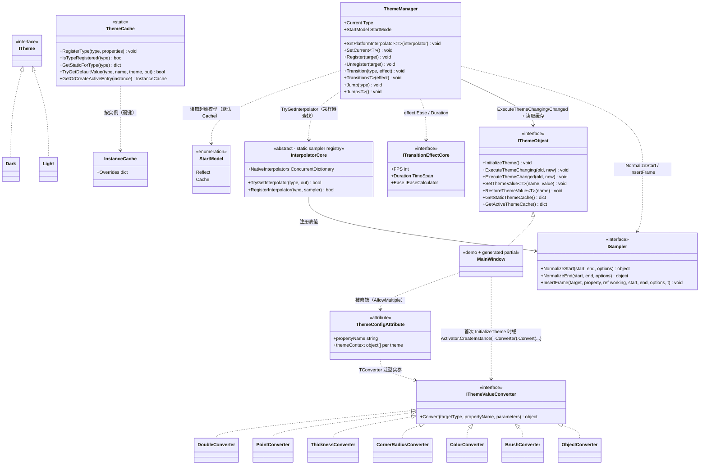

# 设计模式 — 动态主题

动态主题在主题定义（`Dark` / `Light`）之间切换主题感知属性的值，并可选地播放过渡动画。它由「声明式源生成（`VeloxDev.Generators.Theme`，由 `ThemeConfigAttribute<TConverter, TTheme...>` 驱动）」「注册表 + 缓存对（`ThemeManager` + `ThemeCache`）」构成，并把每个属性的插值委托给 TransitionSystem 采样器注册表（`InterpolatorCore` + `ISampler`），由效果的 `IEaseCalculator` 对时间做缓动。特性家族提供六个泛型变体——一个转换器类型外加 2 到 7 个 `ITheme` 标记类型（`Src/Core/VeloxDev.Core/DynamicTheme/ThemeConfigAttribute.cs`）；Demo 与测试只用到两主题形式（`TConverter, Light, Dark`）。

## 类图



> `ThemeManager` 是普通类，其 API 只以静态成员被使用；`ThemeCache` 是静态类。`InterpolatorCore` 是抽象基类，其平台子类（如 WPF 的 `Interpolator`）注册原生采样器，DynamicTheme 经静态的 `TryGetInterpolator` 读取它们。生成的 `partial` 类（如 Demo 的 `MainWindow`）实现 `IThemeObject` 并把它们接起来。源码：`Src/Core/VeloxDev.Core/DynamicTheme/ThemeManager.cs`、`Src/Core/VeloxDev.Core/DynamicTheme/ThemeCache.cs`、`Src/Core/VeloxDev.Core/TransitionSystem/Interpolator.cs`、`Src/Core/VeloxDev.Core/Interfaces/TransitionSystem/ISampler.cs`。

**转换器集合由平台提供。** 上图列出的七个 `IThemeValueConverter` 类是 WPF 的转换器集合（`Src/Adapters/VeloxDev.WPF/PlatformAdapters/ThemeValueConverters.cs`）。Avalonia、MAUI、WinUI 提供同样的七个（`Double`、`Point`、`Thickness`、`CornerRadius`、`Color`、`Brush`、`Object`）。`VeloxDev.WinForms` 提供面向 `System.Drawing` 的集合——`Double`、`Int`、`Float`、`Point`、`PointF`、`Size`、`SizeF`、`Rectangle`、`RectangleF`、`Padding`、`Color`、`Font`、`Object`——`VeloxDev.Razor` 提供最小集合（`Double`、`String`、`Int`、`Bool`）。`VeloxDev.Jalium` **不带** DynamicTheme 层（无值转换器，也无主题接线）。每个转换器都实现核心 `IThemeValueConverter`，每条 `[ThemeConfig]` 声明经 `TConverter` 类型实参选定所用集合，因此核心保持 GUI 无关。`ThemeCache` 另维护一个可选的共享转换器注册表（`RegisterConverter` / `GetConverter`，键形如 `__velox_global_converter_N__`），但当前生成器并不使用它——它在生成的 `InitializeTheme` 里经 `Activator.CreateInstance` 内联实例化转换器（见下）。

## 识别到的模式

| 模式 | 位置 | 作用 |
|---|---|---|
| 外观（Facade） | `ThemeManager` | 覆盖值存储（`ThemeCache`）、采样器注册表（`InterpolatorCore.NativeInterpolators`）与已注册对象列表的静态外观。调用者只看到 `Transition<T>` / `Jump<T>` / `Register` / `SetPlatformInterpolator`。 |
| 模板方法（Template Method） | 源生成的 `IThemeObject` 实现 | `InitializeTheme()` 是固定算法（惰性 `ThemeCache.RegisterType` → `ThemeManager.Register(this)` → 应用当前主题值）。子类添加 `[ThemeConfig]` 属性，生成器链接 `base.InitializeTheme()`；方法按 `virtual`、`override`（祖先带有 `[ThemeConfig]` 时）、或非虚（类为 `sealed` 时）生成。 |
| 钩子 / partial 回调 | 生成的 `ExecuteThemeChanging/Changed` | `ThemeManager` 在动画前调用 `ExecuteThemeChanging(old, new)`，动画后调用 `ExecuteThemeChanged(old, new)`；生成的实现转发给用户的 `partial void OnThemeChanging` / `partial void OnThemeChanged`。 |
| 注册表（弱引用） | `ThemeManager` | 活跃主题感知实例保存在 `ConditionalWeakTable`（去重）加 `List<WeakReference<IThemeObject>>`（每次过渡清理失效项）——注册不泄漏。 |
| 缓存（Cache） | `ThemeCache` | 以声明类型为键的单一全局静态存储取代按类的生成字典；查找时沿继承链收集。运行时覆盖另用 `ConditionalWeakTable<IThemeObject, InstanceCache>`。 |
| 策略（Strategy） | `StartModel` | `Reflect` 或 `Cache` 决定每个属性动画**起始值**的解析方式 —— 反射读取实时属性值，或使用当前主题的缓存值。 |
| 策略（采样器） | `ISampler` | `PrepareSamplers` 从注册表为每个属性类型解析一个 `ISampler`（`TryGetInterpolator`）；采样器归一化端点（`NormalizeStart`/`NormalizeEnd`），`ExecuteTransition` 逐采样调用 `InsertFrame`。`effect.Ease`（`IEaseCalculator`）对归一化时间做缓动。 |
| 适配器 / 桥接（Adapter / Bridge） | 平台适配器 | `Interpolator` 继承 `InterpolatorCore` 并注册平台采样器（Brush、Thickness...）；`TransitionEffect` 实现 `ITransitionEffectCore`；值转换器实现 `IThemeValueConverter`。核心保持 GUI 无关——只依赖 TransitionSystem 抽象。 |

## 模式证据

### 弱引用注册表 — `Register` 与过渡时的清理

```csharp
// Src/Core/VeloxDev.Core/DynamicTheme/ThemeManager.cs, lines 58-66 and 91-93
public static void Register(IThemeObject target)
{
    if (!_act_cache.TryGetValue(target, out _))
    {
        Dictionary<string, Dictionary<PropertyInfo, Dictionary<Type, object?>>>? cache = [];
        _act_cache.Add(target, cache);
        activeThemes.Add(new WeakReference<IThemeObject>(target));
    }
}
// ...
CancleTransition();
activeThemes.RemoveAll(x => !x.TryGetTarget(out _));
```

实例只存放在 `ConditionalWeakTable`（无强引用）加 `WeakReference` 列表中。每次过渡开始时清理失效项，因此不可达的窗口无需手动 `Unregister` 也会被回收。

### 钩子顺序 — 动画进程前后的通知

```csharp
// Src/Core/VeloxDev.Core/DynamicTheme/ThemeManager.cs, lines 94-102
foreach (var themeObject in actives)
{
    themeObject?.ExecuteThemeChanging(current, themeType);
}
await ExecuteTransition(PrepareSamplers(actives, themeType), effect.Ease, effect.Duration.TotalMilliseconds, themeType);
foreach (var themeObject in actives)
{
    themeObject?.ExecuteThemeChanged(current, themeType);
}
```

生成器生成接口方法，使其先调用用户钩子（先 `base` 链，再 `OnThemeChanging/Changed` —— `Src/Generators/VeloxDev.Core.Generator/Theme.cs`，279-298 行）。Demo 提供用户侧实现：

```csharp
// Examples/Theme/WPF/Demo/MainWindow.xaml.cs, lines 60-63
partial void OnThemeChanged(Type? oldValue, Type? newValue)
{
    MessageBox.Show($"Theme changed from {oldValue?.Name} to {newValue?.Name}");
}
```

### 策略 — `StartModel.Cache` 起始值解析

```csharp
// Src/Core/VeloxDev.Core/DynamicTheme/ThemeManager.cs, lines 215-228
case StartModel.Cache:
    // Cache mode
    if (activeCache.TryGetValue(propEntry.Key, out var activePropCache) &&
        activePropCache.TryGetValue(propertyInfo, out var activeTypeCache) &&
        activeTypeCache.TryGetValue(Current, out currentValue))
    {
        hasCurrentValue = true;
    }
    else if (typeValues.TryGetValue(Current, out currentValue))
    {
        hasCurrentValue = true;
    }
    break;
```

`Reflect` 分支（201-213 行）改经 `propertyInfo.GetValue(target)` 读取实时值。两分支都运行在 `PrepareSamplers` 内；目标值随后以同样方式按目标主题查找。

### 采样器策略 — 注册表解析后归一化端点

```csharp
// Src/Core/VeloxDev.Core/DynamicTheme/ThemeManager.cs, lines 269-294
ISampler? resolved = null;
try
{
    if (InterpolatorCore.TryGetInterpolator(propertyInfo.PropertyType, out var registered))
    {
        resolved = registered;
    }
}
catch (Exception ex)
{
    Debug.WriteLine($"[ThemeManager] Error resolving sampler for {propEntry.Key}: {ex.Message}");
}

var transitionProperty = TransitionProperty.FromProperty(propertyInfo);
object? normStart = currentValue;
object? normEnd = targetValue;
if (resolved != null)
{
    normStart = resolved.NormalizeStart(currentValue, targetValue, null);
    normEnd = resolved.NormalizeEnd(currentValue, targetValue, null);
}
entries.Add(new TransitionEntry(target, transitionProperty, resolved, normStart, normEnd));
```

若属性类型没有注册采样器，过渡退化为简单的「先持有再切换」：整趟保持当前值，最后一次采样写入目标值。逐帧写入经 `ISampler.InsertFrame` 完成，它把写入路由到编译后的 `TransitionProperty.SetValue`（`Src/Core/VeloxDev.Core/TransitionSystem/TransitionProperty.cs`，60-68 行）。

> 源码引用：`Src/Core/VeloxDev.Core/DynamicTheme/ThemeManager.cs`、`Src/Core/VeloxDev.Core/DynamicTheme/ThemeCache.cs`、`Src/Core/VeloxDev.Core/Interfaces/DynamicTheme/*`、`Src/Generators/VeloxDev.Core.Generator/Theme.cs`、`Src/Adapters/VeloxDev.WPF/PlatformAdapters/ThemeValueConverters.cs`、`Examples/Theme/WPF/Demo/MainWindow.xaml.cs`。
