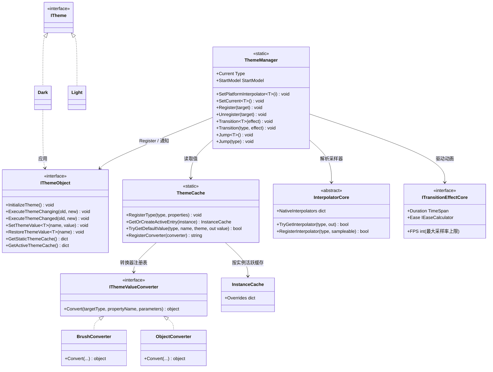

# 设计模式 — 动态主题

动态主题功能将「声明式配置（源生成）」「运行时注册表」与「基于策略的插值引擎（来自 TransitionSystem）」三者结合。

## 类图



## 识别到的模式

| 模式 | 位置 | 作用 |
|---|---|---|
| 外观（Facade） | `ThemeManager` | 覆盖 `ThemeCache`（存储）、`InterpolatorCore`（动画）与 `IThemeObject` 注册表的静态外观。调用者只需看到 `Transition<T>` / `Jump<T>` / `SetPlatformInterpolator`。 |
| 观察者（Observer） | `IThemeObject`（生成） | `ThemeManager.Transition(Type, effect)` 遍历已注册的 `IThemeObject`，动画前调用 `ExecuteThemeChanging(old, new)`，动画后调用 `ExecuteThemeChanged(old, new)`。生成实现转发给用户的 `partial void OnThemeChanging` / `partial void OnThemeChanged`。 |
| 模板方法（Template Method） | 源生成的 `IThemeObject` | `InitializeTheme()` 是固定算法（在 `ThemeCache` 注册类型 → `ThemeManager.Register(this)` → 应用当前主题值）；用户仅通过 `[ThemeConfig]` 提供各属性值。生成器产生 `virtual`/`partial` 钩子（`OnThemeChanging`、`OnThemeChanged`），使基类可扩展。 |
| 策略（Strategy） | `StartModel` | `ThemeManager.StartModel`（`Reflect` 或 `Cache`）选择解析每个属性动画**起始值**的方式 —— 反射读取实时属性值，或使用当前主题的缓存值。 |
| 策略 / 转换器（Strategy / Converter） | `IThemeValueConverter` | `Convert(Type, string, object?[])` 把原始字符串/数值参数适配为平台类型（`Brush`、`Thickness`...）。`Eases.*` 返回 `IEaseCalculator` 策略（`Sine`、`Quad`、`Bounce`...）；`ThemeManager.PrepareSamplers` 解析 `ISampleable` 并 `Normalize` 得到 `ISampler`，由 `ExecuteTransition` 在每个采样点调用 `sampler.Update(...)` 并先缓动归一化时间。 |
| 注册表（弱引用） | `ThemeManager` + `ThemeCache` | `ThemeManager` 以 `ConditionalWeakTable` + `List<WeakReference<IThemeObject>>` 维护活跃实例（每次过渡时清理失效项）；`ThemeCache` 用 `ConditionalWeakTable<IThemeObject, InstanceCache>` 保存按实例覆盖 —— 无强引用，注册永不泄漏。 |
| 适配器（Adapter） | 平台适配器 | `Interpolator`、`TransitionEffect` 与值转换器是核心契约（`InterpolatorCore`、`ITransitionEffectCore`、`IThemeValueConverter`）的适配器实现，使核心引擎保持 GUI 无关。 |
| 缓存（Cache） | `ThemeCache` | 以声明类型为键的单一全局存储，消除了按类生成的静态字典；查找时沿继承链收集。 |

## 模式证据

### 观察者（主题变更通知）

```csharp
// Src/Core/VeloxDev.Core/DynamicTheme/ThemeManager.cs (Transition)
foreach (var themeObject in actives)
    themeObject?.ExecuteThemeChanging(current, themeType);
await ExecuteTransition(PrepareSamplers(actives, themeType), effect.Ease, effect.Duration.TotalMilliseconds, themeType);
foreach (var themeObject in actives)
    themeObject?.ExecuteThemeChanged(current, themeType);
```

### 注册表（WeakReference 跟踪）

```csharp
// Src/Core/VeloxDev.Core/DynamicTheme/ThemeManager.cs (Register / Transition)
_activeCache.Add(target, cache);
activeThemes.Add(new WeakReference<IThemeObject>(target));
// ...
CancleTransition();
activeThemes.RemoveAll(x => !x.TryGetTarget(out _));
var actives = activeThemes.Select(x => x.TryGetTarget(out var obj) ? obj : null).Where(x => x != null).ToArray();
```

### 策略（StartModel 起始值）

```csharp
// Src/Core/VeloxDev.Core/DynamicTheme/ThemeManager.cs (PrepareSamplers)
switch (StartModel)
{
    case StartModel.Reflect:
        currentValue = propertyInfo.GetValue(target);
        hasCurrentValue = true;
        break;
    case StartModel.Cache:
        // 优先活跃缓存，其次 Current 主题的静态值
        if (activeTypeCache.TryGetValue(Current, out currentValue)) hasCurrentValue = true;
        else if (typeValues.TryGetValue(Current, out currentValue)) hasCurrentValue = true;
        break;
}
```

> 源码引用：`Src/Core/VeloxDev.Core/DynamicTheme/ThemeManager.cs`、`Src/Core/VeloxDev.Core/DynamicTheme/ThemeCache.cs`、`Src/Core/VeloxDev.Core/Interfaces/DynamicTheme/*`、`Src/Adapters/VeloxDev.WPF/PlatformAdapters/ThemeValueConverters.cs`、`Examples/Theme/WPF/Demo/MainWindow.xaml.cs`。
