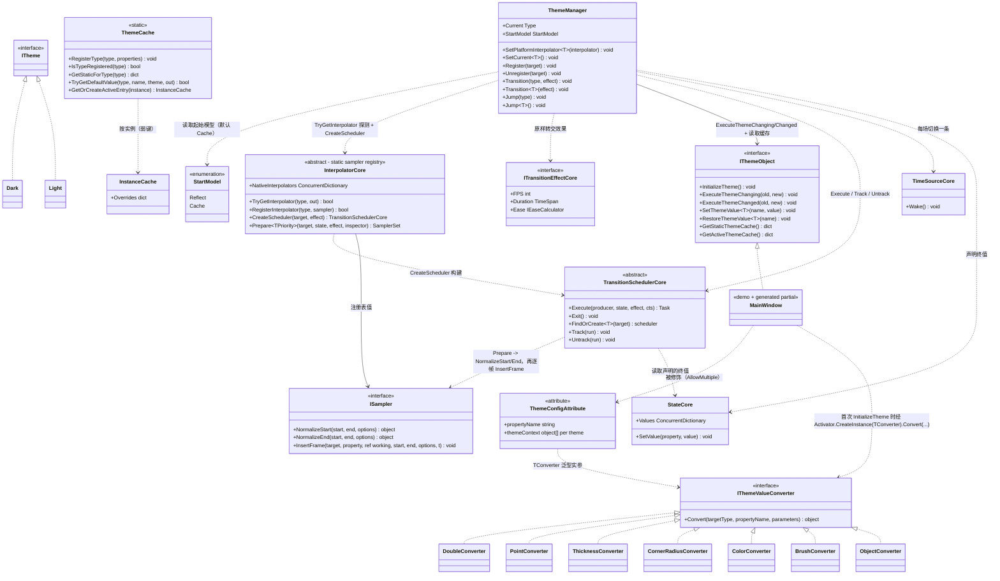

# 设计模式 — 动态主题

动态主题在主题定义（`Dark` / `Light`）之间切换主题感知属性的值，并可选地播放过渡动画。它由「声明式源生成（`VeloxDev.Generators.Theme`，由 `ThemeConfigAttribute<TConverter, TTheme...>` 驱动）」「注册表 + 缓存对（`ThemeManager` + `ThemeCache`）」构成，并把动画本身与逐属性插值一并交给 TransitionSystem：带动画的切换会交给平台经 `InterpolatorCore.CreateScheduler` 虚拟接缝提供的 `TransitionSchedulerCore`，每个属性由共享采样器注册表中的 `ISampler` 插值。特性家族提供六个泛型变体——一个转换器类型外加 2 到 7 个 `ITheme` 标记类型（`Src/Core/VeloxDev.Core/DynamicTheme/ThemeConfigAttribute.cs`）；Demo 与测试只用到两主题形式（`TConverter, Light, Dark`）。

## 类图



> `ThemeManager` 是普通类，其 API 只以静态成员被使用；`ThemeCache` 是静态类。`InterpolatorCore` 是抽象基类，其平台子类（如 WPF 的 `Interpolator`）注册原生采样器，DynamicTheme 经静态的 `TryGetInterpolator` 读取它们。平台实际构建的是泛型闭合形式 `TransitionSchedulerCore<TInspector, TInterpreter, TPriority>`；图中画非泛型基类，因为那才是 `CreateScheduler` 的返回类型。生成的 `partial` 类（如 Demo 的 `MainWindow`）实现 `IThemeObject` 并把它们接起来。源码：`Src/Core/VeloxDev.Core/DynamicTheme/ThemeManager.cs`、`Src/Core/VeloxDev.Core/DynamicTheme/ThemeCache.cs`、`Src/Core/VeloxDev.Core/TransitionSystem/Interpolator.cs`、`Src/Core/VeloxDev.Core/Interfaces/TransitionSystem/ISampler.cs`。

**转换器集合由平台提供。** 上图列出的七个 `IThemeValueConverter` 类是 WPF 的转换器集合（`Src/Adapters/VeloxDev.WPF/PlatformAdapters/ThemeValueConverters.cs`）。Avalonia、MAUI、WinUI 提供同样的七个（`Double`、`Point`、`Thickness`、`CornerRadius`、`Color`、`Brush`、`Object`）。`VeloxDev.WinForms` 提供面向 `System.Drawing` 的集合——`Double`、`Int`、`Float`、`Point`、`PointF`、`Size`、`SizeF`、`Rectangle`、`RectangleF`、`Padding`、`Color`、`Font`、`Object`——`VeloxDev.Razor` 提供最小集合（`Double`、`String`、`Int`、`Bool`）。`VeloxDev.Jalium` **不带** DynamicTheme 层（无值转换器，也无主题接线）。每个转换器都实现核心 `IThemeValueConverter`，每条 `[ThemeConfig]` 声明经 `TConverter` 类型实参选定所用集合，因此核心保持 GUI 无关。`ThemeCache` 另维护一个可选的共享转换器注册表（`RegisterConverter` / `GetConverter`，键形如 `__velox_global_converter_N__`），但当前生成器并不使用它——它在生成的 `InitializeTheme` 里经 `Activator.CreateInstance` 内联实例化转换器（见下）。

## 识别到的模式

| 模式 | 位置 | 作用 |
|---|---|---|
| 外观（Facade） | `ThemeManager` | 覆盖值存储（`ThemeCache`）、采样器注册表（`InterpolatorCore.NativeInterpolators`）、已注册对象列表，以及过渡系统的 scheduler。调用者只看到 `Transition<T>` / `Jump<T>` / `Register` / `SetPlatformInterpolator`。 |
| 虚拟接缝 / 策略（Virtual seam / Strategy） | `InterpolatorCore.CreateScheduler` | 一场切换横跨多种运行时类型的目标，Core 无法写出 `Transition<T>` scheduler 的类型实参；由平台给出「inspector + interpreter + priority」的组合，并以 `null` 回答「这不是我的」。 |
| 共享 transport（Shared transport） | 每场切换一个 `ITimeSourceControl` | 一场切换的所有目标锚在同一条 `ITimeSourceControl` 上；这正是既有的 `TransitionCore.Pause` / `Seek` / `SetRate` / `Exit` 能不改接口地作用到主题切换上的原因。 |
| 模板方法（Template Method） | 源生成的 `IThemeObject` 实现 | `InitializeTheme()` 是固定算法（惰性 `ThemeCache.RegisterType` → `ThemeManager.Register(this)` → 应用当前主题值）。子类添加 `[ThemeConfig]` 属性，生成器链接 `base.InitializeTheme()`；方法按 `virtual`、`override`（祖先带有 `[ThemeConfig]` 时）、或非虚（类为 `sealed` 时）生成。 |
| 钩子 / partial 回调 | 生成的 `ExecuteThemeChanging/Changed` | `ThemeManager` 在动画前调用 `ExecuteThemeChanging(old, new)`，**只在切换走到终点时**调用 `ExecuteThemeChanged(old, new)`；生成的实现转发给用户的 `partial void OnThemeChanging` / `partial void OnThemeChanged`。 |
| 注册表（弱引用） | `ThemeManager` | 活跃主题感知实例保存在 `ConditionalWeakTable`（去重）加 `List<WeakReference<IThemeObject>>`（每次切换清理失效项）——注册不泄漏。 |
| 缓存（Cache） | `ThemeCache` | 以声明类型为键的单一全局静态存储取代按类的生成字典；查找时沿继承链收集。运行时覆盖另用 `ConditionalWeakTable<IThemeObject, InstanceCache>`。 |
| 策略（Strategy） | `StartModel` | `Reflect` 或 `Cache` 决定每个属性动画**起始值**的解析方式 —— 反射读取实时属性值，或使用当前主题的缓存值。 |
| 策略（采样器） | `ISampler` | `PrepareSamplers` 按属性类型探测一次注册表以判断采样器是否存在；随后由 scheduler 的 `InterpolatorCore.Prepare` 解析真正的 `ISampler`、归一化端点（`NormalizeStart`/`NormalizeEnd`），并逐帧驱动 `InsertFrame`。`effect.Ease`（`IEaseCalculator`）对归一化时间做缓动。 |
| 记忆化工厂（Memoized factory） | `TransitionProperty.FromProperty` | 反射入口返回按 `PropertyInfo` 共享的实例，使覆盖 $N$ 个元素的切换不再重复编译 $N$ 棵表达式树。 |
| 适配器 / 桥接（Adapter / Bridge） | 平台适配器 | `Interpolator` 继承 `InterpolatorCore`、注册平台采样器（Brush、Thickness...）并回答 `CreateScheduler`；`TransitionEffect` 实现 `ITransitionEffectCore`；值转换器实现 `IThemeValueConverter`。核心保持 GUI 无关——只依赖 TransitionSystem 抽象。 |

## 模式证据

### 弱引用注册表 — `Register` / `Unregister` 与每次切换的清理

```csharp
// Src/Core/VeloxDev.Core/DynamicTheme/ThemeManager.cs — Register
public static void Register(IThemeObject target)
{
    if (!_act_cache.TryGetValue(target, out _))
    {
        Dictionary<string, Dictionary<PropertyInfo, Dictionary<Type, object?>>>? cache = [];
        _act_cache.Add(target, cache);
        activeThemes.Add(new WeakReference<IThemeObject>(target));
    }
}
```

```csharp
// Src/Core/VeloxDev.Core/DynamicTheme/ThemeManager.cs — Unregister
public static void Unregister(IThemeObject target)
{
    _act_cache.Remove(target);
    activeThemes.RemoveAll(x => x.TryGetTarget(out var obj) && obj == target);
}
```

实例只存放在 `ConditionalWeakTable`（无强引用）加 `WeakReference` 列表中。每次切换都先清理失效项 —— `Transition` 与 `Jump` 在 `CancelActiveSwitch()` 之后做的第一件事就是 `activeThemes.RemoveAll(x => !x.TryGetTarget(out _))` —— 因此不可达的窗口无需手动 `Unregister` 也会被回收。

### 钩子顺序 — 切换前后的通知，以「是否落地」为门

```csharp
// Src/Core/VeloxDev.Core/DynamicTheme/ThemeManager.cs — Transition
foreach (var themeObject in actives)
{
    themeObject?.ExecuteThemeChanging(current, themeType);
}

bool landed;
try
{
    landed = await RunSwitch(actives, themeType, effect);
}
catch (Exception ex)
{
    // async void 的调用方接不住异常，而 RunSwitch 里跑的是适配器的 scheduler —— 不能让它把进程带走。
    Debug.WriteLine($"[ThemeManager] Error during theme transition: {ex.Message}");
    return;
}

if (!landed)
{
    return;
}

foreach (var themeObject in actives)
{
    themeObject?.ExecuteThemeChanged(current, themeType);
}
```

`ExecuteThemeChanging` 在任何一帧之前对整批目标触发；`ExecuteThemeChanged` 只在 `RunSwitch` 返回 `true` 时触发 —— 被取消或被顶替的切换不发通知，因为它并未落地。生成器生成接口方法，使其先调用用户钩子（先 `base` 链，再 `OnThemeChanging/Changed` —— `Src/Generators/VeloxDev.Core.Generator/Theme.cs`，279-298 行）。最小 Demo 提供用户侧实现：

```csharp
// Examples/Theme/WPF Trimmed/Demo/MainWindow.xaml.cs, lines 60-63
partial void OnThemeChanged(Type? oldValue, Type? newValue)
{
    MessageBox.Show($"Theme changed from {oldValue?.Name} to {newValue?.Name}");
}
```

### 虚拟接缝 — `CreateScheduler` 以 `null` 作答，而非抛异常

```csharp
// Src/Adapters/VeloxDev.WPF/PlatformAdapters/Interpolator.cs, lines 28-31
public override TransitionSchedulerCore? CreateScheduler(object target, ITransitionEffectCore effect)
    => effect is ITransitionEffect<DispatcherPriority>
        ? (TransitionSchedulerCore)TransitionSchedulerCore<UIThreadInspector, TransitionInterpreter, DispatcherPriority>.FindOrCreate(target)
        : null;
```

`InterpolatorCore` 上的默认实现同样返回 `null`（`CreateScheduler` 是 `public virtual`）。Core 写不出平台 scheduler 的类型实参，因为一场切换覆盖多种运行时类型的目标；只有平台知道该由哪个 inspector、interpreter 与 dispatcher priority 组成这个组合。`null` 对「平台没有接入」和「这个 effect 不属于这个平台」两种情形都是诚实的回答，调用方随后直接落值，而不是启动一场只画一半的动画。基类成员的 remarks 要求实现必须走 `FindOrCreate` 而不是直接构造 scheduler：只有那条路径会把它登记到目标名下，而这正是之后 `Transition.Pause` / `Seek` / `Exit` 能找回它的依据。

### 策略 — `StartModel.Cache` 起始值解析

```csharp
// Src/Core/VeloxDev.Core/DynamicTheme/ThemeManager.cs — PrepareSamplers, StartModel.Cache branch
case StartModel.Cache:
    // Cache mode
    if (activeCache.TryGetValue(propEntry.Key, out var activePropCache) &&
        activePropCache.TryGetValue(propertyInfo, out var activeTypeCache) &&
        activeTypeCache.TryGetValue(Current, out currentValue))
    {
        hasCurrentValue = true;
    }
    else if (typeValues.TryGetValue(Current, out currentValue))
    {
        hasCurrentValue = true;
    }
    break;
```

`StartModel.Reflect` 分支改经 `propertyInfo.GetValue(target)` 读取实时值。两分支都运行在 `PrepareSamplers` 内；目标值随后以同样方式按目标主题查找。注意这里准备的是**原始**起始值而非归一化端点：scheduler 会在 `InterpolatorCore.Prepare` 中重新从目标上读取起点，此处归一会归一化两次。`RunSwitch` 会先调用 `WriteStartValues` 把准备好的起点写回目标再启动，这才让默认的 `Cache` 档意味着「从当前主题的值出发」，而不是「从目标上碰巧是什么出发」。

### 采样器策略 — 准备阶段探测一次，解析交给 `Prepare`

```csharp
// Src/Core/VeloxDev.Core/DynamicTheme/ThemeManager.cs — PrepareSamplers
// 有没有采样器只在这里判一次，用途是决定收尾时要不要替 Prepare 补写终值 —— 采样器的解析
// 本身由 Prepare 在启动时重做，这里不预先归一化端点，否则就是归一化两次。
var hasSampler = InterpolatorCore.TryGetInterpolator(propertyInfo.PropertyType, out _);

group ??= new TargetEntries(target);
group.Entries.Add(new TransitionEntry(
    target,
    propertyInfo,
    TransitionProperty.FromProperty(propertyInfo),
    currentValue,
    targetValue,
    hasSampler));
```

`TransitionEntry`（`ThemeManager` 的私有嵌套类）携带 `Target` / `PropertyInfo` / `TransitionProperty` / `StartValue` / `EndValue` / `HasSampler`；条目按目标归入 `TargetEntries`，每个目标一组。这一层不做任何端点归一化 —— scheduler 的 `InterpolatorCore.Prepare` 在目标存在之后才解析采样器并调用 `NormalizeStart` / `NormalizeEnd`。没有采样器的属性整趟保持旧值，由 `ApplyHeldValues` 在最后一次采样写终值；终值为 null 的属性被 `BuildState` 跳过，因此「某主题不管这个属性」不会拖垮整场切换。逐帧写入经编译后的 `TransitionProperty.SetValue` 完成（`Src/Core/VeloxDev.Core/TransitionSystem/TransitionProperty.cs`）。

### 记忆化工厂 — `TransitionProperty.FromProperty`

```csharp
// Src/Core/VeloxDev.Core/TransitionSystem/TransitionProperty.cs, lines 601-611
public static TransitionProperty FromProperty(PropertyInfo propertyInfo)
{
    if (propertyInfo is null)
    {
        throw new ArgumentNullException(nameof(propertyInfo));
    }

    return FromPropertyCache.GetOrAdd(propertyInfo, static info => new TransitionProperty([info]));
}

private static readonly ConcurrentDictionary<PropertyInfo, TransitionProperty> FromPropertyCache = new();
```

主题系统在**每一次**切换时，都要为每个已注册目标的每个主题属性重建一条路径，而新建的 `TransitionProperty` 会在首次使用时编译自己的 getter 与 setter。提交 `58ae23b3 perf(theme): memoize TransitionProperty.FromProperty` 的实测：一千个双属性元素下，首帧之前约 1.6 s 的 UI 线程停顿与 29 MB 分配；记忆化之后约 10 ms 与 6 MB。共享是安全的：路径不可变，且在没有需要冻结的索引实参时 `BindTo` 返回实例自身。

> 源码引用：`Src/Core/VeloxDev.Core/DynamicTheme/ThemeManager.cs`、`Src/Core/VeloxDev.Core/DynamicTheme/ThemeCache.cs`、`Src/Core/VeloxDev.Core/Interfaces/DynamicTheme/*`、`Src/Core/VeloxDev.Core/TransitionSystem/Interpolator.cs`、`Src/Core/VeloxDev.Core/TransitionSystem/TransitionProperty.cs`、`Src/Generators/VeloxDev.Core.Generator/Theme.cs`、`Src/Adapters/VeloxDev.WPF/PlatformAdapters/ThemeValueConverters.cs`、`Examples/Theme/WPF Trimmed/Demo/MainWindow.xaml.cs`、`Examples/Theme/WPF/Demo/MainWindow.xaml.cs`。
