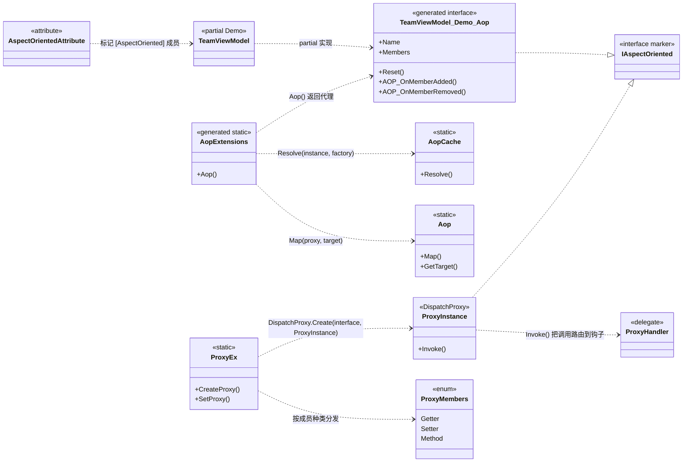

# 设计模式分析 — AOP

VELOXDEV AOP 把横切行为（拦截、日志、校验）附加到普通类上，**而无需改写其业务方法**。它分两层构建：

- **编译期** — `VeloxDev.Core.Generator` 源生成器读取打了 `[AspectOriented]` 标记的成员，生成**类型化的代理接口**与 `Aop()` 工厂扩展。
- **运行期** — `ProxyInstance : DispatchProxy` 拦截经由该接口发出的每一次调用，并转发给已注册的处理器。

在上述两层之上，该功能组合了五种经典模式：**代理（Proxy）**、**装饰器 / 拦截器（Decorator/Interceptor）**、**工厂（Factory）**、**注册表 / 享元（Registry/Flyweight）** 与 **标记接口（Marker Interface）**。

> 以下所有运行期类型都位于工程 `Src/Core/VeloxDev.Core` 的 `VeloxDev.AspectOriented` 命名空间；接口与工厂扩展由工程 `Src/Generators/VeloxDev.Core.Generator` 生成。

## 类图

特性 → 生成的代理接口 → `DispatchProxy` → 处理器：



> 所示类型取自 WPF 示例（`Examples/AOP/WPF/Demo`），其中 `Demo.TeamViewModel` 是被织入切面的类，`TeamViewModel_Demo_Aop` 是生成的代理接口。

## 1. 代理模式 — 基于 `DispatchProxy` 拦截

`ProxyEx.CreateProxy<T>` 把生成的接口 `T` 交给 `DispatchProxy.Create<T, ProxyInstance>()`，再把真实目标与接口类型记录到返回的代理实例上：

```csharp
// Src/Core/VeloxDev.Core/AspectOriented/ProxyEx.cs（第 17-25 行）
public static T CreateProxy<T>(this T target) where T : IAspectOriented
{
    var type = typeof(T);
    dynamic proxy = DispatchProxy.Create<T, ProxyInstance>() ?? throw new InvalidOperationException();
    proxy._target = target;
    proxy._targetType = type;
    ProxyInstance.ProxyIDs.Add(proxy, proxy._localid);
    return proxy;
}
```

`DispatchProxy.Create<T, ProxyInstance>()` 返回一个替身对象，调用方把它当作 `T`（生成的接口）来编程。该替身上的每一次成员调用都会汇入唯一的拦截点 `ProxyInstance.Invoke`，从而让调用方拿到一个代表真实对象、控制对其访问的代理（`ProxyInstance.cs` 第 23-53 行）。

## 2. 装饰器 / 拦截器 — start / coverage / end 钩子

`SetProxy` 用 `ProxyMembers` 枚举对目标成员分类，并把 `(start, coverage, end)` 三元组处理器写入三张按实例存放的字典之一（`GetterActions` / `SetterActions` / `MethodActions`），键为访问器名：

```csharp
// Src/Core/VeloxDev.Core/AspectOriented/ProxyEx.cs（第 26-41 行）
public static void SetProxy<T>(this T target, ProxyMembers memberType, string memberName, ProxyHandler? start, ProxyHandler? coverage, ProxyHandler? end)
   where T : class, IAspectOriented
{
    switch (memberType)
    {
        case ProxyMembers.Getter:
            SetPropertyGetter(target, memberName, start, coverage, end);
            break;
        case ProxyMembers.Setter:
            SetPropertySetter(target, memberName, start, coverage, end);
            break;
        case ProxyMembers.Method:
            SetMethod(target, memberName, start, coverage, end);
            break;
    }
}
```

`ProxyInstance.Invoke` 随后按 `start` →（`coverage`，或对真实目标的反射回退）→ `end` 装饰成员，并通过处理器的 `previous` 参数串联各阶段结果：

```csharp
// Src/Core/VeloxDev.Core/AspectOriented/ProxyInstance.cs（Invoke，method 分支，第 47-51 行）
MethodActions.TryGetValue(Name, out var actions);
var R0 = actions?.Item1?.Invoke(args, null);
var R1 = actions?.Item2 == null ? _targetType?.GetMethod(Name)?.Invoke(_target, args) : actions.Item2.Invoke(args, R0);
actions?.Item3?.Invoke(args, R1);
return R1;
```

- `Item1`（`start`）是**前置通知**——它看到调用实参，但看不到结果。
- `Item2`（`coverage`）是**装饰器**：非空时它接收 `R0`，其自身返回值成为该成员的结果，从而**整体替换**原逻辑。
- `Item3`（`end`）是**后置通知**——它看到最终结果 `R1`。
- 当 `coverage == null` 时，代理回退为对真实目标做反射调用——调用形状相同，只是策略不同。

WPF 示例（`Examples/AOP/WPF/Demo/MainWindow.xaml.cs`，第 45-95 行）在 `TeamViewModel` 上正好注册了这些角色：一个 `start` 钩子记录每次 `Name` 读取，一个 `end` 钩子观察每次 `Name` 写入，一个 `coverage` 钩子取消内置的 `Reset()`。

## 3. 工厂 — `AopCache` + 生成的 `Aop()` 扩展

利用 CLR 泛型特化，为每一对 `(TClass, TInterface)` 提供一张共享的 `ConditionalWeakTable`（`AopCache.cs` 的 `Entry<TClass,TInterface>`），因此无需为每个类生成缓存代码。`AopCache.Resolve` 是 get-or-create：

```csharp
// Src/Core/VeloxDev.Core/AspectOriented/AopCache.cs（第 24-32 行）
public static TInterface Resolve<TClass, TInterface>(
    TClass instance,
    Func<TClass, TInterface> factory)
    where TInterface : class, IAspectOriented
    where TClass : class
{
    return Entry<TClass, TInterface>.Instances
        .GetValue(instance, k => factory(k));
}
```

生成的扩展充当**工厂对象**：它调用 `AopCache.Resolve`、经 `ProxyEx.CreateProxy` 创建代理、再经 `Aop.Map` 登记逆向映射。对 WPF 示例中的 `Demo.TeamViewModel`，`AopWriter.WriteExtension`（`Src/Generators/VeloxDev.Core.Generator/Writers/AopWriter.cs`，第 53-88 行）把模板展开为：

```csharp
// 依据 AopWriter.cs 第 75-85 行生成，按 Demo.TeamViewModel 展开
public static global::VeloxDev.AopInterfaces.TeamViewModel_Demo_Aop Aop(this global::Demo.TeamViewModel instance)
    => global::VeloxDev.AspectOriented.AopCache.Resolve<
        global::Demo.TeamViewModel,
        global::VeloxDev.AopInterfaces.TeamViewModel_Demo_Aop>(
        instance,
        static x =>
        {
            var p = global::VeloxDev.AspectOriented.ProxyEx.CreateProxy<global::VeloxDev.AopInterfaces.TeamViewModel_Demo_Aop>(x);
            global::VeloxDev.AspectOriented.Aop.Map(p, x);
            return p;
        });
```

示例的使用不引入任何业务改动——钩子注册全部位于 `MainWindow.ConfigureAOP`（`MainWindow.xaml.cs` 第 45-95 行）：

```csharp
// Examples/AOP/WPF/Demo/MainWindow.xaml.cs（第 45-68 行）
private static void ConfigureAOP(TeamViewModel data)
{
    var p = data.Aop();

    /* 前置钩子：读取 Name 之前 */
    p.SetProxy(ProxyMembers.Getter,
        nameof(TeamViewModel.Name),
        (_, _) => { MessageBox.Show($"a read operation happened at [{DateTime.Now}]"); return null; },
        null,
        null);

    /* 覆盖原逻辑：调用 Reset() 时 */
    p.SetProxy(ProxyMembers.Method,
        nameof(TeamViewModel.Reset),
        null,
        (_, _) => { MessageBox.Show($"the default Reset() has been cancelled"); return null; },
        null);
}
```

## 4. 注册表 / 享元 — 弱引用身份映射

`AopCache.Entry<TClass,TInterface>.Instances` 同时充当**享元 / 身份映射**：`AopCache.Resolve` 对同一目标总是返回同一个代理实例，因此每个目标恰好一个代理。`Aop` 维护逆向的**注册表**（代理 → 目标），供 `GetTarget` 使用：

```csharp
// Src/Core/VeloxDev.Core/AspectOriented/Aop.cs（第 19-26 行）
public static void Map(object proxy, object target)
    => _proxyToTarget.Add(proxy, target);

public static TTarget? GetTarget<TTarget>(IAspectOriented proxy) where TTarget : class
    => _proxyToTarget.TryGetValue(proxy, out var t) ? (TTarget)t : null;
```

两张表都是 `ConditionalWeakTable`。（键为弱引用；关于静态 `ProxyInstance.ProxyInstances` / `ProxyIDs` 注册表如何与该设计相互作用，参见[复杂度分析](../../04_复杂度分析/05_AOP/index.md)。）

## 5. 标记接口与分类

`IAspectOriented` 是空标记接口，同时充当 `CreateProxy` / `SetProxy` / `AopCache.Resolve` 的泛型约束。生成的代理接口、`ProxyInstance`，以及任何交给 `GetTarget` 的对象都继承自它：

```csharp
// Src/Core/VeloxDev.Core/Interfaces/AspectOriented/IAspectOriented.cs（第 5-8 行）
public interface IAspectOriented
{
}
```

`[AspectOriented]` 特性（`AspectOrientedAttribute.cs`，可作用于方法、属性与字段）用于选择生成器暴露哪些成员；`ProxyMembers` 枚举则在注册钩子时把成员分为 getter / setter / method 三类。

## 模式汇总

| 模式 | 参与者 | 作用 |
|---|---|---|
| 代理（Proxy） | `ProxyInstance : DispatchProxy`、生成的 `{Class}_{Ns}_Aop` 接口 | 代表真实目标拦截每个成员调用的替身对象 |
| 装饰器 / 拦截器 | `ProxyHandler`（start / coverage / end） | 用 before / 替换 / after 行为包裹成员；非空 `coverage` 可整体替换逻辑 |
| 工厂（Factory） | `AopCache.Resolve` + 生成的 `Aop()` 扩展 | 每个目标实例恰好创建一个代理并缓存 |
| 注册表 / 享元 | `AopCache.Entry<TClass,TInterface>`（每对 CWT）、`Aop`（代理 → 目标 CWT） | 共享代理实例，支持逆向查找 |
| 标记接口 | `IAspectOriented`、`[AspectOriented]` 特性 | 类型级标记 + 泛型约束；成员级选择供生成器使用 |

> 出处汇总：`Src/Core/VeloxDev.Core/AspectOriented/{ProxyEx,ProxyInstance,AopCache,Aop,AspectOrientedAttribute}.cs`、`Src/Core/VeloxDev.Core/Interfaces/AspectOriented/IAspectOriented.cs`、`Src/Generators/VeloxDev.Core.Generator/{AopInterface,AopProxy}.cs`、`Src/Generators/VeloxDev.Core.Generator/Writers/AopWriter.cs`、`Examples/AOP/WPF/Demo/MainWindow.xaml.cs`。
