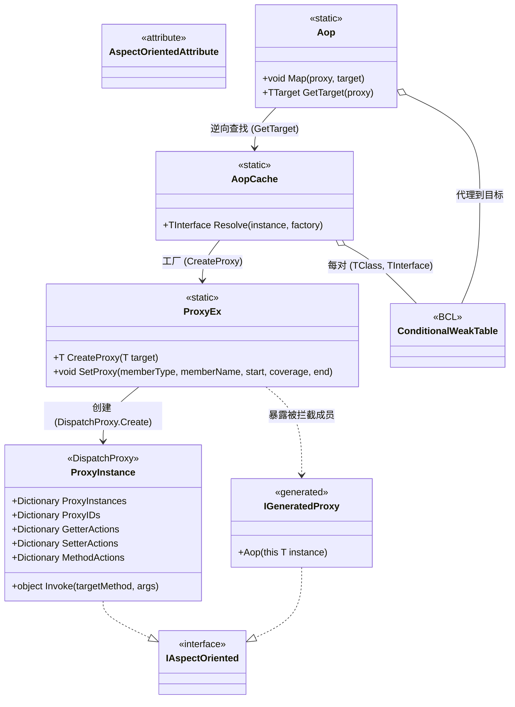

# 设计模式分析 — AOP

AOP 子系统围绕编译期生成的代理组合了四种经典模式：**代理模式（Proxy）**、**装饰器 / 拦截器（Decorator/Interceptor）**、**工厂 / 注册表（Factory/Registry，基于每对类型的弱表）** 以及 **标记接口（Marker Interface）**。



## 1. 代理模式 — 基于 `DispatchProxy` 拦截

`ProxyEx.CreateProxy<T>` 把生成的接口 `T` 交给 `DispatchProxy.Create<T, ProxyInstance>()`，再把真实目标与接口类型记录到代理实例上：

```csharp
// Src/Core/VeloxDev.Core/AspectOriented/ProxyEx.cs（第 16-25 行）
public static T CreateProxy<T>(this T target) where T : IAspectOriented
{
    var type = typeof(T);
    dynamic proxy = DispatchProxy.Create<T, ProxyInstance>() ?? throw new InvalidOperationException();
    proxy._target = target;
    proxy._targetType = type;
    ProxyInstance.ProxyIDs.Add(proxy, proxy._localid);
    return proxy;
}
```

对代理的所有调用都汇入唯一的拦截点 `ProxyInstance.Invoke`，从而让客户端拿到一个代表真实对象、控制对其访问的替身。

## 2. 装饰器 / 拦截器 — start / coverage / end 钩子

`SetProxy` 把 `(start, coverage, end)` 三元组写入三张钩子表之一（`GetterActions` / `SetterActions` / `MethodActions`）。`ProxyInstance.Invoke` 通过 `start` →（`coverage`，或反射回退）→ `end` 装饰成员，并用 `previous` 参数串联返回值：

```csharp
// Src/Core/VeloxDev.Core/AspectOriented/ProxyInstance.cs（第 29-35 行，getter 分支）
var R0 = actions?.Item1?.Invoke(args, null);
var R1 = actions?.Item2 == null ? _targetType?.GetMethod(Name)?.Invoke(_target, args) : actions.Item2.Invoke(args, R0);
actions?.Item3?.Invoke(args, R1);
return R1;
```

`coverage` 处理器非空时是**装饰器**：它接收 `start` 的结果 `R0`，其自身返回值 `R1` 成为成员的结果，从而绕开原逻辑。当 `coverage == null` 时，代理回退为对真实目标做反射调用——调用形状相同，只是策略不同。

## 3. 工厂 / 注册表 / 享元 — 带 `ConditionalWeakTable` 的 `AopCache`

利用 CLR 泛型特化，为每一对 `(TClass, TInterface)` 提供一张共享的 `ConditionalWeakTable`，无需为每个类生成缓存代码。代理每个目标只创建一次，并随目标一起被 GC 回收：

```csharp
// Src/Core/VeloxDev.Core/AspectOriented/AopCache.cs（第 14-32 行）
private static class Entry<TClass, TInterface>
    where TClass : class
    where TInterface : class, IAspectOriented
{
    public static readonly ConditionalWeakTable<TClass, TInterface> Instances = [];
}
// ...
return Entry<TClass, TInterface>.Instances.GetValue(instance, k => factory(k));
```

生成的 `Aop()` 扩展充当喂给 `AopCache.Resolve` 的工厂；`Aop.Map` 维护代理 → 目标的逆向注册表：

```csharp
// Src/Generators/VeloxDev.Core.Generator/Writers/AopWriter.cs（第 75-87 行，节选）
public static Counter_AopDemo_Aop Aop(this global::AopDemo.Counter instance)
    => global::VeloxDev.AspectOriented.AopCache.Resolve<
        global::AopDemo.Counter,
        global::VeloxDev.AopInterfaces.Counter_AopDemo_Aop>(
        instance,
        static x =>
        {
            var p = global::VeloxDev.AspectOriented.ProxyEx.CreateProxy<global::VeloxDev.AopInterfaces.Counter_AopDemo_Aop>(x);
            global::VeloxDev.AspectOriented.Aop.Map(p, x);
            return p;
        });
```

## 4. 标记接口 — `IAspectOriented`

`IAspectOriented` 是一个空接口，用于标记类型“可代理”，并充当 `CreateProxy` / `SetProxy` / `GetTarget` 的泛型约束。生成的代理接口与 `ProxyInstance` 都继承自它，因此钩子注册辅助方法可以接受任意一侧。

## 模式汇总

| 模式 | 参与者 | 作用 |
|---|---|---|
| 代理（Proxy） | `ProxyInstance : DispatchProxy`、生成的 `{Class}_{Ns}_Aop` 接口 | 代表真实目标拦截每个成员调用的替身对象 |
| 装饰器 / 拦截器 | `ProxyHandler`（start / coverage / end） | 用 before / 替换 / after 行为包裹成员；`coverage` 可整体替换逻辑 |
| 工厂（Factory） | `AopCache.Resolve` + 生成的 `Aop()` 扩展 | 每个目标实例恰好创建一个代理并缓存 |
| 注册表 / 享元 | `AopCache.Entry<TClass,TInterface>`（每对 CWT）、`Aop`（代理→目标 CWT） | 共享代理实例，支持逆向查找 |
| 标记接口 | `IAspectOriented` | 类型级标记 + 泛型约束 |

> 出处汇总：`Src/Core/VeloxDev.Core/AspectOriented/{ProxyEx,ProxyInstance,AopCache,Aop}.cs`、`Src/Core/VeloxDev.Core/Interfaces/AspectOriented/IAspectOriented.cs`、`Src/Generators/VeloxDev.Core.Generator/Writers/AopWriter.cs`、`Examples/AOP/WPF/Demo/MainWindow.xaml.cs`。
