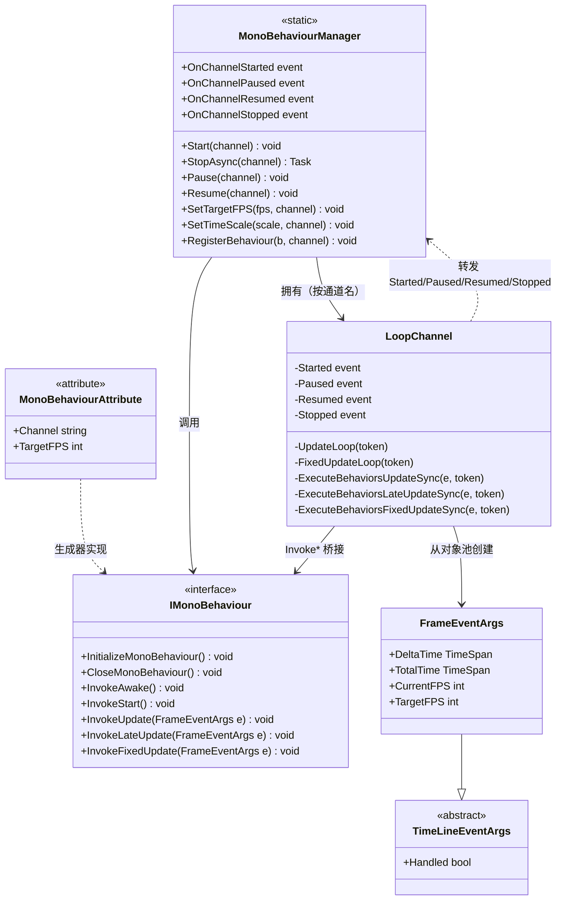

# 设计模式 — MonoBehaviour

`VeloxDev.TimeLine` 帧循环把模板方法骨架（循环在管理器里，可变步骤在用户 partial 方法里）、发布-订阅事件面、池化事件参数类型以及 `IMonoBehaviour` 定义的弱交互契约结合在一起。



## 1. 模板方法 — 帧循环生命周期

帧循环骨架固定在 `LoopChannel.UpdateLoop` / `FixedUpdateLoop`；可变步骤是用户的 partial 钩子 `Awake` / `Start` / `Update` / `LateUpdate` / `FixedUpdate`。

```csharp
// Src/Generators/VeloxDev.Core.Generator/Writers/MonoWriter.cs（第 80-121 行）
public void InitializeMonoBehaviour()
{
    VeloxDev.TimeLine.MonoBehaviourManager.RegisterBehaviour(this, "default");
}

public void InvokeUpdate(VeloxDev.TimeLine.FrameEventArgs e)
{
    Update(e);
}
// ...
partial void Awake();
partial void Start();
partial void Update(VeloxDev.TimeLine.FrameEventArgs e);
partial void LateUpdate(VeloxDev.TimeLine.FrameEventArgs e);
partial void FixedUpdate(VeloxDev.TimeLine.FrameEventArgs e);
```

| 角色 | 元素 |
|---|---|
| 骨架（固定算法） | `LoopChannel.UpdateLoop` / `FixedUpdateLoop` —— 节奏控制、配置处理、错误隔离 |
| 钩子方法 | `partial void Awake/Start/Update/LateUpdate/FixedUpdate` |
| 桥接 | 由 `[MonoBehaviour]` 类生成的 `Invoke*` 方法 |
| 注册 | 生成的 `InitializeMonoBehaviour()` / `CloseMonoBehaviour()` |

出处：`MonoBehaviourManager.cs` 第 443-488 行（UpdateLoop）、394-441 行（FixedUpdateLoop）、610-656 行（执行循环）。

## 2. 生命周期钩子 — Awake / Start / Update / LateUpdate / FixedUpdate

行为被加入时，管理器先调用 `InvokeAwake()` 再调用 `InvokeStart()`（`ProcessAddedBehaviors`，第 710-726 行）；之后每帧在更新线程调用 `InvokeUpdate` → `InvokeLateUpdate`，在固定线程调用 `InvokeFixedUpdate`。

```csharp
// Src/Core/VeloxDev.Core/TimeLine/MonoBehaviourManager.cs（第 710-726 行）
wrapper.Reset(behavior, Interlocked.Increment(ref _instanceCounter));
_behaviors[RuntimeHelpers.GetHashCode(behavior)] = wrapper;
SafeExecute(behavior.InvokeAwake);
SafeExecute(behavior.InvokeStart);
added = true;
```

| 钩子 | 线程 | 频率 |
|---|---|---|
| `Awake` | 更新线程 | 注册时执行一次 |
| `Start` | 更新线程 | `Awake` 之后立即执行一次 |
| `Update` | 更新线程 | 每帧 |
| `LateUpdate` | 更新线程 | 每帧，所有 `Update` 之后 |
| `FixedUpdate` | 固定线程 | 每 `SetFixedUpdateInterval` 毫秒（默认 16） |

## 3. 发布-订阅 — 通道生命周期事件

`LoopChannel` 暴露 `Started` / `Paused` / `Resumed` / `Stopped`；静态 `MonoBehaviourManager` 以 `OnChannelStarted` / `OnChannelPaused` / `OnChannelResumed` / `OnChannelStopped` 转发，并携带带通道名的 `MonoBehaviourChannelEventArgs`。

```csharp
// Src/Core/VeloxDev.Core/TimeLine/MonoBehaviourManager.cs（第 987-991 行）
ch.Started += (s, e) => OnChannelStarted?.Invoke(s, new MonoBehaviourChannelEventArgs(n));
ch.Paused  += (s, e) => OnChannelPaused?.Invoke(s, new MonoBehaviourChannelEventArgs(n));
ch.Resumed += (s, e) => OnChannelResumed?.Invoke(s, new MonoBehaviourChannelEventArgs(n));
ch.Stopped += (s, e) => OnChannelStopped?.Invoke(s, new MonoBehaviourChannelEventArgs(n));
```

订阅者观察整个管理器（所有通道），需要时按 `ChannelName` 过滤。

## 4. 对象池 — 池化 `FrameEventArgs`

`FrameEventArgs` 实例从每通道 `ObjectPool<FrameEventArgs>`（默认容量 50）取出，每帧结束后归还，避免热循环中的逐帧分配。

```csharp
// Src/Core/VeloxDev.Core/TimeLine/MonoBehaviourManager.cs（第 744-754 行）
private FrameEventArgs CreateFrameEventArgs(long deltaTime)
{
    var frameArgs = _frameEventArgsPool.Get();
    frameArgs.DeltaTime = ScaleDuration(ConvertStopwatchTicksToTimeSpan(deltaTime), ts);
    frameArgs.Handled = false;
    return frameArgs;
}
```

> 出处汇总：`Src/Core/VeloxDev.Core/TimeLine/MonoBehaviourManager.cs`、`Src/Generators/VeloxDev.Core.Generator/Writers/MonoWriter.cs`、`Examples/MonoBehaviour/WPF/Demo/MainWindow.xaml.cs`。
