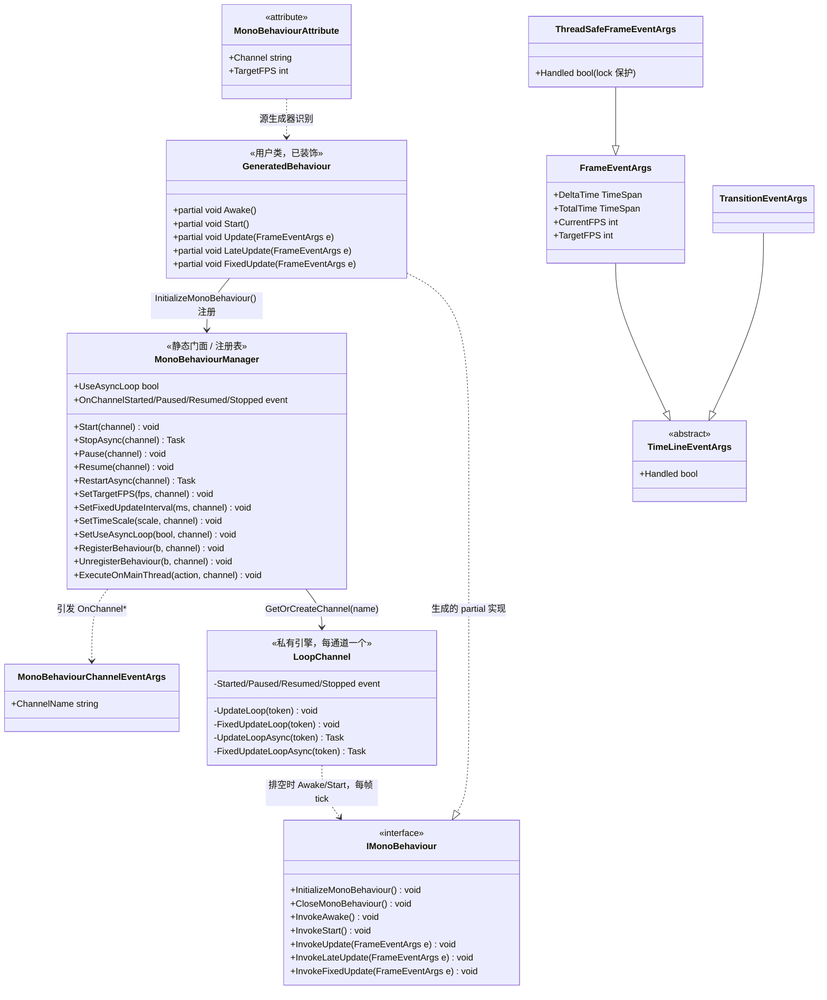

# 设计模式 — MonoBehaviour

`VeloxDev.TimeLine` 为标注了 `[MonoBehaviour]` 的类运行类似 Unity 的帧驱动生命周期。静态的 `MonoBehaviourManager` 是一个门面与通道注册表 / 可观察对象：它为每个命名通道持有一个 `LoopChannel` 引擎，并对外发布通道状态转换。Roslyn 源生成器把该特性变成一份 `IMonoBehaviour` 实现，其入口方法转发到用户的 `partial void` 钩子——管理器固定循环骨架、用户提供可变步骤（模板方法）。事件参数层次与 Transition 系统共享，热路径事件参数类型做了池化。



> 出处：`Src/Core/VeloxDev.Core/TimeLine/MonoBehaviourManager.cs`、`.../Interfaces/MonoBehaviour/IMonoBehaviour.cs`、`Src/Generators/VeloxDev.Core.Generator/Writers/MonoWriter.cs`、`Examples/MonoBehaviour/WPF/Demo/MainWindow.xaml.cs`。

## 1. 模板方法 — 帧循环生命周期

循环骨架固定在 `LoopChannel`：`UpdateLoop`（第 444-489 行）与 `FixedUpdateLoop`（第 395-442 行）负责逐帧节奏控制、队列排空与错误隔离；`UpdateLoopAsync`（548-605 行）/ `FixedUpdateLoopAsync`（492-546 行）是启用异步循环模式时使用的 `Task.Delay` 孪生版本。可变步骤是用户的 `partial void Awake` / `Start` / `Update` / `LateUpdate` / `FixedUpdate` 钩子。源生成器生成桥接：生成的 partial 上每个 `Invoke*` 方法把事件参数转发进对应的 partial 钩子，`InitializeMonoBehaviour()` 与 `CloseMonoBehaviour()` 提供注册 / 注销入口点。生成代码不会自动调用它们——用户在构造函数中调用 `InitializeMonoBehaviour()`（示例即如此），并在实例需要离开通道时调用 `CloseMonoBehaviour()`。

```csharp
// Src/Generators/VeloxDev.Core.Generator/Writers/MonoWriter.cs — MonoWriter.GenerateBody（第 80-121 行）
public void InitializeMonoBehaviour()
{
    VeloxDev.TimeLine.MonoBehaviourManager.RegisterBehaviour(this, "default");
}

public void InvokeUpdate(VeloxDev.TimeLine.FrameEventArgs e)
{
    Update(e);
}
// ... InvokeAwake/InvokeStart/InvokeLateUpdate/InvokeFixedUpdate 同样转发，
//     生成器还会声明这些 partial 钩子：
partial void Awake();
partial void Start();
partial void Update(VeloxDev.TimeLine.FrameEventArgs e);
partial void LateUpdate(VeloxDev.TimeLine.FrameEventArgs e);
partial void FixedUpdate(VeloxDev.TimeLine.FrameEventArgs e);
```

当特性提供 `fps >= 1`（位置第二参数或命名参数 `TargetFPS`）时，`InitializeMonoBehaviour()` 会先调用 `SetTargetFPS(fps, channel)` 再执行 `RegisterBehaviour(this, channel)`；`CloseMonoBehaviour()` 调用 `UnregisterBehaviour(this, channel)`。

| 角色 | 元素 |
|---|---|
| 骨架（固定算法） | `LoopChannel.UpdateLoop` / `FixedUpdateLoop`（线程版）或 `*Async` 孪生版 —— 节奏控制、配置处理、错误隔离 |
| 钩子方法 | `partial void Awake` / `Start` / `Update` / `LateUpdate` / `FixedUpdate` |
| 桥接 | `[MonoBehaviour]` 类上生成的 `Invoke*` 方法 |
| 注册 | 生成的 `InitializeMonoBehaviour()` / `CloseMonoBehaviour()` |

出处：`MonoBehaviourManager.cs` 第 444-489 行（UpdateLoop）、395-442 行（FixedUpdateLoop）、492-605 行（异步孪生版）、611-657 行（逐行为执行循环）。

## 2. 生命周期钩子 — Awake / Start / Update / LateUpdate / FixedUpdate

注册通过每通道队列延迟处理。当更新驱动在排空它时（`ProcessAddedBehaviors`，第 711-727 行）——对预先注册的行为是 `Start` 后的第一帧，对运行中通道新增的行为是下一帧——管理器在更新驱动上各调用一次 `InvokeAwake()` 与 `InvokeStart()`。

```csharp
// Src/Core/VeloxDev.Core/TimeLine/MonoBehaviourManager.cs（第 718-724 行）
var wrapper = _wrapperPool.Get();
wrapper.Reset(behavior, Interlocked.Increment(ref _instanceCounter));

_behaviors[RuntimeHelpers.GetHashCode(behavior)] = wrapper;
SafeExecute(behavior.InvokeAwake);
SafeExecute(behavior.InvokeStart);
added = true;
```

注册之后，每帧在更新驱动上调用 `InvokeUpdate` → `InvokeLateUpdate`，并在固定驱动上调用 `InvokeFixedUpdate`；固定驱动按自身间隔与更新驱动并发运行。

| 钩子 | 驱动 | 频率 |
|---|---|---|
| `Awake` | 更新驱动 | 注册被排空时执行一次 |
| `Start` | 更新驱动 | `Awake` 之后立即执行一次 |
| `Update` | 更新驱动 | 每帧 |
| `LateUpdate` | 更新驱动 | 每帧，所有 `Update` 之后 |
| `FixedUpdate` | 固定驱动 | 每 `SetFixedUpdateInterval` 毫秒（默认 16），与更新驱动并发 |

## 3. 发布-订阅 / 可观察对象 — 通道生命周期事件

`LoopChannel` 暴露 `Started` / `Paused` / `Resumed` / `Stopped`；`GetOrCreateChannel`（第 983-994 行）把它们订阅到静态管理器事件上，每类事件用携带通道名的新建 `MonoBehaviourChannelEventArgs` 重新抛出。

```csharp
// Src/Core/VeloxDev.Core/TimeLine/MonoBehaviourManager.cs（第 988-991 行）
ch.Started += (s, e) => OnChannelStarted?.Invoke(s, new MonoBehaviourChannelEventArgs(n));
ch.Paused  += (s, e) => OnChannelPaused?.Invoke(s, new MonoBehaviourChannelEventArgs(n));
ch.Resumed += (s, e) => OnChannelResumed?.Invoke(s, new MonoBehaviourChannelEventArgs(n));
ch.Stopped += (s, e) => OnChannelStopped?.Invoke(s, new MonoBehaviourChannelEventArgs(n));
```

管理器同时也是通道注册表：通道按需惰性创建并保存在静态 `ConcurrentDictionary` 中（`ChannelNames` 暴露其名）。订阅者观察整个管理器，需要时按 `ChannelName` 过滤。

## 4. 对象池 — 池化的事件参数与请求 / 注册对象

`LoopChannel` 维护三个固定容量对象池（默认 `DEFAULT_OBJECT_POOL_SIZE = 50`）：`ObjectPool<FrameEventArgs>`、`ObjectPool<ConfigChangeRequest>` 与 `ObjectPool<BehaviorWrapper>`。配置设置器从池中取出一个 `ConfigChangeRequest`、填入字段并入队；逐帧排空时重置并归还。行为注册表复用 `BehaviorWrapper` 对象，每帧取出一个 `FrameEventArgs` 而非重新分配。

```csharp
// Src/Core/VeloxDev.Core/TimeLine/MonoBehaviourManager.cs（第 745-755 行）
private FrameEventArgs CreateFrameEventArgs(long deltaTime)
{
    var ts = (float)BitConverter.Int64BitsToDouble(Interlocked.Read(ref _timeScaleBits));
    var frameArgs = _frameEventArgsPool.Get();
    frameArgs.DeltaTime = ScaleDuration(ConvertStopwatchTicksToTimeSpan(deltaTime), ts);
    frameArgs.TotalTime = TimeSpan.FromTicks(Interlocked.Read(ref _totalTimeTicks));
    frameArgs.CurrentFPS = _currentFPS;
    frameArgs.TargetFPS = Volatile.Read(ref _targetFPS);
    frameArgs.Handled = false;
    return frameArgs;
}
```

未被处理的 `FixedUpdate` 事件被入队，由更新驱动在下一帧开头归还池中（`DrainFixedUpdateEvents`，第 757-761 行）；把 `Handled` 置为 `true` 的 `FixedUpdate` 则立即归还对象池。

> 同一功能的兄弟分析：[数据流 — MonoBehaviour](../../03_数据流分析/06_MonoBehaviour/index.md) 与 [复杂度分析 — MonoBehaviour](../../04_复杂度分析/06_MonoBehaviour/index.md)。
