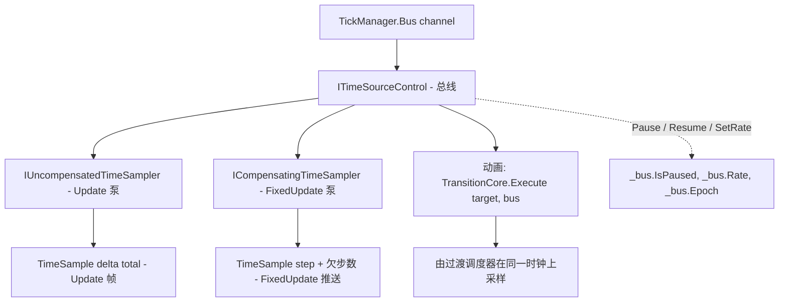

# 共享 transport —— 每通道一条时钟

每个通道恰好拥有一个 `ITimeSourceControl`，在通道构造时创建，此后永不替换。暂停、恢复、速率与 epoch 都住在这个对象上而不是通道字段里，并由 `TickManager.Bus` 公开出去。结果是：帧循环与锚定在同一条 transport 上的动画不可能对「现在几点」产生分歧。

| 元素 | 类型 | 源码 |
|---|---|---|
| transport | `LoopChannel._bus` —— `TimerCore.CreateTimeSource<ITimeSourceControl>()` | `TickManager.cs` 116 |
| 无补偿采样器（Update） | `IUncompensatedTimeSampler _updateSampler` | `TickManager.cs` 119 |
| 补偿采样器（FixedUpdate） | `ICompensatingTimeSampler _fixedSampler` | `TickManager.cs` 122 |
| 公开访问器 | `TickManager.Bus(channel)` | `TickManager.cs` 1144-1145 |
| 消费者契约 | `ITimeSourceControl` / `ITimeSource` | `Src/Core/VeloxDev.Core/Interfaces/Timing/` |



## 为什么速率不是通道字段

`SetTimeScale` 就是一句转发到 transport 的话：

```csharp
// Src/Core/VeloxDev.Core/TimeLine/TickManager.cs（第 238 行）
public void SetTimeScale(float timeScale) => _bus.SetRate(timeScale);
```

旧形状里速率是通道字段，由循环在下一次配置排空时施加，带钳制，超范围静默忽略。现在它继承 transport 的规矩：不钳制，负值以 `ArgumentOutOfRangeException` 拒绝而不是丢弃。`TickableBusTests.ANegativeTimeScaleIsRejectedRatherThanClamped` 就是这一差异的可执行表述。

速率住在时钟而不是通道上，带来两条推论：

- **它同时乘到两个消费者上。** `TickableBusTests.TheChannelsRateScalesTheAnimationButNotTheFrameCadence` 设 `4f` 并同时断言 `TickManager.TimeScale(channel) == 4f` 与 `bus.Rate == 4f` —— 一个值，从两处读，因为只有一个值。
- **它不缩放帧节拍。** 目标帧率约束的是*采样节奏*，按墙钟测量（`FrameRateControlSync` 备注，`TickManager.cs` 第 838 行），所以速率减半不会让帧数减半。

## 为什么两个泵都 park 而不轮询

在此之前，暂停中的通道每 10 ms 醒来重新读一次暂停标志。现在暂停是 transport 的属性，两个泵等待 transport 的信号：

```csharp
// Src/Core/VeloxDev.Core/TimeLine/TickManager.cs（520-524 行，位于 UpdateLoop 内）
if (!_bus.IsAdvancing)
{
    _bus.WaitWhileStalledAsync(token).GetAwaiter().GetResult();
    continue;
}
```

判据是 `IsAdvancing` 而不是 `IsPaused`，这个区别是刻意的。速率为 `0` 会*冻结*时钟却不构成暂停，所以只测 `IsPaused` 的循环会在一个永不前进的时钟上空转。`ITimeSource` 把 `IsAdvancing` 记录为一条不变量而不是一条公式：*为真蕴含位置将会移动*。

这个设计有一项代价，代码明确地支付了它。「这条线程最近有没有活动」—— 存活判据 —— 对 park 住的泵必然为假。因此 `IsUpdateThreadAlive` 对它做了限定：

```csharp
// Src/Core/VeloxDev.Core/TimeLine/TickManager.cs（193-194 行）
public bool IsUpdateThreadAlive => _isRunning && _isUpdateThreadActive &&
    (!_bus.IsAdvancing || IsRecentActivity(Interlocked.Read(ref _updateThreadLastActivityTimestamp)));
```

`TickableBusTests.PausingAChannelStopsItsFramesAndResumingRestartsThem` 断言两个查询在整个暂停期间保持 `true`，并附言：park 住的循环是活着的，不是死的。

## 恢复的是 transport，不是循环

`Start` 与 `StopAsync` 都会调用 `_bus.Resume()`：

```csharp
// Src/Core/VeloxDev.Core/TimeLine/TickManager.cs（第 293 行，位于 Start 内）
// 启动要清掉上一个生命周期留下的暂停，与旧实现的 _isPaused = false 对齐。不清的话，
// 一个「暂停中被停掉」的渠道重启后会立刻 park，再也跑不起来。
_bus.Resume();
```

transport 是通道长期持有的对象，所以「停止顺手清掉暂停」必须显式做，而旧设计靠线程创建时重置实例字段白拿。`TickableBusTests.StartingAChannelClearsAPauseLeftOverFromTheLastLifecycle` 覆盖的正是这一回归。

同一次调用还会重新锚定采样器：

```csharp
// Src/Core/VeloxDev.Core/TimeLine/TickManager.cs（288-289 行）
_updateSampler.Reset();
_fixedSampler.Reset();
```

这就是重启后立刻送达的那一帧带的是「一帧」的 `DeltaTime` 而不是整段停机时间的原因（`TickableBusTests.RestartingAChannelRePrimesItsClocks`）。

注意 `Resume()` **不**解除什么：速率为 `0`。时钟被冻结之后，`Resume` 清掉了暂停标志而通道依旧 park，因为 `IsAdvancing` 仍为假。`LoopChannel.Resume` 刻意不把总线的规矩抹平（391-396 行）。

## 消费者一侧

`TickableBusTests.PausingAChannelStopsItsFramesAndTheAnimationAnchoredToIt` 是整套设计的验收测试，值得当作规格来读：

```csharp
var bus = TickManager.Bus(channel);
Assert.IsNotNull(bus, "a started channel must expose its transport");

var target = new Target();
TestTransition.Create()
    .Property(t => t.Value, 1d)
    .Effect(new TransitionEffectCore { Duration = TimeSpan.FromSeconds(30), FPS = 60 })
    .Execute(target, bus!); // 锚到渠道的同一条 transport
```

随后一次 `TickManager.Pause(channel)`，并断言帧数与动画值都没有动。这就是「接线同时接动画和帧循环」的可执行定义。

> 源码：`Src/Core/VeloxDev.Core/TimeLine/TickManager.cs` 116、119、122、187-197、238、288-293、339、384-402、520-524、1134-1145 行；`Src/Core/VeloxDev.Core/Interfaces/Timing/ITimeSource.cs`；`Src/Core/VeloxDev.Core.Test/TimeLine/TickableBusTests.cs` 112-243 行。
