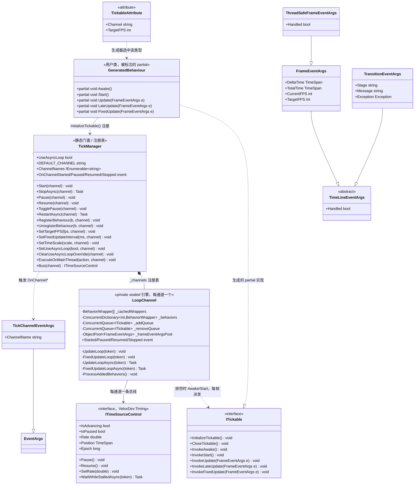

# 设计模式 — Tickable

`VeloxDev.TimeLine` 为带 `[Tickable]` 的类运行一套类 Unity 的帧驱动生命周期。静态 `TickManager` 同时扮演三种角色：门面、通道注册表与可观察对象 —— 它拥有每个通道唯一的具名 `LoopChannel` 引擎，并把该通道的状态迁移在整个进程内重新发布。Roslyn 源生成器把特性变成一份 `ITickable` 实现，其入口转发到用户的 `partial void` 钩子 —— 引擎固定循环骨架，用户提供可变步骤（模板方法）。两个泵都 park 在共享时间源上而不是轮询标志位，这正是「一次 `Pause()` 同时停住帧循环与动画」的由来（适配共享时钟）。热路径上的事件参数被池化。

本页是总览：类图与模式清单。每个模式各有独立子页。

> 源码：`Src/Core/VeloxDev.Core/TimeLine/TickManager.cs`（`TickManager` 区域 1046-1156，`LoopChannel` 99-996）、`Src/Core/VeloxDev.Core/Interfaces/Tickable/ITickable.cs`、`Src/Generators/VeloxDev.Core.Generator/Writers/TickWriter.cs`、`Src/Core/VeloxDev.Core/Interfaces/Timing/ITimeSourceControl.cs`、`Examples/Tickable/WPF/Demo/MainWindow.Hooks.cs`。

## 模式清单

| # | 模式 | 位置 | 子页 |
|---|---|---|---|
| 1 | **模板方法** —— 循环骨架固定，钩子是可变步骤 | `LoopChannel.UpdateLoop` / `FixedUpdateLoop` + 生成器的 `Invoke*` 桥接 | [模板方法](00_模板方法/index.md) |
| 2 | **适配器 / 共享 transport** —— 两个泵与任何被锚定的动画都跑在同一条 `ITimeSourceControl` 上 | `LoopChannel._bus`、`TickManager.Bus` | [共享时钟](01_共享时钟/index.md) |
| 3 | **发布订阅 / 门面 + 注册表** —— 静态门面覆盖惰性通道字典，并把每通道事件重新发布到全进程 | `GetOrCreateChannel`、四个 `OnChannel*` 事件 | [发布订阅](02_发布订阅/index.md) |
| 4 | **对象池** —— 每通道三个定容池，外加一个变更时复制的有序快照 | `ObjectPool<T>`、`_frameEventArgsPool`、`_cachedWrappers` | [对象池](03_对象池/index.md) |

四个模式之下还有两个支撑性决定，值得点名，因为它们塑造了代码的形状：

- **延迟命令队列。** 注册、注销与目标帧率变更都不是由调用方直接施加的，而是入队到通道上，由某个泵在 `ProcessMainThreadOperations` 里施加。这就是所有 mutator 无需给行为字典加锁即可线程安全的原因 —— 命令模式作用于状态修改。
- **写时复制的派发数组。** `_cachedWrappers` 是一个普通数组，在 `volatile` 字段下整体替换，因此派发循环读到的是一个稳定快照，无锁且每帧零分配。
