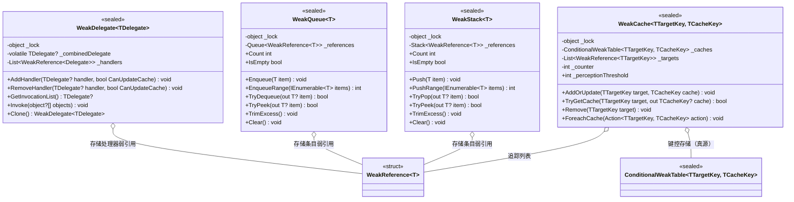

# 设计模式 — 弱引用类型

四个 `VeloxDev.WeakTypes` 类型（`WeakDelegate<TDelegate>`、`WeakQueue<T>`、`WeakStack<T>`、`WeakCache<TTargetKey, TCacheKey>`）实现了**弱引用（Weak Reference）**一族惯用法。它们并不对载荷持有强引用，而是存储 `WeakReference<T>`——缓存则使用 `ConditionalWeakTable`——因此容器自身绝不会让订阅者、队列/栈条目或缓存键一直存活。清理是**惰性**的（死亡引用在访问时被剪除），而非由后台线程完成。四者皆为 `sealed` 泛型类型，并用每实例监视器加锁；`WeakDelegate` 额外提供一条无锁读快车道。证据来源：源码 `Src/Core/VeloxDev.Core/WeakTypes/*.cs` 与 MSTest 套件 `Src/Core/VeloxDev.Core.Test/WeakTypes/*.cs`。



| 类型 | 模式 |
|---|---|
| `WeakDelegate<TDelegate>` | 弱引用（订阅者）；作为 C# `event` 后备存储的**弱事件**多播 |
| `WeakQueue<T>` | 弱引用（条目）；惰性淘汰（访问时清扫） |
| `WeakStack<T>` | 弱引用（条目）；惰性淘汰（访问时清扫） |
| `WeakCache<TTargetKey, TCacheKey>` | **ephemeron 缓存**（条目生命周期绑定目标键）；周期自适应清扫 |

## 1. 弱引用语义

每个类型都存储弱引用，因此容器绝不会让载荷一直存活。泛型约束：`WeakQueue<T>` / `WeakStack<T>` 要求 `where T : class`，`WeakCache<...>` 要求键与值皆为 `class`，`WeakDelegate<TDelegate>` 要求 `where TDelegate : Delegate`。

```csharp
// Src/Core/VeloxDev.Core/WeakTypes/WeakQueue.cs（第 34-42 行）
public void Enqueue(T item)
{
    if (item == null) throw new ArgumentNullException(nameof(item));
    lock (_lock)
    {
        _references.Enqueue(new WeakReference<T>(item));
    }
}
```

| 类型 | 存储 | 可被回收的对象 | 被存储对象的角色 |
|---|---|---|---|
| `WeakDelegate<TDelegate>` | `List<WeakReference<Delegate>>` | 订阅者委托（仅在组合缓存尚未将其重新扎根时保持弱引用） | 多播订阅者 |
| `WeakQueue<T>` | `Queue<WeakReference<T>>` | 队列条目 | 载荷，FIFO |
| `WeakStack<T>` | `Stack<WeakReference<T>>` | 栈条目 | 载荷，LIFO |
| `WeakCache<TTargetKey,TCacheKey>` | `ConditionalWeakTable` + `List<WeakReference<TTargetKey>>` | 目标键；其值随之消亡 | `TTargetKey` = 决定生命周期的键；`TCacheKey` = 生命周期绑定键的载荷 |

`WeakCache` 使用两个角色不同的结构。`ConditionalWeakTable` 是查找的**真源**：它弱持有目标键（ephemeron），且仅在键存活期间强持有值，因此 `TryGetCache` 读取真实表，键一旦被回收即 miss。`_targets` 弱引用列表仅用于**枚举**存活条目（`ForeachCache`）并在 `AddOrUpdate` / `Remove` 间保持清扫列表无重复——它绝不参与查找。

## 2. 访问时清扫 —— 条目何时被回收

死亡引用在成员被触碰时被惰性剪除，而非由专用线程处理。

| 类型 | 包装条目何时被移除 |
|---|---|
| `WeakQueue<T>` / `WeakStack<T>` | `TryDequeue` / `TryPop` / `TryPeek` 在扫描队头/栈顶时丢弃死亡引用；`Count`、`GetEnumerator`、`TrimExcess` 对整结构调用 `Prune()` |
| `WeakDelegate<TDelegate>` | `CleanupCollectedHandlers()`（由每次 `RebuildCache()` 调用——即带缓存更新的 `AddHandler`/`RemoveHandler`、缓存为 null 的 `GetInvocationList` 以及 `Clone`） |
| `WeakCache<TTargetKey,TCacheKey>` | 目标键被回收时 CWT 条目自动消失；追踪条目是 `WeakReference`，由 `AddOrUpdate` 在插入计数超过 `_perceptionThreshold` 时清扫，也由 `ForeachCache` / `Remove` 清扫 |

```csharp
// Src/Core/VeloxDev.Core/WeakTypes/WeakQueue.cs（第 124-135 行）
private void Prune()
{
    var activeReferences = _references
        .Where(r => r.TryGetTarget(out _))
        .ToList();

    _references.Clear();
    foreach (var reference in activeReferences)
    {
        _references.Enqueue(reference);
    }
}
```

两点值得注意。其一，`WeakStack.Prune` 在重新压入前额外调用 `activeReferences.Reverse()`（`Src/Core/VeloxDev.Core/WeakTypes/WeakStack.cs`，第 124-136 行），以保证 LIFO 顺序在压缩后不变。其二，回收是**两阶段**的：一旦没有其它强引用持有对象，GC 便清空其 `WeakReference` 目标，但空的包装条目会一直留在底层容器里，直到某次清扫到达它——因此队列/栈在两次清扫之间会保留垃圾槽位，其规模受限并在访问时被清理。

## 3. 弱事件用法与唯一的强引用

`WeakDelegate` 充当过渡引擎生命周期事件的后备：`TransitionEffectCore` 把每个事件声明为 `WeakDelegate<EventHandler<TransitionEventArgs>>` 字段，并把 C# `event` 访问器转发到它。

```csharp
// Src/Core/VeloxDev.Core/TransitionSystem/TransitionEffect.cs（第 51-55 行）
public virtual event EventHandler<TransitionEventArgs> Awaked
{
    add => _awaked.AddHandler(value);
    remove => _awaked.RemoveHandler(value);
}
```

调用经由组合委托进行，`TransitionEffectCore` 以**类型化**（免反射）方式调用它（`Src/Core/VeloxDev.Core/TransitionSystem/TransitionEffect.cs`，第 87-90 行）：

```csharp
public virtual void InvokeAwake(object sender, TransitionEventArgs e)
{
    _awaked.GetInvocationList()?.Invoke(sender, e);
}
```

重要的告诫：`_combinedDelegate` 是**强**引用。默认 `CanUpdateCache: true` 的 `AddHandler` 会立即重建缓存，因此每个当前已添加的处理器都会被它扎根，直到下次重建将其排除。只有当处理器以 `CanUpdateCache: false` 添加（仅存入 `_handlers`，从不进入强缓存）时，它才是真正弱的——订阅期间即可被回收。死亡包装条目最终由下次重建中的 `CleanupCollectedHandlers()`（`Clone`、下一次 `AddHandler`/`RemoveHandler`，或缓存为 null 的 `GetInvocationList`）从 `_handlers` 中剪除。这一设计用热路径的无锁读取换取了未退订订阅者的延迟释放，也正是文档把该委托缓存描述为「强、但按需重建并剪除」的原因。

| 权衡 | 分析 |
|---|---|
| 惰性清理 | 每次变更摊还 O(1)；偶发清扫为 O(n) —— 可接受，因为清扫只在确实遇到死亡引用时发生 |
| `WeakDelegate` 组合缓存 | 强缓存提供无锁读快车道，但会把已订阅处理器扎根到下次重建；`CanUpdateCache: false` 可逐处理器选择退出以获得真正弱的订阅 |
| `WeakCache` 追踪列表 | `_targets` 仅弱、绝不扎根键，因此查找保持 ephemeron 正确，同时枚举依然可行 |

> 出处汇总：`Src/Core/VeloxDev.Core/WeakTypes/{WeakDelegate,WeakQueue,WeakStack,WeakCache}.cs`；用法见 `Src/Core/VeloxDev.Core/TransitionSystem/TransitionEffect.cs`；行为由 `Src/Core/VeloxDev.Core.Test/WeakTypes/*.cs` 验证。
