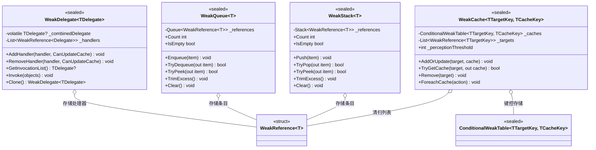

# 设计模式 — 弱引用类型

四个 `VeloxDev.WeakTypes` 集合都实现了**弱引用（Weak Reference）**惯用法：它们持有 `WeakReference<T>`（或 `ConditionalWeakTable`）而非强引用，因此 GC 可以回收在别处不可达的订阅者、队列条目、栈条目与缓存键。在此基础上，它们应用**访问时清扫（Sweep-on-Access）**：死亡引用在成员被触碰时惰性剪除，无需任何后台线程做清理。



## 1. 弱引用惯用法

每个类型都存储弱引用而非强引用，因此容器绝不会让载荷一直存活。

```csharp
// Src/Core/VeloxDev.Core/WeakTypes/WeakQueue.cs（第 34-42 行）
public void Enqueue(T item)
{
    if (item == null) throw new ArgumentNullException(nameof(item));
    lock (_lock)
    {
        _references.Enqueue(new WeakReference<T>(item));
    }
}
```

| 类型 | 存储 | 可被回收的对象 |
|---|---|---|
| `WeakDelegate<TDelegate>` | `List<WeakReference<Delegate>>` | 订阅者委托（外加一个强引用组合委托缓存） |
| `WeakQueue<T>` | `Queue<WeakReference<T>>` | 队列条目 |
| `WeakStack<T>` | `Stack<WeakReference<T>>` | 栈条目 |
| `WeakCache<TTargetKey,TCacheKey>` | `ConditionalWeakTable` + `List<WeakReference<TTargetKey>>` | 缓存键（值随键消亡） |

## 2. 访问时清扫

死亡引用在成员被触碰时惰性剪除，而非由专用线程处理。

| 类型 | 清扫触发点 |
|---|---|
| `WeakQueue<T>` / `WeakStack<T>` | `Count`、`GetEnumerator`、`TrimExcess` 调用 `Prune()`；`TryDequeue`/`TryPop`/`TryPeek` 循环跳过死亡引用 |
| `WeakDelegate<TDelegate>` | `RebuildCache()`（由带缓存更新的 `AddHandler`/`RemoveHandler`、缓存为 null 时的 `GetInvocationList` 以及 `Clone` 触发） |
| `WeakCache<TTargetKey,TCacheKey>` | `AddOrUpdate` 在插入计数超过 `_perceptionThreshold` 时清扫；`ForeachCache` 先移除死亡目标 |

```csharp
// Src/Core/VeloxDev.Core/WeakTypes/WeakQueue.cs（第 124-135 行）
private void Prune()
{
    var activeReferences = _references
        .Where(r => r.TryGetTarget(out _))
        .ToList();

    _references.Clear();
    foreach (var reference in activeReferences)
    {
        _references.Enqueue(reference);
    }
}
```

| 权衡 | 分析 |
|---|---|
| 惰性清理 | 每次变更摊还 O(1)；偶发清扫为 O(n) —— 可接受，因为清扫只在确实遇到死亡引用时发生 |
| `WeakDelegate` 的弱缓存 | 组合委托缓存是强引用；已回收处理器只在缓存被重建时剪除（详见 API 页） |

> 出处汇总：`Src/Core/VeloxDev.Core/WeakTypes/*.cs`，由 `Src/Core/VeloxDev.Core.Test/WeakTypes/*.cs` 及 2026-08-17 运行的独立控制台探针验证。
